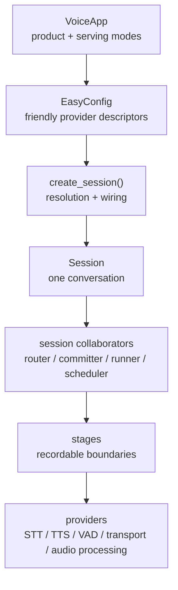
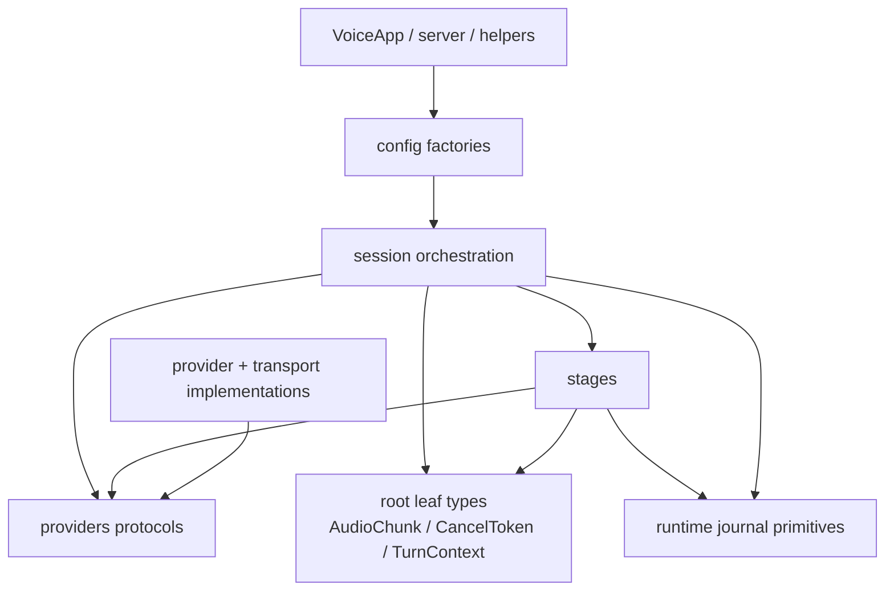
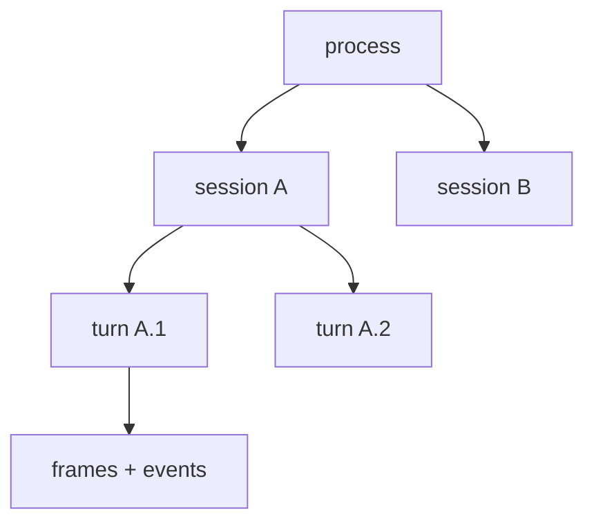

# Chapter 1 — The System Map

EasyCat is a chained voice runtime. It accepts audio through a transport,
extracts a user turn, asks an agent or workflow for a response, synthesizes
that response, and sends audio back. Around that apparent line is the harder
work: formats, endpointing, cancellation, provider lifecycles, history,
forensic recording, security, and multi-session process ownership.

The first maintainer skill is knowing which layer owns a question.

## 1.1 The Public Product and the Runtime Beneath It

Application authors encounter a progression of surfaces:

The progression is a ladder, not a set of competing APIs:

- [`VoiceApp`](../../src/easycat/voice_app.py) chooses a product mode
  (`local`, `browser`, `websocket`, `twilio`, or `telnyx`) and owns the
  synchronous versus asynchronous serving entrance.
- [`EasyConfig`](../../src/easycat/config/easy.py) accepts provider names,
  typed provider configs, and a small number of prebuilt objects.
- [`create_session`](../../src/easycat/config/_factory.py) resolves those
  descriptors into live providers and a low-level `SessionConfig`.
- [`Session`](../../src/easycat/session/_session.py) owns exactly one
  conversation and delegates focused concerns to collaborators.
- [`stages`](../../src/easycat/stages) wrap live boundaries with uniform
  recording, snapshots, error metadata, and replay behavior.
- [`providers.py`](../../src/easycat/providers.py) defines structural
  interfaces. Implementations live in the provider subpackages.

Do not bypass a rung merely because the lower layer is importable. A change to
`VoiceApp` is product-surface work; a change to `SessionConfig` is low-level
runtime work. They have different compatibility obligations.

## 1.2 Feature Map

The table below is an ownership map, not a marketing list.

| Capability | Primary implementation | Neighboring contracts |
| --- | --- | --- |
| Product modes and dev mode | [`voice_app.py`](../../src/easycat/voice_app.py) | [`tests/test_voice_app.py`](../../tests/test_voice_app.py) |
| Friendly configuration and presets | [`config/easy.py`](../../src/easycat/config/easy.py) | [EasyConfig reference](../reference/easyconfig.md) |
| Session construction | [`config/_factory.py`](../../src/easycat/config/_factory.py) | [`session/_types.py`](../../src/easycat/session/_types.py) |
| Audio ingress/egress | [`session/_audio_router.py`](../../src/easycat/session/_audio_router.py) | [`audio_format.py`](../../src/easycat/audio_format.py) |
| Turn detection and smart endpointing | [`turn_manager.py`](../../src/easycat/turn_manager.py), [`smart_turn.py`](../../src/easycat/smart_turn.py) | [`tests/turns/`](../../tests/turns) |
| Agent and workflow support | [`integrations/agents/`](../../src/easycat/integrations/agents) | [`tests/integrations/agents/`](../../tests/integrations/agents) |
| Streaming speech output | [`session/_streaming.py`](../../src/easycat/session/_streaming.py), [`session/_tts_scheduler.py`](../../src/easycat/session/_tts_scheduler.py) | [`tts/input.py`](../../src/easycat/tts/input.py) |
| Tools and session actions | [`session/actions.py`](../../src/easycat/session/actions.py) | [`events.py`](../../src/easycat/events.py) |
| Debug journals and replay | [`runtime/`](../../src/easycat/runtime), [`debug/`](../../src/easycat/debug) | [journal record reference](../reference/journal-records.md) |
| Browser debugger | [`debugger/`](../../src/easycat/debugger) | [observability guide](../observability.md) |
| Provider discovery | [`_provider_catalog.py`](../../src/easycat/_provider_catalog.py) | [`stt/factory.py`](../../src/easycat/stt/factory.py), [`tts/factory.py`](../../src/easycat/tts/factory.py) |
| WebSocket/WebRTC production process | [`server/`](../../src/easycat/server) | [`session_manager.py`](../../src/easycat/session_manager.py) |
| Twilio and call policy | [`telephony/`](../../src/easycat/telephony), [`transports/twilio_media.py`](../../src/easycat/transports/twilio_media.py) | [telephony feature chapter](../using-easycat/10-telephony/) |
| Validation and reports | [`validation/`](../../src/easycat/validation) | [validation workflow](../validation.md) |

If a capability appears in several rows, ask which object owns its state. For
example, Twilio media bytes belong to a transport, one call's policy belongs
to a session and helpers, and admission/shutdown of many calls belongs to a
server.

## 1.3 Package Dependency Direction

The desired direction is downward:

[`_turn_context.py`](../../src/easycat/_turn_context.py) is at the package root
for a reason: both `session/` and the lower `stages/` layer need the type.
Putting it under `session/` would make stages import upward and create a cycle.
The same “small leaf shared downward” pattern appears in
[`cancel.py`](../../src/easycat/cancel.py),
[`audio_format.py`](../../src/easycat/audio_format.py),
[`_net.py`](../../src/easycat/_net.py), and
[`_env.py`](../../src/easycat/_env.py).

Import weight is also architecture. [`easycat/__init__.py`](../../src/easycat/__init__.py)
uses PEP 562 lazy exports backed by
[`_public_api.py`](../../src/easycat/_public_api.py), so `import easycat` does
not eagerly import optional SDKs, audio models, aiohttp, or telephony runtime
code. Optional dependencies should be checked at the feature boundary, not at
package import.

## 1.4 Four Kinds of State

EasyCat keeps state at four lifetimes:

| Lifetime | Examples | Owner |
| --- | --- | --- |
| Process | admission capacity, dev session registry, server metrics | `VoiceServer`, debugger registry |
| Session | providers, agent bridge, journal, event bus, helpers | `Session` |
| Turn | cancellation token, transcript segments, playback accounting | `TurnContext` |
| Frame/event | `AudioChunk`, `STTEvent`, `TTSEvent`, public `Event` | immutable or short-lived values |

The strongest newcomer rule is: **never store shorter-lived mutable state on a
longer-lived shared object without an explicit key and cleanup policy.**
Conversation history on a process-global bridge, STT futures on `Session`
instead of `TurnContext`, or a single transport reused across clients all
violate that rule.

## 1.5 The Three Runtime Planes

The data, control, and evidence planes introduced in the book overview map to
specific code:

- Data: [`session/_audio_router.py`](../../src/easycat/session/_audio_router.py),
  [`session/_streaming.py`](../../src/easycat/session/_streaming.py), and the
  provider protocols.
- Control: [`turn_manager.py`](../../src/easycat/turn_manager.py),
  [`session/_cancel_orchestrator.py`](../../src/easycat/session/_cancel_orchestrator.py),
  [`session/_turn_runner.py`](../../src/easycat/session/_turn_runner.py), and
  [`runtime/scope.py`](../../src/easycat/runtime/scope.py).
- Evidence: [`events.py`](../../src/easycat/events.py),
  [`session/_journal_sink.py`](../../src/easycat/session/_journal_sink.py),
  stage wrappers, and [`_observability.py`](../../src/easycat/_observability.py).

A `ControlSignal` in [`stages/base.py`](../../src/easycat/stages/base.py) is an
especially important example. Stages observe and journal the signal, but they
do not own actual cancellation. The orchestrator cancels tasks and providers.
This keeps the evidence trail visible without distributing teardown authority
through every stage.

## 1.6 Read the Code in This Order

1. [`_public_api.py`](../../src/easycat/_public_api.py) — see what EasyCat
   intentionally promises.
2. [`config/easy.py`](../../src/easycat/config/easy.py) — see the friendly
   inputs.
3. [`config/_factory.py`](../../src/easycat/config/_factory.py) — see those
   inputs become concrete collaborators.
4. [`session/_session.py`](../../src/easycat/session/_session.py) — scan fields
   and public verbs, not every helper.
5. [`session/_builder.py`](../../src/easycat/session/_builder.py) — see the
   collaborator graph in one place.
6. [`providers.py`](../../src/easycat/providers.py) and
   [`stages/base.py`](../../src/easycat/stages/base.py) — distinguish the two
   extension boundaries.

Then read [`tests/test_public_api.py`](../../tests/test_public_api.py) and
[`tests/install/test_agent_guides.py`](../../tests/install/test_agent_guides.py)
to see how the repository prevents those maps from silently drifting.

## 1.7 Common First Misreadings

- `Session` is not the multi-client server. It is one conversation.
- `EventBus` is not the durable observability backend.
- A stage is not a provider base class.
- `STTEvent` and `TTSEvent` are provider-scoped values; `STTFinal` and
  `TTSAudio` are EasyCat session events.
- A transport returning `True` means it accepted a chunk at its contract
  boundary. It does not universally prove that a human heard it.
- `EasyConfig` fields can be descriptors; `SessionConfig` fields are live
  instances.
- Everything importable from a submodule is not automatically stable public
  API.

## Checkpoint

Before continuing, answer:

1. Which layer should construct a provider from the string
   `"deepgram/nova-2"`?
2. Which object owns a single turn's playback acknowledgements?
3. Why does `TurnContext` not live under `session/`?
4. Where would you add a stable top-level import, and which test would change?
5. Which plane should record that an interrupt signal passed through the TTS
   stage, and which plane actually stops TTS?

Next: [Chapter 2 — Session Construction and Lifecycle](02-session-lifecycle.md).
