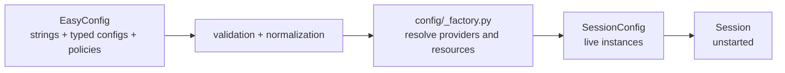
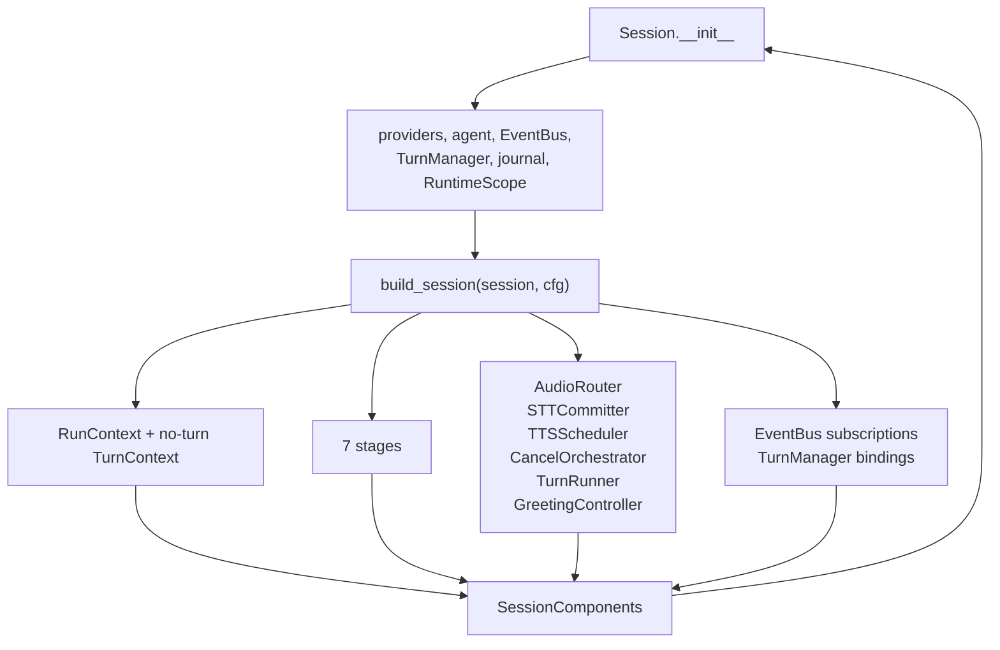
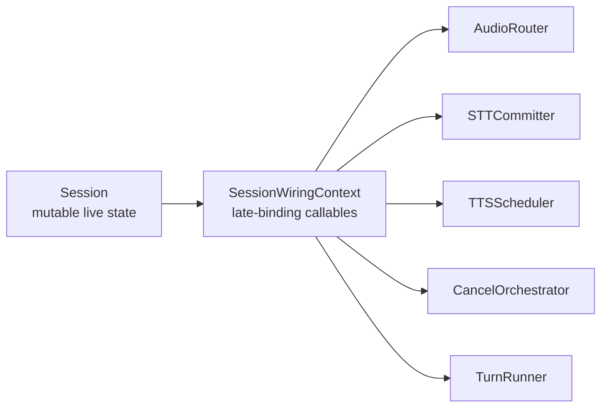
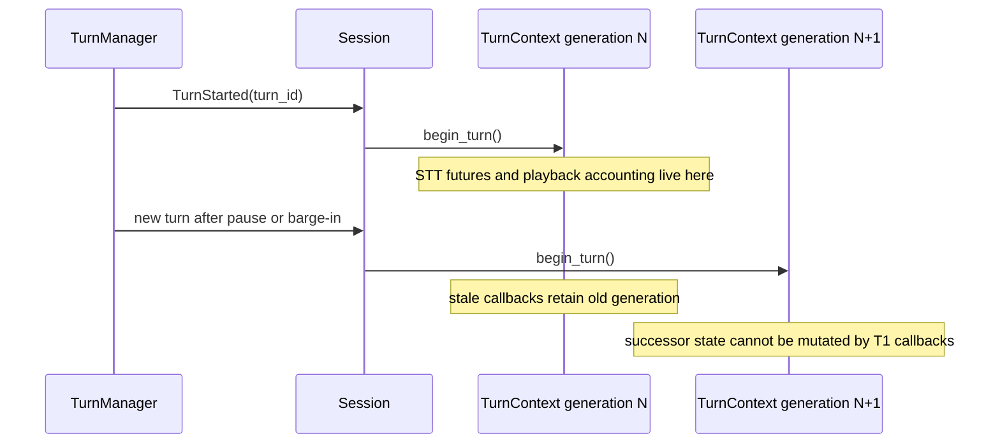
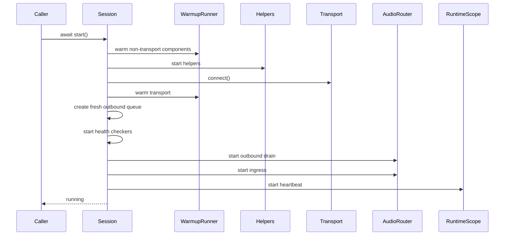
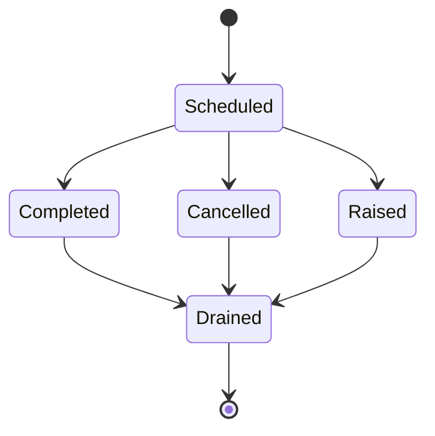
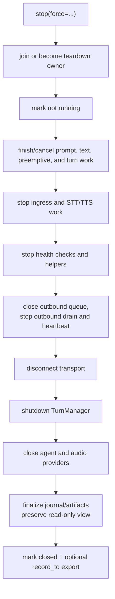

# Chapter 2 — Session Construction and Lifecycle

A `Session` is the ownership boundary for one conversation. It is built
synchronously, started asynchronously, used on one event loop, and stopped
exactly through `stop(force=...)`. Nearly every resource leak or shutdown race
can be understood as a violation of that ownership story.

## 2.1 The Configuration Ladder

EasyCat has two intentionally different configuration levels:



[`EasyConfig`](../../src/easycat/config/easy.py) is an application-facing
description. Its `stt` field may be `"deepgram/nova-2"`, a registered config
dataclass, or a live provider. Its defaults can depend on transport and
provider capabilities: it resolves shortcut strings before computing
smart-turn and audio-alignment defaults.

[`SessionConfig`](../../src/easycat/session/_types.py) is the low-level runtime
input. Its provider fields contain constructed instances. Direct callers use
it only when they need every raw field; most advanced callers should prefer
`Session.from_providers(...)`.

[`create_session`](../../src/easycat/config/_factory.py) is the funnel between
the two. It:

1. allocates the stable session id;
2. constructs journal and artifact resources when debugging is enabled;
3. resolves and validates providers, transport, turn manager, agent bridge,
   and telephony helpers;
4. builds a `SessionConfig` and `Session`;
5. wires outbound call identity and optional debugger/emergency-export hooks;
6. rolls back owned resources if construction fails; and
7. returns an unstarted session.

That last point is important. Callers may subscribe events or attach other
pre-start behavior before any live audio resource opens.

## 2.2 Constructor Versus Builder

The `Session` constructor establishes primitive ownership. The builder
constructs the dependency graph:



Read [`session/_session.py`](../../src/easycat/session/_session.py) until the
single `build_session(self, cfg)` call, then move to
[`session/_builder.py`](../../src/easycat/session/_builder.py). The builder is
the authoritative construction-order map. It returns a frozen
`SessionComponents` bundle, which `Session._unpack()` assigns to its historical
private field names.

The main collaborators have narrow responsibilities:

| Collaborator | Owns | Does not own |
| --- | --- | --- |
| [`AudioRouter`](../../src/easycat/session/_audio_router.py) | ingress, outbound queue drain, transport delivery accounting, AEC reference feed | turn policy or agent history |
| [`STTCommitter`](../../src/easycat/session/_stt_committer.py) | STT event consumption, segment commits, stream teardown | stream start and pre-roll priming (TurnRunner), or when a user turn semantically ends |
| [`TTSScheduler`](../../src/easycat/session/_tts_scheduler.py) | TTS payload preparation, synthesis scheduling, TTS cancellation | agent stream grammar |
| [`TurnRunner`](../../src/easycat/session/_turn_runner.py) | turn-start STT stream priming plus transcript-to-agent-to-TTS orchestration for voice and text turns | raw transport receive loop |
| [`CancelOrchestrator`](../../src/easycat/session/_cancel_orchestrator.py) | control-signal propagation and interruption-history policy | deciding that speech is a barge-in |
| [`GreetingController`](../../src/easycat/session/_greeting.py) | one first-answer greeting task | general agent turns |
| [`SessionJournalSink`](../../src/easycat/session/_journal_sink.py) | event-to-record projection | application reaction to events |

If new behavior spans several collaborators, first ask whether it is a new
orchestration policy or several independent leaf changes. Do not put it back
into the constructor just because `Session` can reach every object.

## 2.3 Typed Late Binding

Collaborators need live session state: the current turn, the current agent
after a swap, enable flags, and lifecycle callbacks. Construction order makes
passing raw values unsafe, while giving every collaborator the whole `Session`
would create tight coupling.

[`session/_wiring.py`](../../src/easycat/session/_wiring.py) solves this with a
frozen `SessionWiringContext` of typed getters and callbacks:



The getters close over `Session` and resolve values when invoked. A
collaborator built early can therefore consult a collaborator-backed state
later without observing a construction-time `None`. `_SessionTurnHandle` in
the same module narrows turn-pointer access for the runner.

When a collaborator needs one more piece of session state, extend the wiring
context deliberately. Avoid a fresh anonymous lambda pile in the builder and
avoid importing `Session` at runtime from a lower layer.

## 2.4 Session and Turn State

Session-wide state includes providers, event bus, journal, helper list,
runtime scope, and lifecycle flags. Turn-specific mutable state belongs in
[`TurnContext`](../../src/easycat/_turn_context.py):

- turn id and monotonically increasing generation;
- the turn's `CancelToken`;
- STT segments and pending segment futures;
- latency milestones;
- bytes sent, playback marks, and acknowledgements; and
- barge-in timing.



The generation protects against stale callbacks, but only if code checks or
retains the correct context. Never fetch `session.current_turn` after an
unbounded await and assume it is the same turn that started the operation.
Capture the `TurnContext` or generation before awaiting.

The builder also creates a `"no-turn"` context for stage calls outside an
active conversation turn. That keeps stage signatures uniform without
pretending idle work belongs to a real turn.

## 2.5 Starting a Session

`Session.start()` is serialized by a lock and is idempotent while already
running. It rejects text sessions and stopped sessions.

The startup order is purposeful:



Non-transport warmup occurs before transport connection because connection
may open a live microphone or media stream. Warming a model for several
seconds after that point would fill the bounded ingress queue before its
consumer starts. Transport warmup occurs after `connect()` because it may need
connection-created resources.

If any step raises or startup is cancelled, `_finish_interrupted_start()`
shields an independently owned rollback task until it releases ingress,
outbound, health checks, helpers, and the transport. Startup cancellation is
not permission to leak partially opened resources.

Read the ordering tests in
[`tests/session/test_session_lifecycle_teardown.py`](../../tests/session/test_session_lifecycle_teardown.py)
and the broader lifecycle scenarios in
[`tests/integration/test_session_lifecycle_e2e.py`](../../tests/integration/test_session_lifecycle_e2e.py).

## 2.6 Background Task Ownership

Async code is not owned merely because a variable once referenced its task.
[`RuntimeScope`](../../src/easycat/runtime/scope.py) retains named tasks until
they are drained, supports group cancellation, and can write scheduled and
terminal journal records. It owns runtime work such as:

- ingress and outbound loops;
- pipeline heartbeat;
- STT pause/commit tasks;
- provider receive loops after their matching STT or TTS finalizer;
- greeting work; and
- post-cutoff barge-in cleanup.

Session constructs an explicit lifecycle root backed by one
`RuntimeSupervisor`/`SurvivorRegistry`. Named child scopes register beneath
that root and share both quotas; a parent drain recursively includes child
work. The audio router's cancellable first-frame transport write is the first
adopted child cohort, so a cancellation-resistant inline send remains anchored
without broadening ownership to unrelated runtime tasks.

Scope teardown policy keeps cooperative token signalling separate from Python
task cancellation. Each member declares graceful and force policies with a
named cohort, optional token signal, `finish` or `cancel` task action, and
optional grace/hard budgets. Teardown synchronously signals every member in a
cohort before awaiting any sibling, then drains cohorts in an explicit phase
order. A hard deadline parks owned work in the shared survivor registry; the
scope reports `closed_with_survivors` until that work settles. Closing a scope
also closes task admission, including callbacks submitted from other threads,
and a force close can supersede an unbounded graceful close without starting a
second concurrent teardown controller.

Non-task teardown steps register as named async finalizers. Their names appear
in the same explicit close sequence as cohorts, so an ordering such as
`outbound` → `transport-disconnect` → `provider-close` is represented without
inventing task-shaped wrappers. An in-flight finalizer is reused when force
supersedes graceful close. Finalizers always retain a typed terminal result;
tasks opt into the same result mode when their caller must preserve raised
cleanup errors. Callers can inspect or pop those results and use `unwrap()` to
apply their existing exception-precedence policy.



“Fire and forget” is usually a leak in a session runtime. If a task can touch a
provider, transport, queue, journal, or session pointer, its owner must retain
it through terminal cleanup. Use stable task names so bundles can reconstruct
concurrency.

## 2.7 Graceful and Forced Stop

`stop()` is the only public teardown verb:

- `stop(force=False)` lets confirmed application prompt work finish, then
  drains and closes the pipeline.
- `stop(force=True)` cancels turn, text, pipeline, TTS, outbound, and scoped
  work before closing providers.
- `async with session:` calls `stop(force=True)` on exit.

Concurrent calls join the active stop. A force request may supersede a hung
graceful owner. The exact internal order is complex because live work must
finish while the resources it needs are still open:



A forced stop cancels the outbound drain earlier, during the pipeline
cancellation step; the later `stop_outbound()` call is idempotent. In both
modes the outbound drain must be stopped before `transport.disconnect()`, or
a pending `send_audio()` could hang on a disconnected transport.

Do not move provider or journal teardown earlier to make a timeout look
bounded. Late cleanup tasks may still need them. Do not detach a
cancellation-resistant task and call the session stopped; the owner must
continue to own it or terminate the resource boundary that contains it.

The accepted lifecycle contract and postmortem surface are summarized in the
[session lifecycle reference](../reference/session-lifecycle.md). The
force-escalation and streaming-prompt cases are tested in
[`tests/session/test_session_streaming_behavior.py`](../../tests/session/test_session_streaming_behavior.py).

## 2.8 Postmortem State

Stopping closes live journal and artifact resources, but the session preserves
a read-only replacement through
[`SessionDebugBackends`](../../src/easycat/session/_debug_backends.py). After a
clean stop:

```python
records = session.journal.read() if session.journal is not None else []
session.export_debug_bundle("runs/call.zip")
```

remain valid. New writes do not. This is why `stop()` has to finalize and
replace backends rather than simply setting references to `None`.
[`tests/session/test_debug_backends.py`](../../tests/session/test_debug_backends.py)
pins that behavior.

## 2.9 Text Sessions

[`create_text_session`](../../src/easycat/config/_factory.py) builds the same
agent stage, runner, event bus, and journal concepts with no-op audio
providers and `runtime_mode="text_session"`. It supports `send_text()` and
rejects `start()`.

Text mode is not a separate agent runtime. It is a narrower entrance to the
same bridge and evidence model, which makes it useful for fast agent tests.
Do not add agent behavior exclusively to the audio start path if text turns
should share it.

## 2.10 Lifecycle Pitfalls

- **Reusing a stopped session:** stopped sessions cannot restart. Construct a
  new one.
- **Building in a hot async path:** construction may touch filesystem state or
  load optional models. A server may use `asyncio.to_thread` for synchronous
  construction, then start/use/stop on the owning loop.
- **Sharing live instances:** a provider or stateful bridge usually belongs to
  one session.
- **Closing only the transport:** the agent, provider clients, health checkers,
  journal, artifact store, and scoped tasks still need teardown.
- **Cancelling the waiter, not the work:** shielding or retaining an owned task
  is necessary when caller cancellation must not interrupt cleanup.
- **Awaiting the current task:** shutdown callbacks can run from a task they
  are stopping. The lifecycle code explicitly avoids awaiting/cancelling
  itself.
- **Adding another teardown verb:** `close()` and `destroy()` aliases would
  split the public lifecycle contract. Extend `stop()` only with evidence and
  a documented migration.

## Checkpoint

1. Why does `create_session()` return before transport connection?
2. Which file is the authoritative collaborator-construction map?
3. Why are the values in `SessionWiringContext` mostly callables?
4. What prevents an STT future from an old turn resolving a new turn's future?
5. Why must debug backends be replaced rather than merely closed?
6. What makes a background task “owned”?

Previous: [Chapter 1 — The System Map](01-system-map.md).
Next: [Chapter 3 — Audio and Turn-Taking](03-audio-and-turns.md).
