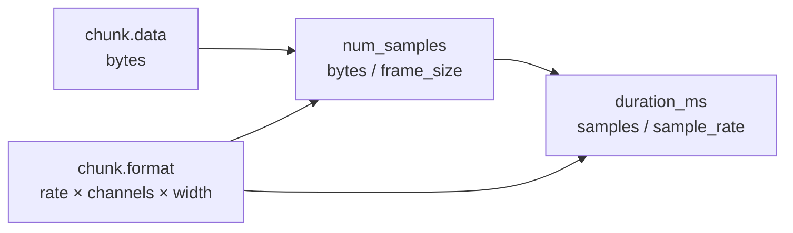
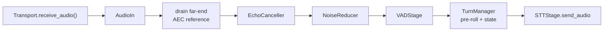
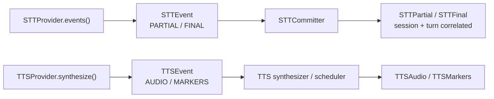
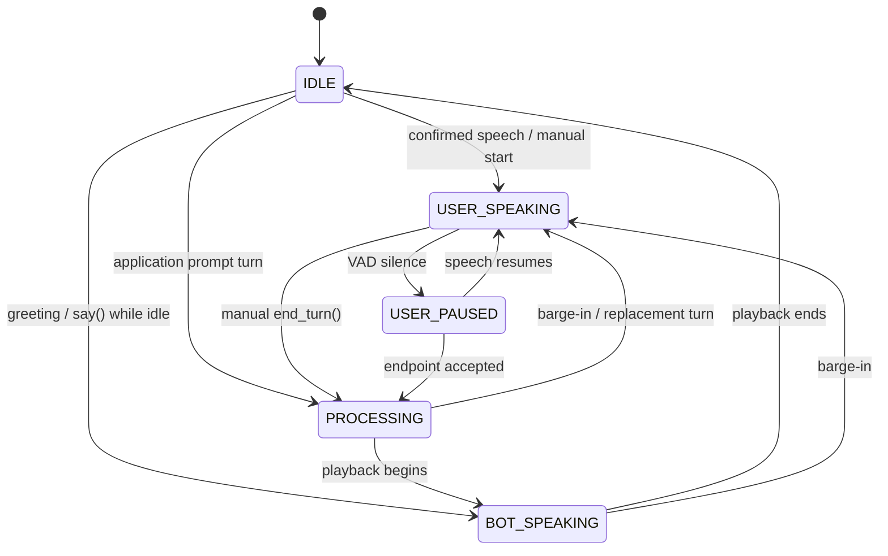
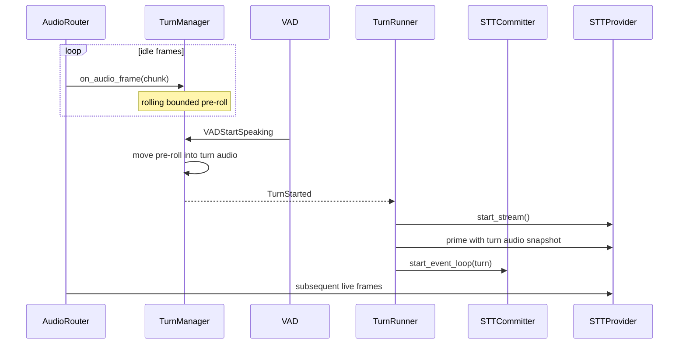
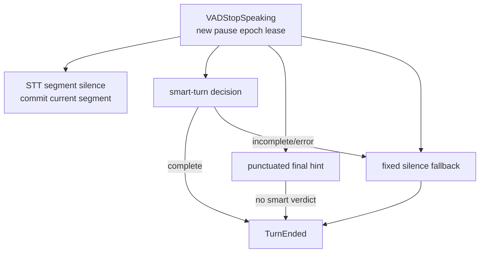
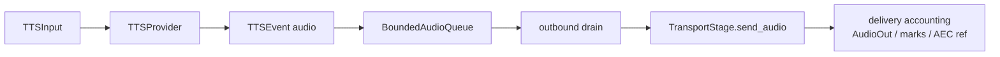
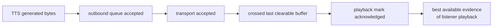

# Chapter 3 — Audio and Turn-Taking

Voice applications are concurrent streaming systems whose control decisions
depend on signal history. A chunk can be correctly typed and still arrive at
the wrong rate; a transcript can be final without proving a conversational
turn is complete; generated speech can exist without having reached the
listener. EasyCat keeps those distinctions explicit.

## 3.1 `AudioChunk` Is the Format Contract

[`AudioFormat`](../../src/easycat/audio_format.py) names sample rate, channel
count, sample width, and encoding. [`AudioChunk`](../../src/easycat/audio_format.py)
couples bytes to that format and derives sample count and duration.

There is no process-global implicit sample rate. Every provider and transport
boundary must either accept the chunk's declared format or convert at one
named boundary. The standard constants (`PCM16_MONO_8K`, `16K`, `24K`, `48K`)
are conveniences, not hidden runtime state.

Audio position is derived from samples and duration, not from how quickly the
event loop happened to schedule frames. That matters for:

- VAD pre-roll and debounce;
- bounded turn-audio windows;
- playback progress;
- latency and barge-in estimates; and
- chunk-split-equivalent resampling.

Start with [`tests/audio/test_audio_format.py`](../../tests/audio/test_audio_format.py)
and the resampling cases in
[`tests/audio/test_audio_utils.py`](../../tests/audio/test_audio_utils.py).

## 3.2 Ingress Pipeline

The live ingress owner is
[`AudioRouter._process_chunk`](../../src/easycat/session/_audio_router.py):

The actual path is conditional: disabled audio processing or VAD stages are
skipped, and STT receives audio only while its committer is active. The
ordering is firm:

1. Decide audio-capture consent at ingress, so buffered audio cannot inherit a
   later permission change.
2. Emit `AudioIn`.
3. Feed transport-delivered far-end reference frames before the matching
   near-end frame when the transport supports that capability.
4. Run AEC on raw microphone audio.
5. Run noise reduction on the echo-cancelled result.
6. Run VAD and pass its events to the event bus and turn manager.
7. Give the processed frame to `TurnManager` for pre-roll/turn capture.
8. Send the frame to STT when an STT stream is active.

[`AudioStage`](../../src/easycat/stages/audio.py) groups AEC and noise
reduction as one replay stage but preserves the internal AEC-before-NR order.
Noise reduction is nonlinear and can destroy the relationship the adaptive
echo canceller needs to converge.

The far-end AEC reference is playback that was accepted at the appropriate
transport boundary, not raw TTS provider output. Feeding generated audio would
teach the canceller about sound the listener may never receive.

## 3.3 Provider Events and Session Events

Providers yield their own normalized event values:

The distinction in [`events.py`](../../src/easycat/events.py) lets provider
implementations stay independent of session correlation and application event
semantics. Session code is the mapping boundary.

An STT `commit_segment()` returning `True` means the provider accepted the
control request. It does not guarantee a later final transcript; silence or an
empty backend response may produce none. `events()` is authoritative for
transcription, and every new stream must return a fresh iterator. Those rules
are executable in
[`src/easycat/testing/contracts.py`](../../src/easycat/testing/contracts.py).

## 3.4 TurnManager State Machine

[`TurnManager`](../../src/easycat/turn_manager.py) consumes VAD events and
processed audio. Its internal state machine is:

(`reset()` additionally returns to `IDLE` from any state.)

The public `TurnState` collapses both speaking and paused user states into
`LISTENING`; the more detailed `TurnManagerState` remains the internal source
of truth.

`TurnManager` owns:

- state transitions and their reasons;
- pre-roll and bounded active-turn audio;
- silence timers and pause epochs;
- VAD versus push-to-talk mode;
- optional semantic endpoint detection; and
- identifying speech during processing/playback as barge-in.

It emits `TurnStarted` and `TurnEnded`. It does **not** emit `STTFinal` or run
the agent. Those are downstream responsibilities.

The exhaustive transition cases live in
[`tests/turns/test_turn_manager.py`](../../tests/turns/test_turn_manager.py);
duration and chunk-count bounds are in
[`tests/turns/test_turn_manager_buffer_limits.py`](../../tests/turns/test_turn_manager_buffer_limits.py).

## 3.5 Pre-Roll and Stream Priming

VAD recognizes speech after it has observed some audio. Without pre-roll,
the consonant or word before the recognition threshold would be lost.

The order is intentional: pre-roll moves into active turn audio before
`TurnStarted` becomes observable. `turn_audio` returns a copy so the runner
can await while priming without iterating a deque that another callback
mutates.

Pre-roll and active-turn audio are bounded by both duration and chunk count.
Duration alone is unsafe when a producer supplies pathological tiny chunks.

## 3.6 Pauses, Segments, and Endpoints Are Different

A VAD stop opens a pause. Three related timers/decisions may then occur:

- `stt_segment_silence_ms` controls when
  [`STTCommitter`](../../src/easycat/session/_stt_committer.py) asks STT to
  finalize a segment. It is stored on `TurnManagerConfig` for a single tuning
  surface but consumed by the session collaborator.
- `end_of_turn_silence_ms` controls the conversational fallback endpoint.
- A terminally punctuated STT final can shorten the fixed timer only for the
  exact pause whose lease accompanied that final.
- A smart-turn complete verdict ends promptly.
- A smart-turn incomplete or error verdict gets the full fallback grace
  **after** the decision. Detector latency is not subtracted, and semantic
  incompleteness takes precedence over punctuation.

Smart turn is [`smart_turn.py`](../../src/easycat/smart_turn.py) running a
bundled ONNX model,
[`models/smart-turn-v3.2-cpu.onnx`](../../src/easycat/models/), so the semantic
endpoint decision is local and adds no network hop — which is why treating its
latency as part of the pause budget above matters.

TurnManager advances a dedicated pause epoch before publishing
`VADStopSpeaking`. Its silence timer and the STT segment future carry leases
captured from that epoch. A delayed final from an earlier pause therefore
cannot shorten a later pause: its exact lease no longer guards successfully.
This is a general asynchronous design pattern—associate delayed evidence with
the identity that requested it and re-check that identity at the effect.

## 3.7 STT Commitment

On turn start, [`TurnRunner.on_turn_started`](../../src/easycat/session/_turn_runner.py)
begins the provider stream, primes pre-roll/turn audio through the STT stage,
and then hands the open stream to the committer's event consumer.
[`STTCommitter`](../../src/easycat/session/_stt_committer.py) owns the STT
event-consumer task, commit timing, and stream teardown:

1. On turn start, run the event consumer (`start_event_loop`) over the stream
   that `TurnRunner` opened and primed.
2. On pause, schedule or immediately request a segment commit.
3. Map provider partial/final events to correlated session events.
4. Append normalized final segments to the captured `TurnContext`.
5. On turn end, settle pending work and end the stream.
6. On cancellation, cancel delayed commits, end the provider stream, and drain
   the event consumer.

Read [`tests/session/test_stt_committer.py`](../../tests/session/test_stt_committer.py)
for ordering cases. A common failure is to end a provider stream before its
event iterator can publish the final response, or to leave an old iterator
alive into the next turn.

## 3.8 Outbound Audio and Backpressure

Agent text is converted into typed TTS inputs, then TTS events become chunks
queued for `AudioRouter`:

[`BoundedAudioQueue`](../../src/easycat/_bounded_queue.py) supports three
policies:

| Policy | Good fit | Audio consequence |
| --- | --- | --- |
| `DROP_OLDEST` | live input where newest context may be preferable | loses the earliest queued audio |
| `DROP_NEWEST` | default outbound speech | preserves already accepted prefix, may trim later chunks |
| `BLOCK` | caller explicitly wants producer backpressure | can increase latency and must have a hard timeout |

Dropping the oldest outbound chunk makes the listener hear an utterance jump
forward mid-sentence. That is why default outbound policy differs from common
live-input queue policy. The builder's constants in
[`session/_builder.py`](../../src/easycat/session/_builder.py) are authoritative
for current size and policy; do not duplicate those numbers in downstream
docs or code.

The router counts a chunk as in flight before awaiting the send lock, so a
dequeued-but-contended chunk cannot disappear from both queue depth and drain
accounting. See
[`tests/session/test_audio_router.py`](../../tests/session/test_audio_router.py).

## 3.9 Accepted, Delivered, and Heard

There are several progressively stronger facts:

Not every transport implements every boundary. Direct transports may emit
`AudioOut` when `send_audio()` accepts a chunk. Buffered transports defer
delivery reporting until a chunk crosses the last buffer a barge-in could
still clear. Playback-capable transports can acknowledge marks.

`TurnContext` retains cumulative sent bytes, mark-to-byte mappings, and ack
history. Interruption code uses the best available evidence:

1. fresh playback acknowledgements;
2. a bounded heuristic tail when acknowledgements are stale; or
3. a conservative delivery estimate when marks are unavailable.

Never equate full generated assistant text with heard text. Chapter 4 follows
this evidence into history mutation.

## 3.10 Audio and Turn Pitfalls

- **Implicit format assumptions:** hard-coding `16000` rather than inspecting
  `chunk.format` creates silent duration and AEC errors.
- **Stateless per-chunk resampling:** restarting conversion at every boundary
  causes chunk-split-dependent drift.
- **NR before AEC:** nonlinear cleaning breaks echo-canceller convergence.
- **Using wall time for audio progress:** scheduler delay is not playback
  duration.
- **Treating VAD stop as turn end:** a pause may resume or be semantically
  incomplete.
- **Treating commit acceptance as transcript completion:** consume provider
  events.
- **Unbounded pre-roll or turn buffers:** long noise/speech turns become memory
  leaks.
- **One queue policy everywhere:** inbound freshness and outbound continuity
  have different priorities.
- **Recording capture consent late:** buffered frames must retain the decision
  made at ingress.
- **Observability on the serialized send path:** a slow diagnostic handler
  must not delay or change accepted audio accounting.

## Checkpoint

1. Why is `AudioChunk.format` more authoritative than provider defaults?
2. Why does AEC run before noise reduction?
3. What is the difference between an STT segment commit and a turn endpoint?
4. How does a pause lease prevent stale punctuation from ending a turn?
5. Why is `DROP_NEWEST` preferable to `DROP_OLDEST` for queued bot speech?
6. Which fact is stronger: transport acceptance or playback-mark
   acknowledgement?

Previous: [Chapter 2 — Session Construction and Lifecycle](02-session-lifecycle.md).
Next: [Chapter 4 — Agents, Streaming, and Interruption](04-agents-and-interruption.md).
