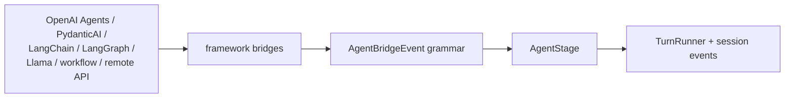
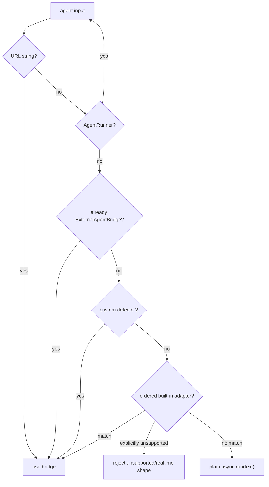
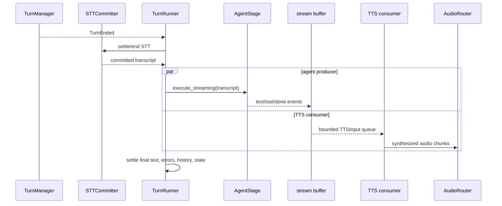
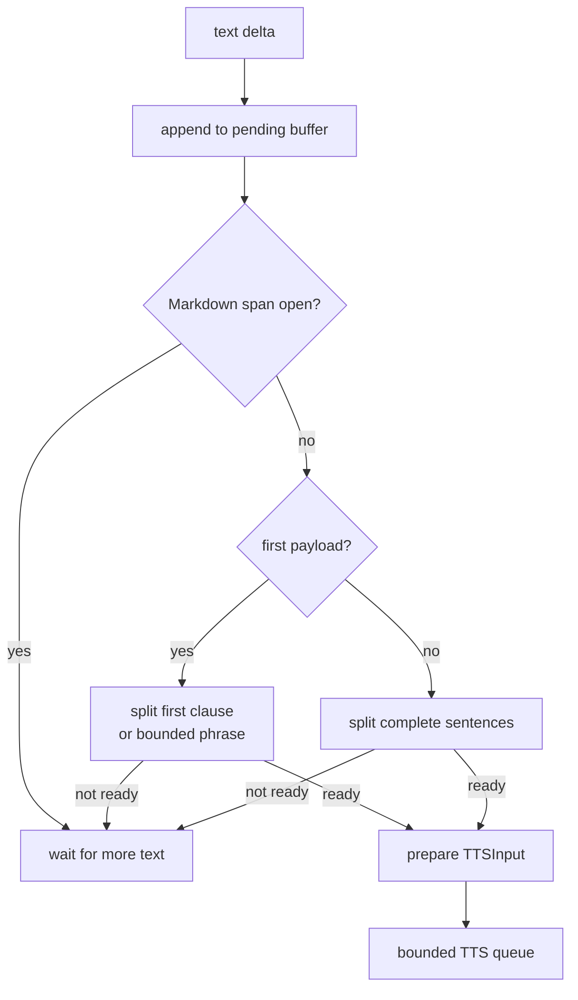
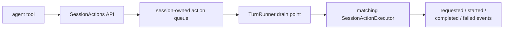
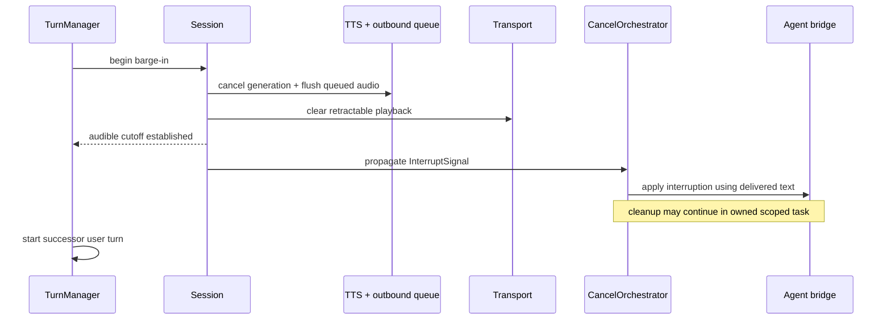
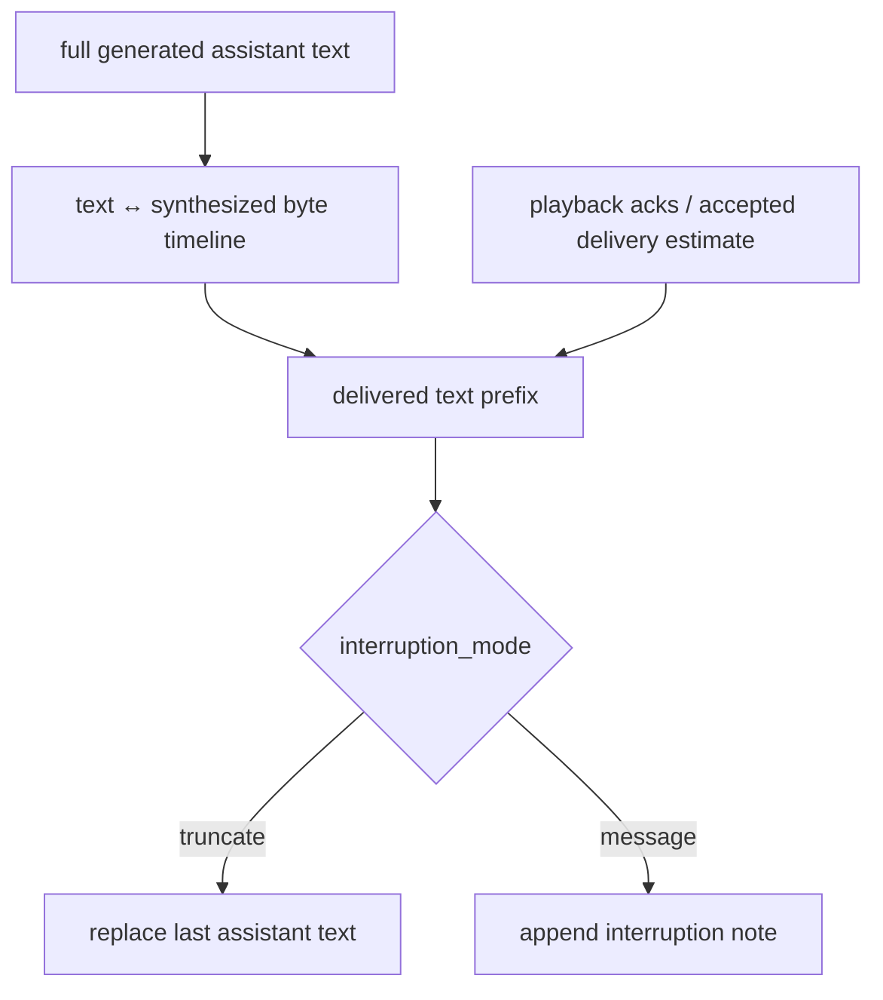

# Chapter 4 — Agents, Streaming, and Interruption

The agent boundary has to normalize very different frameworks while
preserving streaming text, tools, history, cancellation, and framework state.
The speech boundary then begins playback early without committing words the
user never heard. EasyCat's bridge grammar and interruption protocol exist to
make those two problems explicit.

## 4.1 One Bridge Protocol

Every agent path reaches
[`ExternalAgentBridge`](../../src/easycat/integrations/agents/base.py):

```python
def invoke(
    self,
    turn_input: AgentTurnInput,
    recorder: AgentRecorder,
    cancel_token: CancelToken | None = None,
) -> AsyncIterator[AgentBridgeEvent]: ...
```

The protocol also includes state snapshot, interruption application, history
replacement/note operations, and reset. The event grammar is deliberately
small:

| Kind | Important fields | Runtime use |
| --- | --- | --- |
| `text_delta` | `text`, optional `part_index` | append text, emit `AgentDelta`, feed streaming TTS buffer |
| `text_replace` | `text`, `part_index` | replace one indexed text part and repair or cut off TTS safely |
| `tool_started` | `tool_name`, `call_id` | emit and journal tool start |
| `tool_delta` | `call_id`, `text` | stream tool progress |
| `tool_result` | `call_id`, `result` | complete tool evidence |
| `done` | final `text`, optional `structured_output` | close the stream and settle final response |

Framework-specific execution cursors, handoffs, snapshots, and commit
boundaries are carried in the recorder/evidence model without expanding the
public speech grammar for every SDK.

Text has two mutually exclusive stream shapes. Most bridges emit flat,
unindexed `text_delta` events. Frameworks with replaceable response parts emit
indexed `text_replace` snapshots plus indexed `text_delta` continuations. A
repeated replacement at the same index changes the canonical transcript
instead of appending duplicate text.



The contract suite in
[`tests/contracts/test_agent_bridge_contracts.py`](../../tests/contracts/test_agent_bridge_contracts.py)
and the reusable `AgentBridgeContractSuite` in
[`src/easycat/testing/contracts.py`](../../src/easycat/testing/contracts.py)
define observable bridge semantics.

## 4.2 Agent Adaptation

[`auto_adapt_agent`](../../src/easycat/integrations/agents/_factory.py)
recognizes supported framework objects in a policy-sensitive order. The order
is not cosmetic: a compiled LangGraph may also satisfy LangChain's `Runnable`,
so LangGraph detection must happen first.



The URL check runs before everything else, including registered custom
detectors: a URL string resolves to `RemoteResponsesAPIBridge` immediately, so
a detector predicate never sees URL-shaped input. Custom detectors take
precedence over the built-in framework adapters only.

Plain `async run(text) -> str` objects are wrapped by
[`AgentRunner`](../../src/easycat/integrations/agents/_agent_runner.py), which
adds bridge semantics such as timeout, history, cancellation, and optional
preemptive response preparation. `Session` contains a final safety wrapper so
the downstream stack always sees the bridge interface.

Do not detect frameworks by class-name substring alone. Detection must be
cheap, ordered, testable, and fail with actionable input errors for shapes
that require explicit configuration. See
[`tests/integrations/agents/test_factory.py`](../../tests/integrations/agents/test_factory.py).

Bridge cleanup must remain owned even when an SDK exposes a synchronous reset
hook. `LlamaAgentsBridge` starts paused-handler reset work in a named task
scope, and uses a separate scope for handler cancellation that survives its
best-effort deadline. `aclose()` joins reset work without turning the bounded
cancel path back into an unbounded shutdown wait.
Llama and Remote Responses also run each cancel-token-versus-next-item race in
a short-lived named scope. Both sides are cancelled and joined before the
iterator closes; Llama still lets cancellation win immediately, while Remote
Responses still drains an in-flight tool lifecycle when its commit rule
requires that behavior.

## 4.3 The Agent Stage

[`AgentStage`](../../src/easycat/stages/agent.py) is the recordable execution
boundary. It:

- adapts or validates its provider;
- creates an agent recorder for the current run and turn;
- builds `AgentTurnInput` from transcript, history, and optional system
  prefix;
- invokes the bridge and journals deltas, tools, snapshots, and completion;
- maintains shadow history only when the raw bridge does not own history;
- supports state reset and provider replacement; and
- exposes preemptive generation only when the wrapped runner can prepare a
  response transactionally.

Agent history has one authoritative owner per path. `AgentRunner` owns its
wrapped history; raw bridges may receive stage-owned shadow history. Tracking
both would double-add messages. A caller-id system prefix is transient context
for the current turn and must not be folded into persistent history.

## 4.4 TurnRunner: Transcript to Concurrent Agent and TTS

[`TurnRunner`](../../src/easycat/session/_turn_runner.py) connects the control
plane to the agent and speech data planes:



`run_streaming_agent()` launches two owned tasks:

1. an agent consumer that converts bridge events into session events and TTS
   payloads; and
2. a TTS consumer that synthesizes those payloads and settles playback.

The queue between them is bounded. A fast model and slow TTS provider must
create backpressure rather than unbounded text accumulation. Both tasks stay
owned across every exception/cancellation gap, so stale audio cannot escape
into a successor turn.

If both branches fail, the session emits an `ExceptionGroup`-backed pipeline
error so neither cause disappears.

### Stage timeouts

Each of the three slow stages has its own deadline, in
[`timeouts.py`](../../src/easycat/timeouts.py): `TimeoutConfig` carries
`stt_timeout` (10s), `agent_timeout` (30s), and `tts_first_byte_timeout` (5s),
and `validate()` re-checks them at every runtime build boundary because the
dataclass is mutable. Each expiry raises its own coded error —
`STTTimeoutError`, `AgentTimeoutError`, `TTSTimeoutError` — so a stalled turn
names the stage that stalled.

Two of the wrappers are more than `asyncio.wait_for`:

- `with_agent_timeout` guards a **shielded** agent task, so the timeout does
  not race the agent's own cleanup. `_await_agent_task` sets
  `agent_stream_aborted` and cancels only the agent task on expiry — the TTS
  consumer stays alive so a configured failure fallback can still be spoken
  (§4.4).
- `with_tts_timeout` is a **first-byte** deadline over an async iterator, not a
  whole-synthesis budget. It arms until the first *non-empty audio* event;
  marker and empty-audio events are still yielded but neither disarm nor reset
  the original deadline, so a provider that emits markers promptly and audio
  never does still times out.

Consumers are `session/_stt_committer.py`, `_turn_runner.py`,
`_tts_scheduler.py`, `_tts_synthesizer.py`,
`integrations/agents/_agent_runner.py`, and `config/easy.py` (which surfaces
`timeouts=` on `EasyConfig`). These are *stage* budgets and are distinct from
the teardown budgets in
[`teardown_budgets.py`](../../src/easycat/teardown_budgets.py) discussed in
§2.6 — one bounds how long a stage may take to answer, the other bounds how
long teardown may take to give up.

## 4.5 Streaming Text to Speech

[`consume_agent_stream`](../../src/easycat/session/_streaming.py) separates
bridge grammar from orchestration. Its sentence buffer balances three goals:

- emit the first natural clause or bounded first phrase early to reduce
  time-to-first-audio;
- use full sentence boundaries after the first payload; and
- avoid speaking incomplete Markdown constructs.



When Markdown stripping is enabled, the buffer does not rerun regex-heavy
analysis on every tiny token. Trigger character sets cause a recheck only when
a delta could close a sentence, first clause, or Markdown span. The final
`done` event replaces/flushes pending text and closes the stream defensively.

The invariants around chunk boundaries, Markdown, and first-payload latency
are tested in:

- [`tests/session/test_session_streaming_segmentation.py`](../../tests/session/test_session_streaming_segmentation.py)
- [`tests/session/test_session_streaming_markdown.py`](../../tests/session/test_session_streaming_markdown.py)
- [`tests/session/test_session_streaming_consumer.py`](../../tests/session/test_session_streaming_consumer.py)

Indexed replacements remain repairable until a TTS payload crosses the
sentence buffer. If a later replacement changes text after that boundary,
EasyCat cancels and clears current playback and suppresses further speech for
the turn. The agent continues so `AgentFinal` and framework history receive
the corrected transcript; EasyCat does not replay a correction over words the
caller may already have heard.

## 4.6 TTS Preparation and Scheduling

[`TTSScheduler`](../../src/easycat/session/_tts_scheduler.py) converts response
text into [`TTSInput`](../../src/easycat/tts/input.py), applies configured
output processors/Markdown policy, and owns synthesis cancellation and
speaking lifecycle.

TTS text is represented in two related forms:

- provider-facing text/metadata, after configured processing; and
- an estimation timeline used to map audio bytes back to spoken text.

Processors that alter pronunciation or insert pauses must preserve a useful
timeline. Otherwise interruption code may truncate history at the wrong
place. After final output processing succeeds, the bridge's last assistant
history is replaced with the cleaned final form so the next model turn does
not condition on raw Markdown or unspoken markup.

[`_tts_synthesizer.py`](../../src/easycat/_tts_synthesizer.py) drives provider
events and enforces first-audio and cancellation barriers. Its focused tests
are in [`tests/tts/test_tts_synthesizer.py`](../../tests/tts/test_tts_synthesizer.py).

## 4.7 Tools and Session Actions

Tool events describe work inside the agent framework. Session actions request
changes to the live voice session or call:



[`session/actions.py`](../../src/easycat/session/actions.py) defines typed core
actions such as end call, transfer, DTMF, SMS, DNC changes, and custom
requests. Executors declare `supports(action)` and perform the operation.
Session appends a core executor after configured executors.

Action cancellation and audible interruption are separate policies. An action
may set `no_interrupt` while it reaches a safe point, but code must not use a
long-running tool as justification for continuing stale bot audio. Review
[`tests/session/test_session_actions.py`](../../tests/session/test_session_actions.py).

## 4.8 Barge-In Is a Multi-Phase Protocol

When VAD reports speech during `PROCESSING` or `BOT_SPEAKING`,
`TurnManager` invokes the session's barge-in callback. The critical sequence
is:



The first responsibility is audible cutoff. Model generation and tool cleanup
can be slower. [`CancelOrchestrator`](../../src/easycat/session/_cancel_orchestrator.py)
fans out the observable signal and applies history policy; stage
`handle_upstream()` methods record the signal but do not perform teardown.

The old-turn cleanup task remains owned by `RuntimeScope` while the new user
turn begins. Graceful session stop drains that cleanup before closing its
providers and journal.

## 4.9 Delivered Text and History

[`session/interruption.py`](../../src/easycat/session/interruption.py) combines
TTS chunk timelines with playback evidence from `TurnContext`. The result is
the best estimate of assistant text actually delivered before cutoff.

Two interruption history modes are supported:

- `truncate`: replace the last assistant message with delivered text plus a
  truncation marker;
- `message`: append an explicit system/developer interruption note, for
  frameworks that support interleaved system context.



The user's current request remains in history. Undelivered assistant output
does not. See the property and timing tests in
[`tests/session/test_interruption_property.py`](../../tests/session/test_interruption_property.py)
and
[`tests/session/test_interruption_cutoff_latency.py`](../../tests/session/test_interruption_cutoff_latency.py).

## 4.10 Framework-State Atomicity

Conversation history is not the only state a framework may hold. Graph
checkpoints, workflow cursors, tool state, and model response ids can also
change on interruption.

The shared helper in
[`integrations/agents/base.py`](../../src/easycat/integrations/agents/base.py)
uses four-step ordering:

1. plan a mutation and persist its pre-state;
2. write `FrameworkStateCommitted`;
3. apply the planned mutation; and
4. persist post-state plus a cancellation boundary, or record
   `InterruptionApplyFailed`.

If the journal is already degraded before the mutation commit record, the
bridge skips the mutation and falls back rather than creating unrecorded state
change. Tests live in
[`tests/integrations/agents/test_apply_standard_interruption.py`](../../tests/integrations/agents/test_apply_standard_interruption.py).

## 4.11 Agent and Interruption Pitfalls

- **Calling framework SDKs directly from Session:** this bypasses the bridge
  grammar, recorder, history, and cancellation contract.
- **Declaring `invoke` as an async coroutine returning an iterator:** bridge
  implementations are async generator functions; calling them returns the
  iterator directly.
- **Double-owning history:** a runner and stage must not both append the same
  messages.
- **Assuming `done` will naturally exhaust every generator:** close the stream
  defensively after terminal protocol.
- **Waiting for tools before cutting audio:** audible cutoff is independent.
- **Committing generated text:** history should reflect delivered text.
- **Using one bridge across sessions:** mutable framework/history state is
  session-owned unless explicitly proven shareable.
- **Dropping task references on cancellation:** cancelled generators and TTS
  tasks still need to unwind.
- **Speaking inside open Markdown:** wait or normalize before TTS.
- **Changing output text without updating history/timeline:** the next turn and
  interruption estimator will disagree.

## Checkpoint

1. Why is the adapter order observable policy?
2. Which layer maps `tool_started` to `ToolCallStarted`?
3. Why are agent production and TTS consumption separate tasks?
4. What lets the first audio begin before the model completes a sentence-long
   response?
5. Which work must happen before a barge-in callback returns to
   `TurnManager`?
6. Why can framework checkpoint state not simply be replaced after writing
   history?

Previous: [Chapter 3 — Audio and Turn-Taking](03-audio-and-turns.md).
Next: [Chapter 5 — Providers, Stages, and Extensions](05-providers-and-extensions.md).
