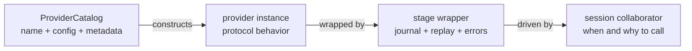
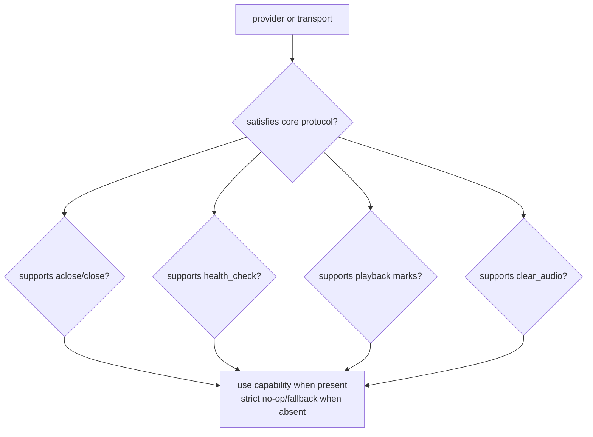
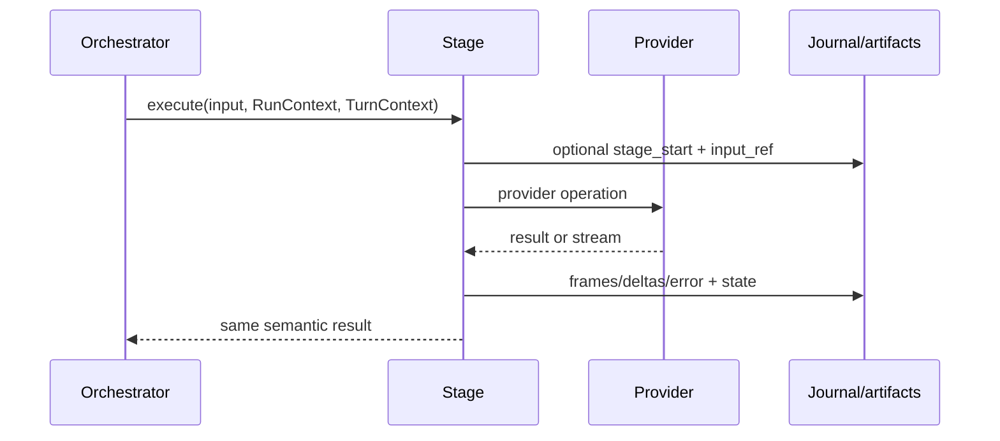
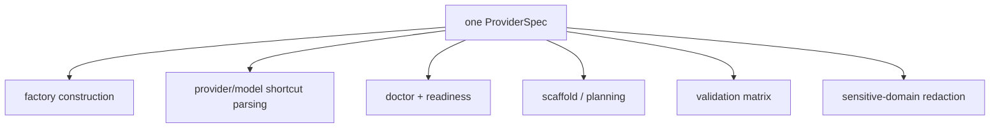
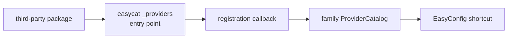
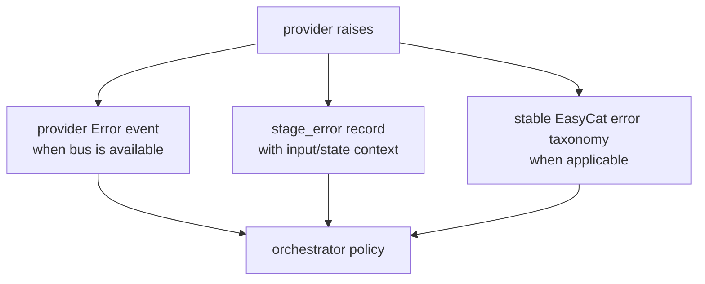
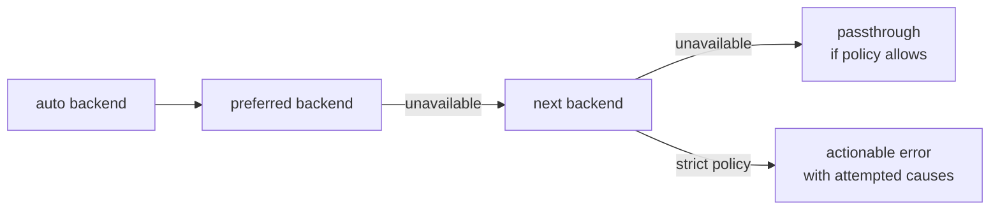

# Chapter 5 — Providers, Stages, and Extensions

EasyCat separates the object that performs work from the wrapper that records
the work, and separates both from the catalog that constructs named
integrations. This keeps third-party providers small while giving the runtime
uniform lifecycle, error, discovery, and replay behavior.

## 5.1 Three Different Concepts



- A **provider** implements the structural behavior in
  [`providers.py`](../../src/easycat/providers.py).
- A **stage** implements the uniform execution/evidence surface in
  [`stages/base.py`](../../src/easycat/stages/base.py).
- A **catalog** maps names and config types to implementations and discovery
  metadata in [`_provider_catalog.py`](../../src/easycat/_provider_catalog.py).

Provider authors usually implement the protocol, not a stage. Session creates
the standard stage wrappers. A catalog is optional for direct instance
injection but required for named shortcuts and package discovery.

## 5.2 Structural Provider Protocols

The core protocols are runtime-checkable and use duck typing:

| Protocol | Data shape | Lifecycle highlights |
| --- | --- | --- |
| `STTProvider` | audio in, `STTEvent` stream out | `start_stream`, `commit_segment`, `end_stream`, fresh `events()` |
| `TTSProvider` | `TTSInput`/text in, `TTSEvent` stream out | `synthesize`, `stop`, `cancel` |
| `VADProvider` | audio in, VAD events out | `process`, `configure` |
| `NoiseReducer` | audio in/out | stateful `process` |
| `EchoCanceller` | near-end audio in/out, far-end reference in | `process`, `feed_reference` |
| `Transport` | bidirectional audio | `connect`, `disconnect`, `receive_audio`, `send_audio` |

All versioned providers expose `version_info()`. The agreed keys let a bundle
identify the provider/model/API/SDK that produced a failure without leaking
credentials.

Runtime-checkable protocols verify member presence, not full async semantics,
stream termination, return types, or resource behavior. They are dispatch
tools, not sufficient conformance tests.

## 5.3 Optional Capabilities Stay Optional

Only universally required behavior belongs on a runtime-checkable protocol.
Transport playback marks, buffered-audio clearing, pending playout, AEC
reference drains, provider warmup, health checks, and close hooks are
discovered structurally in
[`runtime/capabilities.py`](../../src/easycat/runtime/capabilities.py).



Adding a rare method to `Transport` would make every otherwise valid minimal
transport fail `isinstance(..., Transport)`. Add an optional capability helper
unless the observable guarantee truly applies to every implementation.

`EventBusBindable` is a public optional protocol because live provider
instances may need the session bus. Its `set_event_bus()` hook is synchronous
and runs during construction before provider work begins.

## 5.4 Stages Are Evidence Boundaries

Every concrete stage supplies:

- an `execute` path;
- a serializable state snapshot;
- a replay path; and
- `handle_upstream` for control-signal observation.



The concrete wrappers are:

- [`AudioStage`](../../src/easycat/stages/audio.py) for AEC + NR;
- [`VADStage`](../../src/easycat/stages/vad.py);
- [`STTStage`](../../src/easycat/stages/stt.py);
- [`AgentStage`](../../src/easycat/stages/agent.py);
- [`TTSStage`](../../src/easycat/stages/tts.py);
- [`TransportStage`](../../src/easycat/stages/transport.py); and
- [`TurnStage`](../../src/easycat/stages/turn.py) for smart endpoint decisions.

`RunContext` carries session/run identity, journal, artifact store, debug
detail, and capture-consent access. `TurnContext` carries the turn correlation
and cancellation state.

In `debug="light"`, stages avoid expensive per-frame artifacts and spans. In
`full`, input/output refs permit replay. Stage wrappers also attribute
exceptions to a stable stage/provider/surface and attach journal sequence
context.

Control signals are observational in stages. `handle_upstream()` can update
local evidence state and journal the signal, but real cancellation belongs to
the session orchestrator and provider lifecycle calls.

## 5.5 Provider Catalogs

[`ProviderSpec`](../../src/easycat/_provider_catalog.py) groups construction
and discovery metadata:

- provider class and config class;
- credential environment variable;
- optional-dependency extra;
- sensitive API domains;
- optional import probe module;
- static and config/model-dependent capabilities.



This is why a provider addition is not complete if only its factory branch
works. Parallel name, environment, extra, and domain lists would inevitably
drift.

STT and TTS define built-in specs in
[`stt/factory.py`](../../src/easycat/stt/factory.py) and
[`tts/factory.py`](../../src/easycat/tts/factory.py). VAD, noise reduction,
and echo cancellation keep optimized built-in fallback configuration while
using extension-only catalogs for third-party config types. Their built-ins
share one config type, so registering the same config type several times
would make reverse dispatch ambiguous.

[`_provider_registry.py`](../../src/easycat/_provider_registry.py) aggregates
the family catalogs only for consumers that need a cross-family view. Provider
families remain independently importable.

## 5.6 Registration and Entry Points

Direct instance injection always works:

```python
session = Session.from_providers(
    stt=my_stt,
    tts=my_tts,
    vad=my_vad,
    transport=my_transport,
    agent=my_agent,
)
```

Reusable packages can register a provider/config pair and expose a package
entry point:



Discovery is lazy and one-time. Registration is idempotent only when class and
metadata match exactly; a conflicting duplicate raises. Names are normalized
and role-qualified by their catalog so an STT `"openai"` and TTS `"openai"`
do not overwrite one another.

Use the dedicated guides under [`docs/extending/`](../extending/) for complete
out-of-tree examples.

## 5.7 Event Bus Injection

There are two supported construction cases:

1. A provider config dataclass declares an optional `event_bus` field. The
   catalog/factory returns a replaced config with the shared bus when the field
   is unset.
2. A prebuilt live instance implements `set_event_bus(event_bus)`. `Session`
   calls it before work starts.

An explicitly configured provider bus wins. Do not guess and mutate private
attributes in new code; compatibility probes for older providers are a
fallback, not the contract.

STT and TTS providers yield provider-scoped normal events, while provider
failures may publish session `Error` events through the injected bus.
[`ProviderErrorEmitter`](../../src/easycat/_provider_helpers.py) places
asynchronous error-emission tasks in a named child of the Session runtime
scope. Standalone providers use a local scope with the same drain semantics.
That explicit ownership keeps pending publications alive, joins them during
provider teardown, and leaves no detached task dangling during interpreter
shutdown.

## 5.8 Failure and Teardown Semantics

Provider failures cross two evidence paths:



Publishing an error while a provider lifecycle lock is held must not await
arbitrary application handlers. The helper schedules and owns emission so
locking and application behavior do not deadlock.

Providers holding sockets, HTTP clients, model state, or worker resources
should implement `aclose()` or `close()`. These remain optional protocol
capabilities, and Session calls the capability helper during stop.
Built-in STT providers also expose the internal `RuntimeScopeBindable`
capability: Session attaches interruptible provider writes to its
`stt-runtime` cohort, while standalone providers create and close a local
scope. This makes cancellation ownership visible without adding lifecycle
methods to the minimal public STT protocol.

Cancellation operations should be idempotent and prompt. `TTSProvider.stop()`
means graceful synthesis stop; `cancel()` means immediate discard. STT
`end_stream()` must cause the matching event iterator to terminate.

## 5.9 Built-In Fallbacks

Fallback is explicit policy, not exception swallowing:

- VAD auto mode tries Silero, FunASR, TEN, then Krisp and raises with collected
  installation evidence when none resolves.
- Noise reduction auto mode tries Krisp, then RNNoise, then follows its
  `fallback_policy` (passthrough or error).
- Echo cancellation uses LiveKit AEC when enabled/available, then follows its
  fallback policy.



When a caller selects a concrete backend, failure should be loud. Silent
fallback would make benchmarks, quality expectations, and deployment
readiness dishonest.

## 5.10 Testing an Extension

The installable contract kit in
[`easycat.testing`](../../src/easycat/testing) provides offline suites for
STT, TTS, VAD, transports, and agent bridges. For example:

```python
from easycat.testing import STTProviderContractSuite


class TestAcmeSTT(STTProviderContractSuite):
    provider_factory = AcmeSTT
```

The suite checks more than protocol membership: lifecycle, event types,
iterator termination/freshness, cancellation, version metadata, and redaction.
EasyCat's own provider contract map is
[`tests/contracts/README.md`](../../tests/contracts/README.md).

A provider change may need four evidence levels:

1. provider unit tests with a fake client;
2. offline contract/cassette tests;
3. session wiring tests proving event bus, formats, and teardown; and
4. explicitly marked live canaries.

Use `just guard-contracts` or `uv run easycat validate contracts`, then run a
live lane only when credentials and external provider behavior are genuinely
in scope.

## 5.11 Provider Extension Checklist

For an in-tree STT/TTS provider:

1. add one implementation module and typed config;
2. add one `ProviderSpec` to the family catalog;
3. implement `version_info`, teardown, normalized events, and error
   publication;
4. verify string parsing and config construction;
5. add unit and offline contract/cassette coverage;
6. add an optional, correctly marked live canary;
7. update relevant extras and install guidance; and
8. update provider docs/examples without adding a second metadata table.

For an out-of-tree provider, use direct injection first, then registration and
entry points if named discovery is valuable. Choose the scaffold matching the
provider surface (`provider` remains the VAD name for compatibility):

```bash
uv run easycat init my-stt --template provider-stt
uv run easycat init my-tts --template provider-tts
uv run easycat init my-vad --template provider
```

## 5.12 Provider and Stage Pitfalls

- **Subclassing a framework base unnecessarily:** structural protocols are the
  public boundary.
- **Writing a custom stage for a normal provider:** it bypasses shared replay
  and error semantics.
- **Using `isinstance` as conformance proof:** run the behavioral contract
  suite.
- **Adding metadata in doctor/scaffold only:** the catalog must be the source.
- **Requiring optional hooks on the core protocol:** minimal providers become
  invalid.
- **Reusing a cached STT iterator:** later turns silently lose transcripts.
- **Emitting `STTFinal` from a provider:** providers yield `STTEvent`; Session
  maps it.
- **Holding a lifecycle lock while awaiting EventBus:** application handlers
  can block or reenter teardown.
- **Ignoring stream state across chunks:** resamplers, recurrent filters, and
  websocket contexts often require continuity.
- **Silently falling back after an explicit backend choice:** configuration no
  longer means what it says.

## Checkpoint

1. What is the difference between provider, stage, and catalog?
2. Why is playback acknowledgement not a required `Transport` method?
3. Which object should own provider credential/install metadata?
4. Why are VAD's built-in configs not four ordinary reverse-dispatched catalog
   specs?
5. What does a contract suite prove that `isinstance` cannot?
6. Why does a provider error emitter retain its emission tasks?

Previous: [Chapter 4 — Agents, Streaming, and Interruption](04-agents-and-interruption.md).
Next: [Chapter 6 — Runtime, Journals, and Debugging](06-runtime-and-debugging.md).
