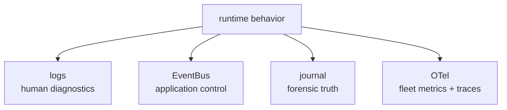
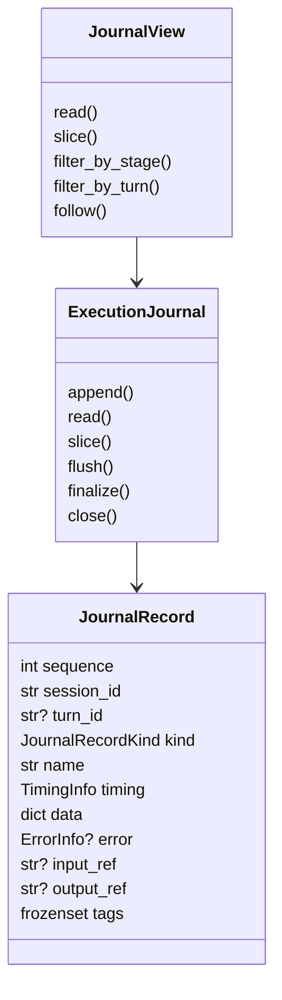
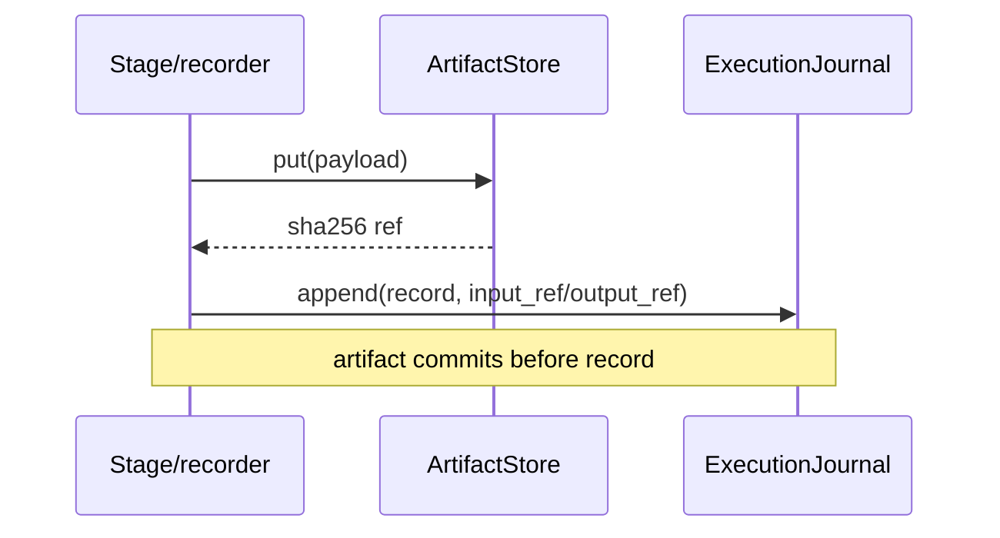
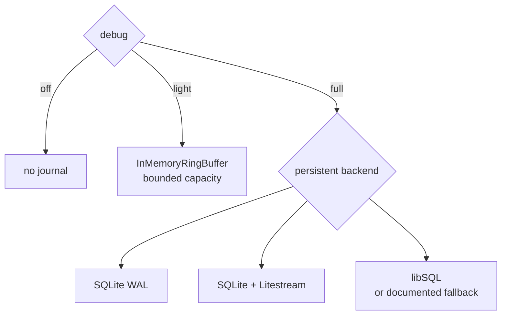
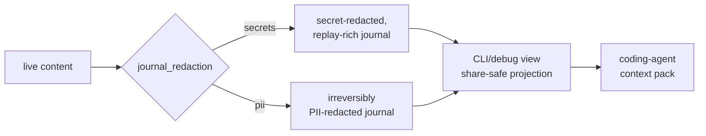
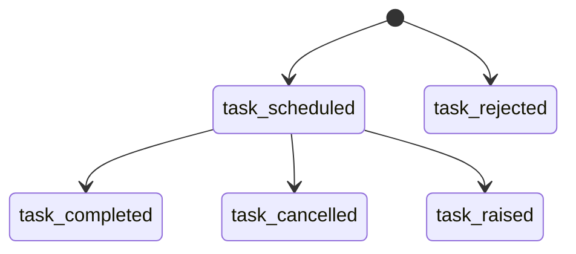
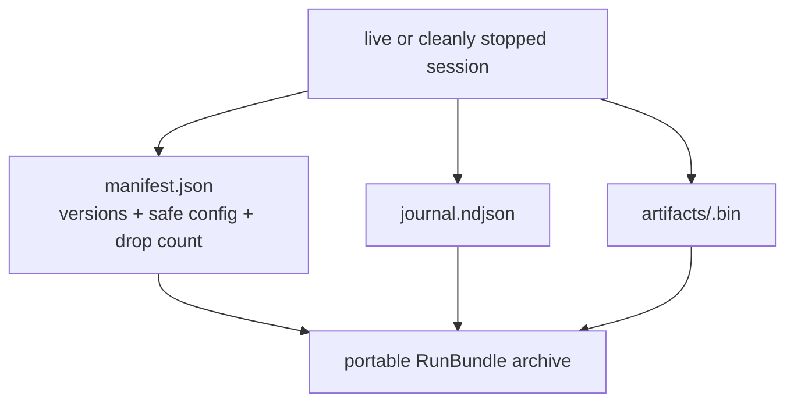
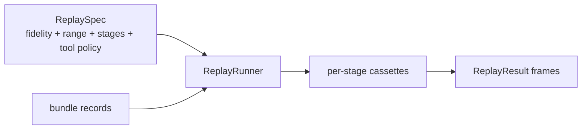

# Chapter 6 — Runtime, Journals, and Debugging

Voice bugs are often temporal: an endpoint fired early, a stream finished
late, one task cancelled another, or audio crossed a buffer just before a
barge-in. A traceback alone rarely proves that sequence. EasyCat's runtime is
therefore journal-first: live behavior creates structured evidence that can be
queried, bundled, replayed, and compared after the session stops.

## 6.1 Four Observation Layers

The layers have different guarantees:

| Layer | Code | Best question | Durability/privacy |
| --- | --- | --- | --- |
| stdlib logs | [`_logging.py`](../../src/easycat/_logging.py) and module loggers | “What should a human notice now?” | lossy; app-controlled |
| EventBus | [`events.py`](../../src/easycat/events.py) | “What should application code react to?” | live, in-process |
| execution journal | [`runtime/`](../../src/easycat/runtime) | “What exactly happened in this session?” | structured; light or durable; PII-bearing |
| OpenTelemetry facade | [`_observability.py`](../../src/easycat/_observability.py) | “How is the fleet behaving?” | low-cardinality, PII-scrubbed |



Do not parse logs for correctness. Do not use the journal as a synchronous
application command bus. Do not put transcripts or session ids into
low-cardinality telemetry. The detailed policy lives in
[`docs/observability.md`](../observability.md).

## 6.2 EventBus Is Live Control

[`EventBus.emit`](../../src/easycat/events.py) invokes matching handlers
inline and awaits asynchronous handlers. Dispatch order is: `subscribe_all`
handlers first, then handlers for the exact event type, then handlers for each
parent class up to `Event`; subscription order is preserved only within each
of those buckets. The default error
policy logs/counts a handler failure and continues; strict tests can select
`handler_error_policy="raise"`.

Inline dispatch means a slow handler can affect a latency-critical emitter.
Use the slow-handler threshold while diagnosing callbacks and keep
application handlers bounded. Components that own a callback lifecycle should
retain the returned `EventSubscription` and unsubscribe during teardown.

[`SessionJournalSink`](../../src/easycat/session/_journal_sink.py) subscribes
to events and projects them into stable record names. The journal also
receives stage/task detail that never appears on the public bus, so the two
surfaces are not redundant.

## 6.3 Journal Record Model

[`JournalRecord`](../../src/easycat/runtime/records.py) carries:

- a monotonically assigned `sequence`;
- session id and optional turn id;
- kind and stable name;
- wall, monotonic, and CPU timing;
- JSON-safe data and optional structured error;
- optional content-addressed input/output refs; and
- tags.



The `ExecutionJournal` protocol in
[`runtime/journal.py`](../../src/easycat/runtime/journal.py) is append-only and
must not raise from `append`; backend failures enter degraded mode. Readers
use a read-only `JournalView`. Stable record names shared by producers and
consumers live in [`runtime/records.py`](../../src/easycat/runtime/records.py)
and schema rules in
[`runtime/record_contracts.py`](../../src/easycat/runtime/record_contracts.py).

Adding a field after release requires a default so older bundles remain
loadable. Renaming a record or changing meaning is a persisted-schema change,
not a private refactor.

## 6.4 Artifacts and Atomic References

Large audio/framework payloads live in an
[`ArtifactStore`](../../src/easycat/runtime/artifacts.py). The SHA-256 content
digest is the ref stored on a record:



The order prevents durable records from pointing at payloads that were never
stored. Artifact stores are bounded. When full, they refuse new data rather
than evict still-referenced content and creating dangling refs.

Filesystem artifacts use restrictive permissions and atomic sibling rename.
Blocking stores declare `writes_block`; capture helpers offload them so disk
I/O does not run directly on the audio loop.

## 6.5 Debug Modes

[`create_journal`](../../src/easycat/runtime/journal_factory.py) turns the
`debug` setting into a precise evidence contract:

| Mode | Journal | Stage detail/artifacts | Intended use |
| --- | --- | --- | --- |
| `off` | none | none | lowest overhead, no forensic record |
| `light` | bounded in-memory ring | turn/control/error history; no per-frame capture | default development/operational context |
| `full` | selected persistent backend | replay-complete configured detail | production incidents and deep debugging |



Light-mode eviction is observable through dropped-record counts and synthetic
follow gaps. Full-mode durability, clean-close, recovery, and retention are
specified in
[`src/easycat/runtime/DURABILITY.md`](../../src/easycat/runtime/DURABILITY.md).

Debug level, storage backend, capacity, retention, redaction, and audio
capture consent are orthogonal. Increasing debug detail does not override
capture consent.

## 6.6 Privacy Model

Raw journals contain transcripts, agent output, tool arguments, provider
responses, and call context needed for faithful debugging. Treat them as
sensitive.



The default write policy removes credentials while retaining replay-critical
content. `journal_redaction="pii"` is an explicit irreversible choice.
Redacted CLI output and coding-agent exports apply another share-safe
projection regardless of raw policy.

Audio capture is a separate consent policy. The decision is stamped at
ingress and survives buffering. Capturing an AEC reference is a further
explicit, decimated diagnostic opt-in because per-frame writes would add
pressure and sensitive audio.

Redaction rules and reports live in
[`validation/redaction.py`](../../src/easycat/validation/redaction.py). Contract
tests guard cassettes and provider metadata against credentials.

## 6.7 Task and State Evidence

Stages record input/output boundaries, but concurrency needs its own evidence.
`RuntimeScope.create_journaled_task()` writes:



The turn manager journals every state transition with from-state, to-state,
reason, and turn id. Agent recorders add framework unit entry/exit, tool
phases, handoffs, state commits, and cancellation boundaries. Together these
records let a bundle answer not just “what output appeared?” but “which
concurrent task and decision caused it?”

Stable task and record names matter. Python object ids and wall-clock-only
labels do not survive replay.

Scope terminal results complement journal evidence when teardown code must
preserve an exception for its direct caller. Each retained result identifies
its lifecycle owner, member name, task/finalizer kind, and terminal status;
the scope keeps it until the owner inspects or pops it.

## 6.8 Bundles

[`export_debug_bundle`](../../src/easycat/debug/export.py) snapshots a session
into:



[`RunBundle`](../../src/easycat/debug/bundle.py) validates archive paths,
artifact hashes, limits, format versions, and manifests. It can load exported
archives or recover a raw SQLite journal plus artifacts. A bundle can filter
by stage/turn/sequence and create a per-stage replay cassette.

Export reads a stable record/artifact snapshot or surfaces a gap. It must not
silently claim that a racing partial snapshot is complete. Writes use an
atomic final rename and reject overwriting unless explicitly requested.

`record_to=` exports automatically on clean stop. Emergency export is an
explicit process-level opt-in with one shared hook registry, not a default
global side effect.

## 6.9 Replay

[`runtime/replay.py`](../../src/easycat/runtime/replay.py) defines one replay
spec and three fidelity levels:

| Fidelity | Behavior |
| --- | --- |
| `ARTIFACT` | use captured stage outputs for deterministic reconstruction |
| `SIMULATED` | execute simulated boundaries according to replay support |
| `LIVE` | re-drive selected live providers from captured inputs |

Tool replay defaults to `DENY`; callers explicitly select `STUB` or `ALLOW`.
Live side effects are never a harmless default.



Fast artifact replay masks known nondeterministic fields such as clocks.
Provider version checks surface skew; forcing through mismatch may downgrade
the determinism claim. Replay only starts at committable checkpoints when
framework state requires it.

See [`tests/runtime/test_replay.py`](../../tests/runtime/test_replay.py) and
[`tests/debug/test_replay_and_bundle.py`](../../tests/debug/test_replay_and_bundle.py).

## 6.10 Debugger and CLI

The CLI and browser debugger are projections over the same records, serializer,
and bundle model:

- `easycat bundles list/show/export`
- `easycat inspect`
- `easycat replay`
- `easycat latency`
- `easycat journal grep/follow/promote`
- `easycat diff`
- `easycat debugger serve`

The debugger server is in [`debugger/`](../../src/easycat/debugger). Its leaf
modules separate source adapters, record filtering, audio coercion, and AEC
diagnostics. It is loopback-only by default; remote exposure is a security
decision, not a convenience flag to add to examples.

`debug/_serialize.py` is the canonical record/config-to-JSON walk shared by
exports and the debugger. Adding a second serializer would let live and
postmortem views disagree.

## 6.11 A Forensic Workflow

When a report says “the bot cut me off and then spoke over me”:

1. Get the journal/bundle and confirm whether records were dropped.
2. Run a summary and issues rollup:

   ```bash
   uv run easycat bundles show PATH --issues
   ```

3. Identify the affected turn and inspect `turn_state_changed`,
   VAD start/stop, STT final, smart-turn, interruption, bot speaking, and
   playback-ack records.
4. Inspect scheduled/completed/cancelled task pairs for the turn.
5. Compare audio positions and playback evidence, not just timestamps.
6. Filter stage records to determine whether the fault entered at transport,
   audio processing, VAD, STT, agent, TTS, or playback.
7. Promote the turn into a regression bundle:

   ```bash
   uv run easycat journal promote PATH TURN_ID --out regression.bundle
   ```

8. Write the smallest deterministic failing test before changing timing
   constants.

This evidence order prevents tuning a silence threshold to hide a stale task
or format bug.

## 6.12 Runtime and Debugging Pitfalls

- **Using logs as a contract:** logs are intentionally lossy and human-facing.
- **Using EventBus as storage:** it disappears with the process.
- **Treating raw bundles as share-safe:** transcripts and tools are sensitive.
- **Appending before artifact commit:** creates dangling durable refs.
- **Evicting referenced artifacts:** breaks replay of retained records.
- **Adding record fields without defaults:** older bundles stop loading.
- **Ignoring ring-buffer gaps:** absence of a record is not proof when
  eviction occurred.
- **Running blocking artifact writes on the audio loop:** diagnostics become
  the latency bug.
- **Allowing replay tools by default:** a debug command can repeat production
  side effects.
- **Duplicating serialization/filter rules:** CLI, debugger, and bundle views
  drift.
- **Closing the journal before owned cleanup:** final cancellation/error
  evidence disappears.

## Checkpoint

1. Which observation layer should drive application behavior?
2. Why does a journal record reference an artifact only after `put()`?
3. What evidence disappears in light mode, and what remains?
4. Why are redaction and retention separate knobs?
5. What is the safe default replay tool policy?
6. How would you prove that a missing event was actually never emitted rather
   than evicted?

Previous: [Chapter 5 — Providers, Stages, and Extensions](05-providers-and-extensions.md).
Next: [Chapter 7 — Transports and Production Servers](07-transports-and-production.md).
