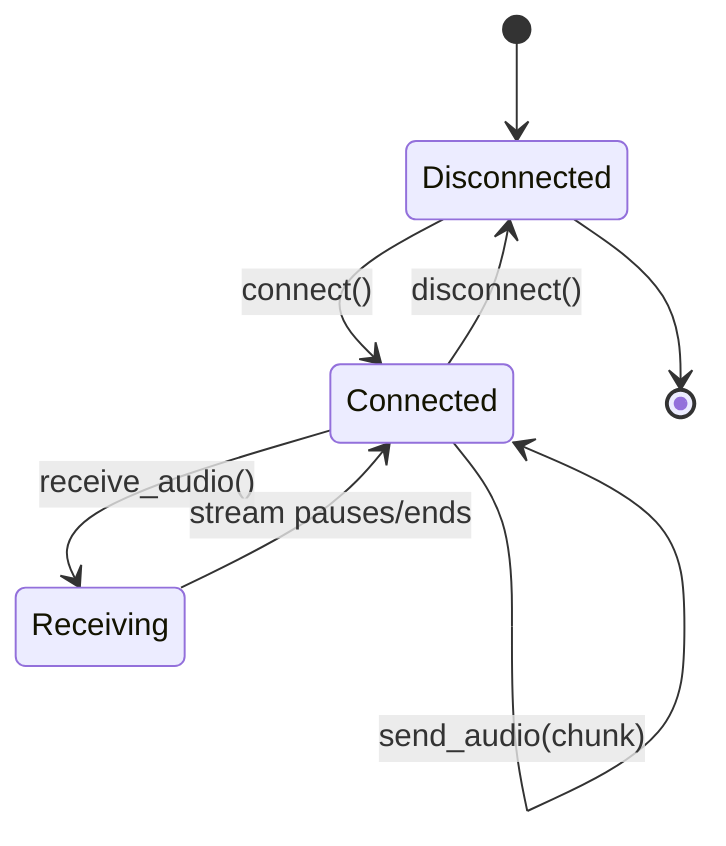
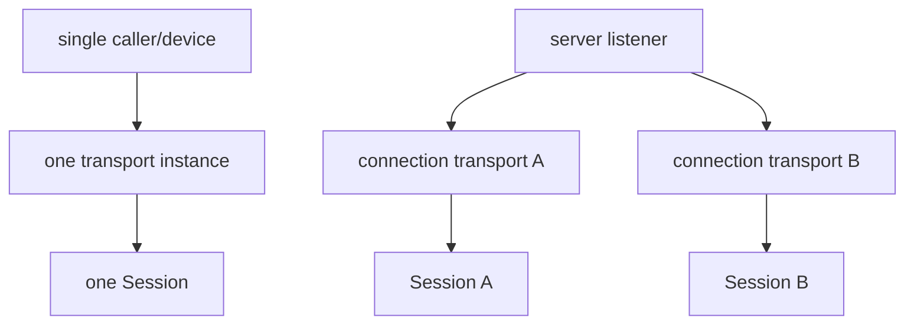
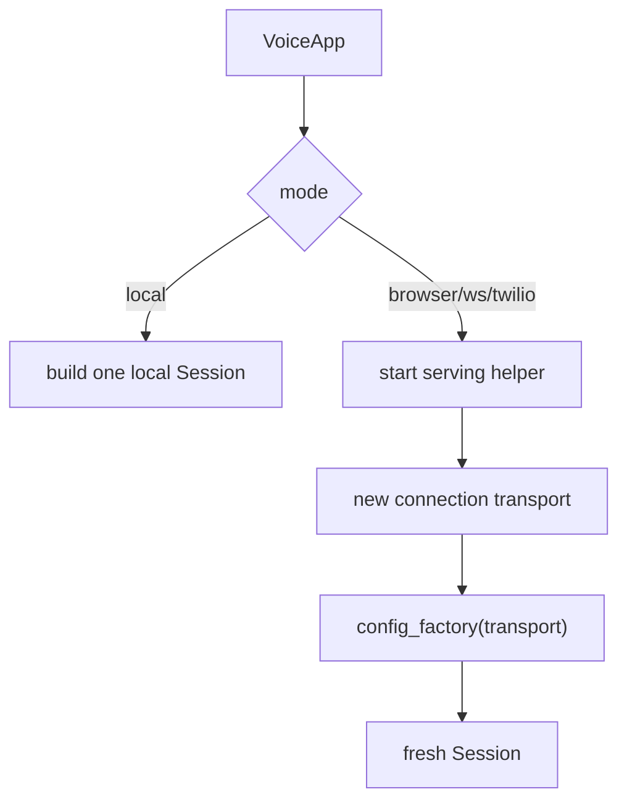
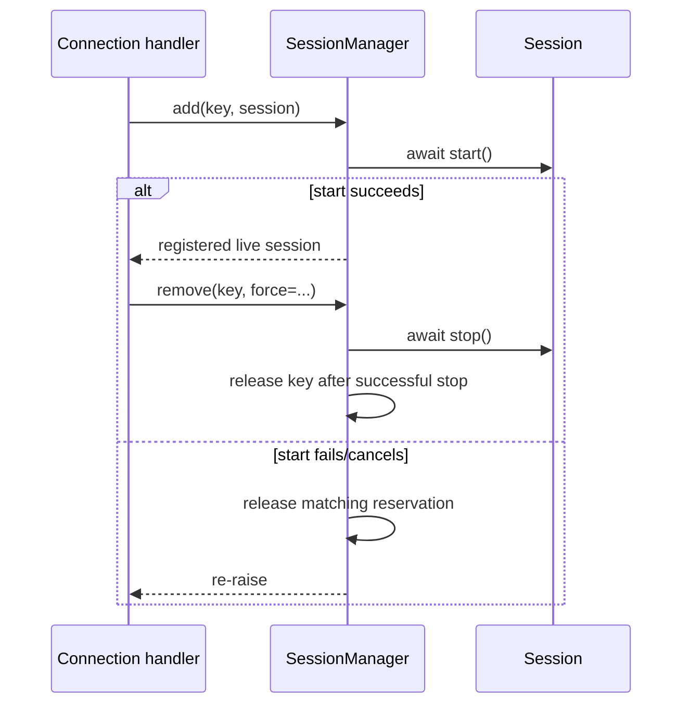
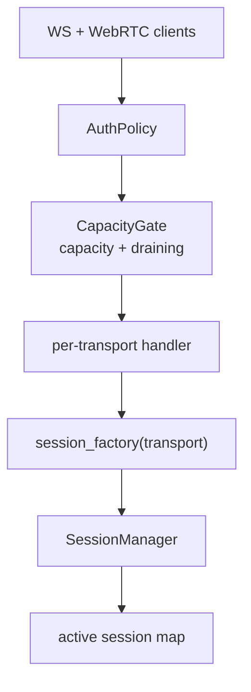
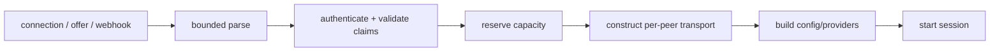
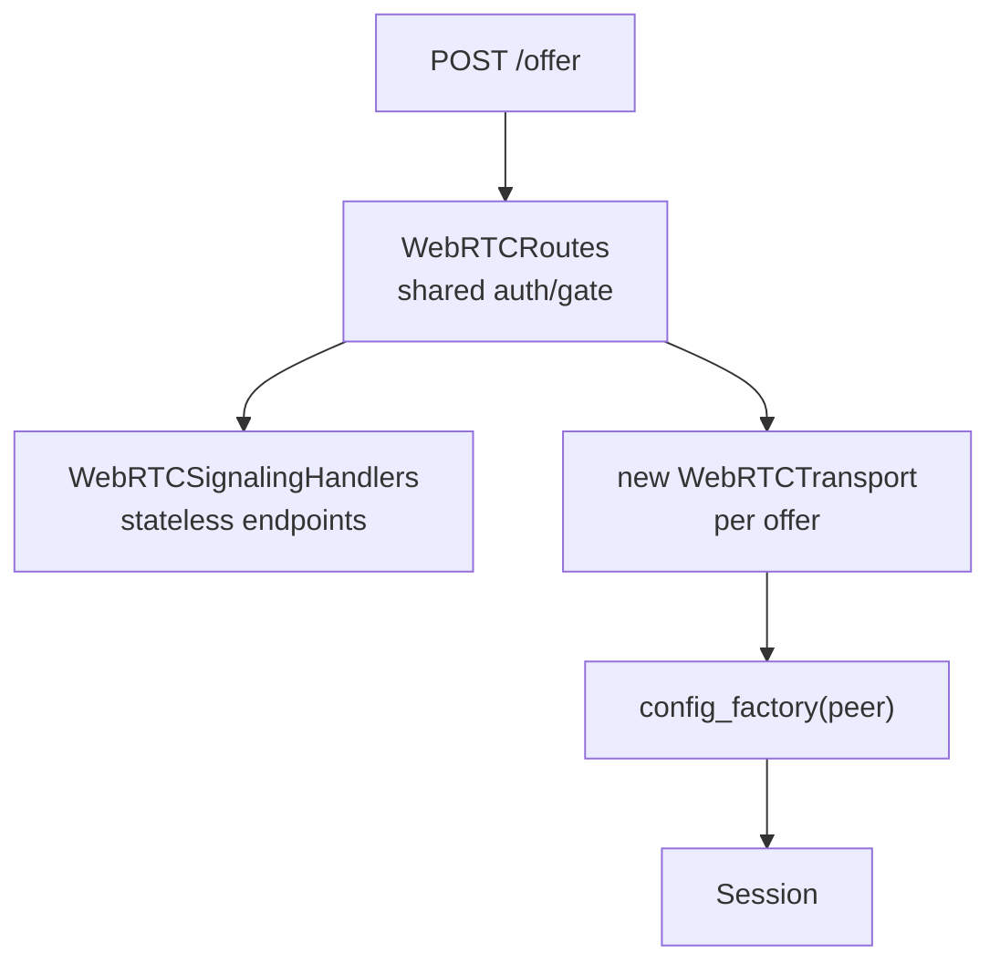
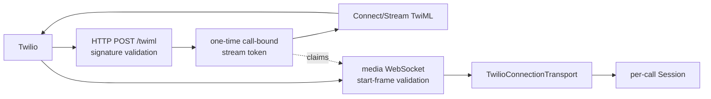
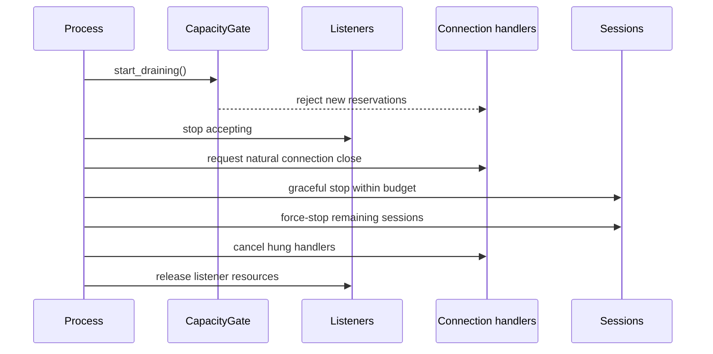

# Chapter 7 — Transports and Production Servers

A transport moves audio for one session. A server authenticates, admits,
constructs, tracks, and drains many sessions. Keeping those responsibilities
separate prevents a WebSocket class from becoming an alternate application
server and prevents examples from inventing their own production lifecycle.

## 7.1 Transport Contract

The core [`Transport`](../../src/easycat/providers.py) contract has four
operations:

`receive_audio()` returns an async iterator of `AudioChunk`.
`send_audio()` returns whether the chunk was accepted at that transport's
delivery boundary. Optional capabilities add:

- buffered-audio clearing during barge-in;
- playback acknowledgements;
- pending local playout duration;
- delivery callbacks after clearable buffers;
- playback-time AEC reference frames; and
- a nonblocking-send declaration used for first-frame ownership.

Transport implementations live under
[`transports/`](../../src/easycat/transports). The public out-of-tree base
surface in [`transports/_base.py`](../../src/easycat/transports/_base.py)
provides `AudioQueueMixin` and `ServerTransportBase`; it is re-exported from
`easycat.transports`, not top-level `easycat`.

## 7.2 One Session Versus Many

Local microphone mode owns one transport and one session. Browser,
WebSocket, WebRTC, WebTransport, and telephony serving modes need a fresh
connection transport and session per client.

Never share a connected transport, live provider, or stateful bridge merely
because the config object is shared. Per-connection factories should receive
the new transport and build fresh session-scoped collaborators.

## 7.3 VoiceApp Product Modes

[`VoiceApp`](../../src/easycat/voice_app.py) is the product-level facade:

| Mode | Shape | Construction rule |
| --- | --- | --- |
| `local` (`mic`) | single session | static config or high-level fields |
| `browser` | per-WebRTC connection | per-transport config factory for live objects |
| `websocket` (`ws`) | per-WebSocket connection | per-transport config factory |
| `twilio` (`phone`) | per-call connection + TwiML listener | per-transport config factory |

Construction styles are mutually exclusive:

1. high-level allow-listed fields;
2. a static `EasyConfig` for local mode; or
3. a `config_factory(transport)` for per-connection modes.

`VoiceApp.run()` is synchronous and owns the event loop. `serve()` is
asynchronous and composes into an existing loop. Do not call `run()` from
inside a server or async test.

The shareability guard in `voice_app.py` accepts declarative specs and
registered provider config dataclasses for multi-session reuse, but rejects
built stateful instances. The cases are covered in
[`tests/test_voice_app.py`](../../tests/test_voice_app.py) and
[`tests/integrations/agents/test_factory_reusable_spec.py`](../../tests/integrations/agents/test_factory_reusable_spec.py).

## 7.4 SessionManager

[`SessionManager`](../../src/easycat/session_manager.py) is a registry and
lifecycle owner for sessions keyed by connection identity:

The manager relies on idempotent `Session.stop()`. It retains a key until stop
completes successfully and owns one stop task per key, so a cancelled waiter
does not lose the actual teardown. Those keyed operations also share a named
runtime task cohort, which keeps a cancellation-surviving stop strongly owned
until the manager callback settles its key and exception policy.

The manager does **not** own admission capacity or server draining. Those are
process policy. It also documents that `connection()` bodies must not overlap
uncoordinated `remove/stop_all` calls for the same key; otherwise application
code could continue using an already stopped session.

## 7.5 VoiceServer Process Ownership

[`VoiceServer`](../../src/easycat/server/voice_server.py) adds production
process concerns:

- HTTP health/readiness/metrics/manifest/plan routes;
- raw WebSocket and mounted WebRTC ingress;
- one shared authentication policy;
- one shared capacity/draining gate;
- active connection/session tracking;
- startup rollback; and
- graceful shutdown with force escalation.

WebSocket and WebRTC share the same gate and active-session map. A WebRTC-only
load therefore counts against the same server capacity and drain behavior as
WebSocket clients.

The aiohttp health/signaling application and raw WebSocket listener are
distinct listener resources but one process lifecycle. `VoiceServer.run()` is
the only loop owner; `serve()` is the composable async operation.

Read [`server/transports.py`](../../src/easycat/server/transports.py) for
`CapacityGate` and hard-timeout helpers, and
[`tests/server/test_voice_server_lifecycle.py`](../../tests/server/test_voice_server_lifecycle.py)
for lifecycle behavior.

## 7.6 Authenticate Before Allocation

Public ingress must authenticate and validate bounds before constructing
providers or starting sessions:

The unified policy lives in [`server/auth.py`](../../src/easycat/server/auth.py).
Non-loopback binds are rejected without authentication unless an explicit
unsafe override is provided. Browser query tokens are a separate opt-in
because browsers cannot set arbitrary WebSocket handshake headers; enabling
them expands where credentials may appear and requires redaction discipline.

Authentication after provider construction would let unauthenticated traffic
consume model memory, sockets, file descriptors, or paid resources. Stream
tokens must not be minted before authenticating the request that asks for
them.

## 7.7 WebSocket and WebRTC

The WebSocket transport implementation lives in
[`transports/websocket.py`](../../src/easycat/transports/websocket.py). Server
connections receive a per-connection transport rather than sharing a
listener-level transport object.

WebRTC has two layers:

- [`transports/webrtc.py`](../../src/easycat/transports/webrtc.py) owns
  per-peer connection, tracks, audio, and negotiation state.
- [`server/webrtc_routes.py`](../../src/easycat/server/webrtc_routes.py) owns
  stateless/per-server route handling, admission, and per-offer transport
  construction. Each accepted offer also installs one named runtime cleanup
  task that waits for peer closure and releases its Session and capacity slot.

Shared config/stats/health/CORS/root behavior lives once in
[`server/_webrtc_handlers.py`](../../src/easycat/server/_webrtc_handlers.py).
Both standalone transport serving and `VoiceServer` routes delegate there,
preventing two copies of security and signaling policy.

WebRTC libraries are optional and loaded lazily at the route/feature boundary.
`import easycat.server` must not require aiohttp or aiortc.

## 7.8 Twilio and Telephony

[`telephony/server.py`](../../src/easycat/telephony/server.py) runs two
coordinated listeners:

The public TwiML webhook validates Twilio's signature by default before
minting a media token. Proxy-header trust is explicit because it affects the
public URL used for signature reconstruction. The media listener independently
validates handshake/start claims and bounds how long a pre-start socket can
hold capacity.

TwiML/token orchestration belongs above the transport. Per-call DTMF,
voicemail, outbound state, screening, compliance, and session actions are
wired through `TelephonyConfig` and helpers under
[`telephony/`](../../src/easycat/telephony), not duplicated on the server
config.

The transport must filter stale/wrong stream frames and label trusted inbound
STT tracks so downstream telephony classifiers do not confuse bot/outbound
audio with caller speech. See
[`tests/transports/test_twilio_transport.py`](../../tests/transports/test_twilio_transport.py).

## 7.9 Draining and Shutdown

A production server stops accepting new sessions before tearing down live
ones:

Soft `wait_for` cancellation is not always a hard bound: a coroutine can catch
or delay cancellation. Server helpers use explicit hard deadlines and can
terminate the enclosing connection/resource boundary.

In-progress startup is not published as live. Shutdown cancels and rolls it
back. A started session is registered before normal handling proceeds so the
drain owner can always find it.

[`docs/deployment/production-servers.md`](../deployment/production-servers.md)
documents the operator surface. Lifecycle tests live under
[`tests/server/`](../../tests/server) and transport-specific suites.

## 7.10 Supervisors and Passive Audio

[`SessionAudioBroadcaster`](../../src/easycat/supervisor.py) supports passive
listeners without turning the transport into a multi-consumer queue. Listener
queues are bounded; attach/detach and dropped-frame counts are visible as
events.

A supervisor is observational. It must not block the primary audio path or
silently consume frames that STT expected to receive.

## 7.11 Transport and Server Pitfalls

- **One live config for all clients:** provider/bridge state leaks across
  sessions; use a per-transport factory.
- **Putting server policy on a transport:** admission, auth, and process drain
  need one owner across transport types.
- **Calling `asyncio.run` inside `serve()`:** nested loop ownership fails in
  servers and tests.
- **Authenticating after construction:** unauthenticated requests allocate
  scarce resources.
- **Publishing a session before start succeeds:** drain logic sees a partially
  initialized object.
- **Releasing a registry key before stop succeeds:** failed teardown becomes
  unreachable.
- **Using a soft timeout as a hard shutdown bound:** cancellation-resistant
  work can continue.
- **Duplicating WebRTC route handlers:** security/CORS/stats behavior drifts.
- **Trusting proxy headers by default:** signature reconstruction becomes
  attacker-controlled.
- **Letting invalid pre-start sockets hold capacity forever:** apply a bounded
  start-frame timeout.
- **Making optional server SDKs eager imports:** basic package import breaks
  without extras.

## Checkpoint

1. Why is a server not just a long-lived transport?
2. Which object owns capacity and draining, and which owns session keys?
3. Why are static configs unsafe for multi-session modes when they contain
   live providers?
4. What must happen before a public request constructs providers?
5. Which WebRTC state is per-server and which is per-peer?
6. Why does Twilio use both webhook authentication and a call-bound stream
   token?

Previous: [Chapter 6 — Runtime, Journals, and Debugging](06-runtime-and-debugging.md).
Next: [Chapter 8 — Development and Testing](08-development-and-testing.md).
