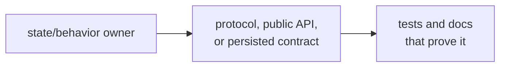
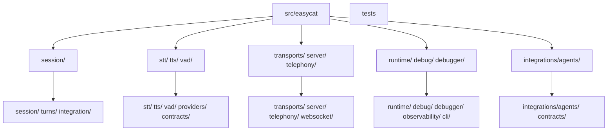
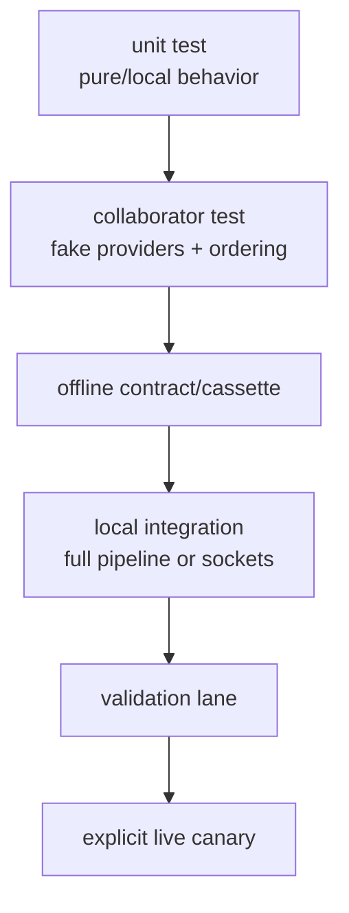
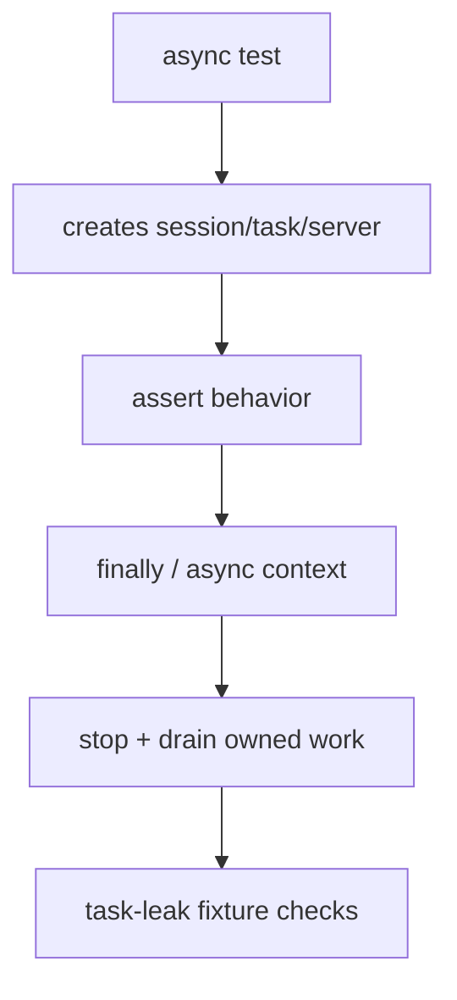
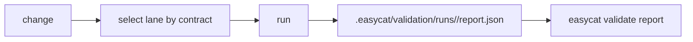
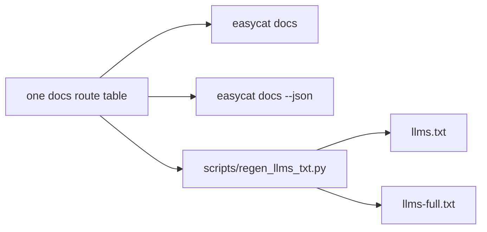
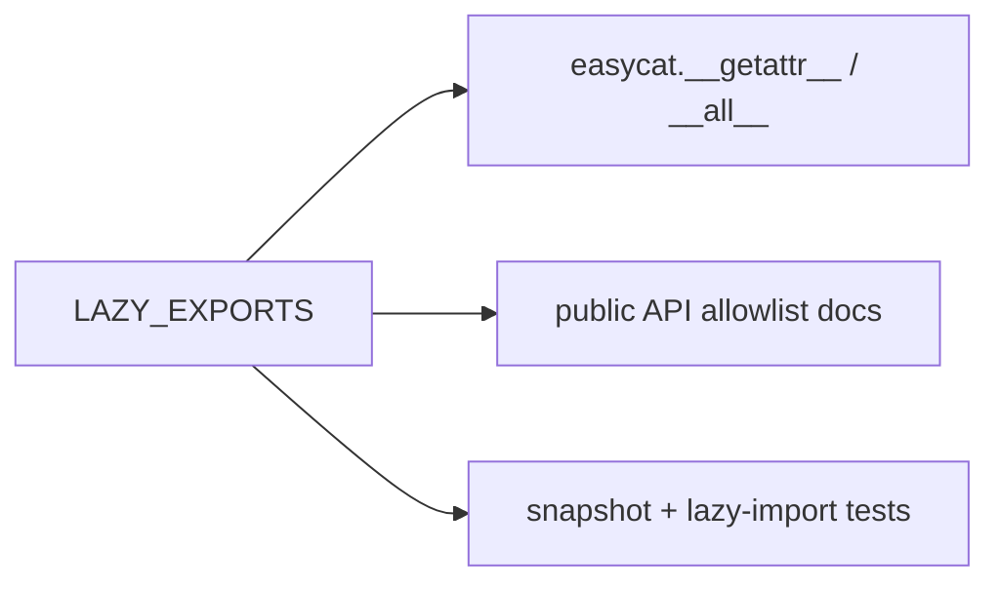

# Chapter 8 — Development and Testing

EasyCat's test suite is part of its architecture. Unit tests protect local
algorithms, contract suites protect extension semantics, integration tests
protect collaborator ordering, documentation guards protect maintained
routes, and validation lanes choose an evidence set for a kind of change.
Running “some tests” is not proof unless those tests cover the changed
contract.

## 8.1 Set Up a Development Environment

From the repository root:

```bash
uv sync --group dev
just
just validate-quick
```

`uv` owns the environment and lockfile behavior. `just` recipes are the
preferred command surface; their raw `uv run` equivalents are in
[`CONTRIBUTING.md`](../../CONTRIBUTING.md#the-development-loop).

Install only the optional extras relevant to the work while retaining dev
tools:

```bash
uv sync --group dev --extra openai
uv sync --group dev --extra webrtc
uv sync --group dev --extra telephony
```

Run `uv run easycat doctor` before credentialed examples. If keys are in a
project `.env`, use (with `--json` for the parseable envelope):

```bash
uv run easycat doctor --env-file .env
uv run easycat doctor --env-file .env --json
```

Never add credentials to tests, cassettes, examples, or committed environment
files.

## 8.2 Navigate by Ownership

Start a change by locating three things:



Useful searches:

```bash
rg "class TurnManager|def on_vad_event" src/easycat tests
rg "STT_FINAL_RECORD_NAME|stt_final" src/easycat tests docs
rg "register_stt_provider|ProviderSpec" src/easycat tests
rg "PUBLIC_API_SNAPSHOT|LAZY_EXPORTS" src/easycat tests docs
```

Do not begin with a global replacement. Read the owner, then its immediate
callers, then the tests that assert observable behavior.

## 8.3 Source and Test Mirrors

The test tree broadly mirrors the source domains:



Some behavior belongs at a boundary rather than in one mirrored directory:

- full turns and failure paths live in `tests/integration/`;
- turn state policy lives in `tests/turns/`;
- public import contracts live in `tests/test_public_api.py`;
- provider/bridge semantics live in `tests/contracts/`;
- prose and route guards live in `tests/docs/` and other guard modules; and
- generated teaching/feature ladders have dedicated suites.

## 8.4 The Evidence Ladder

Choose evidence from smallest to broadest:



Not every change needs the top rung. A sentence-splitting fix needs focused
streaming tests and quick validation, not a paid provider call. A provider
wire-protocol change needs unit/cassette/contract evidence and likely a
separate live canary.

For agent logic, [`easycat.debug.testing`](../../src/easycat/debug/testing.py)
provides a similar product-level ladder:

1. load a checked-in bundle and assert records;
2. run an offline text turn;
3. enforce latency or an LLM-judge rubric; and
4. run live audio validation.

## 8.5 Pytest Marker Taxonomy

Markers are strict and defined in
[`pyproject.toml`](../../pyproject.toml). The main meanings are:

| Marker | Use |
| --- | --- |
| `integration_local` | local integration without live services |
| `integration_socket` | localhost bind/connect behavior |
| `integration_live` | real provider endpoint and credentials |
| `integration_external` | local external SDK/binary/service without live provider credentials |
| `serial` | process-global behavior that cannot run inside xdist |
| `contract` | provider/protocol/bridge contract |
| `latency` | latency measurement/SLO |
| `stress` | load, soak, saturation |
| `release` | installed-wheel release gate |
| `slow` | intentionally long |
| `flaky` | quarantined with issue, owner, and review date |
| `guard` | prose/generated/docs overlay, not product runtime |
| `allow_task_leak` | explicit exceptional async-task policy |

Provider-scoped contract/live/latency tests must carry both a provider marker
and a surface marker. [`tests/_marker_lint.py`](../../tests/_marker_lint.py)
enforces the matrix at collection time.

`integration_live`, `integration_external`, and `serial` are excluded from
bare pytest. The full `just test` recipe adds the serial slice back without
xdist or pytest's watchdog threads; provider and external lanes remain
explicit. Never make a normal unit test depend on credentials merely because
the developer who wrote it has them.

## 8.6 Async Test Hygiene

EasyCat uses `pytest-asyncio` with `asyncio_mode = auto`. Async tests must
leave the event loop as clean as they found it.



Rules:

- Prefer `async with session:` for scoped sessions; remember it force-stops.
- If graceful behavior is under test, call `stop(force=False)` explicitly.
- Retain and close async generators, client sessions, WebSockets, and servers.
- Use port `0` where possible. Fixed-port socket tests stay grouped and marked
  so xdist does not collide.
- Mark direct `os.fork()` coverage `serial`; forking an xdist worker inherits
  its management threads and can deadlock the child before the test timeout.
  Such tests disable pytest-timeout's own helper thread and must bound the
  child with `signal.alarm`, `select`, or an equivalent primitive.
- Do not use untracked `asyncio.create_task()` in production or test helpers.
- Await cancellation and inspect terminal exceptions.
- Use `allow_task_leak` only when the unfinished task is the behavior under
  test and the reason is documented.

In the workspace sandbox, a focused async test that calls
`asyncio.to_thread` may pass its assertions and then hang in
`asyncio.Runner.close()` while the default executor shuts down. When the stack
matches that exact pattern with an idle executor worker, rerun the prescribed
focused `uv run pytest ...` command outside the sandbox before treating it as
a product failure.

## 8.7 Common Command Sets

During implementation:

```bash
uv run pytest tests/session/test_audio_router.py
uv run pytest tests/turns/test_turn_manager.py::test_vad_stop_transitions_to_user_paused
uv run ruff check .
uv run ruff format --check .
```

Before a PR:

```bash
just check
```

For typed boundaries:

```bash
just typecheck
```

The full recipe uses `--dist loadscope` because it includes socket tests. The
fast and quick recipes exclude those tests and use `--dist load` so large
modules can be balanced across workers. `-n auto` is capped at eight workers
unless `PYTEST_XDIST_AUTO_NUM_WORKERS` is set. Follow the canonical recipe in
the `justfile`; tests that need fixed ports belong in the serial socket lane,
and direct-fork tests use the dedicated `serial` marker.

## 8.8 Validation Lanes

Validation lanes are change-shaped:

| Changed surface | Primary lane |
| --- | --- |
| most deterministic code/docs/CLI | `uv run easycat validate quick` |
| WebSocket/WebRTC/local sockets | `uv run easycat validate socket` |
| provider/bridge protocols and cassettes | `uv run easycat validate contracts` |
| queues, saturation, reliability | `uv run easycat validate stress` |
| live timing | `uv run easycat validate latency --smoke` |
| live provider behavior | `uv run easycat validate live --provider openai` |
| packaging/release | `uv run easycat validate release` |



Every lane writes a report. JSON variants use the standard CLI envelope:

```bash
uv run easycat validate quick --json
uv run easycat validate report .easycat/validation/latest.json --json
```

The workflow and exact marker selections are maintained in
[`docs/validation.md`](../validation.md), not in copied scripts.

## 8.9 Documentation as a Maintained Surface

The documentation route registry lives in
[`cli/_app.py`](../../src/easycat/cli/_app.py). It powers:

- `easycat docs`;
- audience-filtered human and JSON output;
- `easycat explain json-schema` for the standard machine-readable envelope;
- [`llms.txt`](../../llms.txt); and
- [`llms-full.txt`](../../llms-full.txt).



The field contract for the JSON envelopes behind `easycat docs --json` is
documented by `uv run easycat explain json-schema`.

After editing the route map:

```bash
uv run python scripts/regen_llms_txt.py
uv run python scripts/regen_llms_txt.py --check
just guard-docs
```

Local Markdown links and anchors are checked by
[`tests/test_markdown_links.py`](../../tests/test_markdown_links.py). Generated
blocks have one source and one regeneration script. Never patch generated
outputs in isolation.

The guard recipes are generated from the `justfile` by
`uv run python scripts/regen_guard_commands.py`:

<!-- BEGIN auto:guard-commands format=just-bash -->
```bash
just guard-docs          # root onboarding docs, install guidance, docs routes, public API docs, CLI JSON envelopes, and maintained Markdown links and anchors
just guard-teaching      # teaching ladder chapters, generated README blocks, and learner route hints
just guard-examples      # examples README, support files, script smoke checks, docs-route hints, and scaffold templates, init flows, catalog output, generated project smoke, and secret/artifact hygiene
just guard-contributing  # contributor guidance, agent guide contracts, validation state, and route hints
just guard-validation    # validation workflow docs, validation reference docs, and validate CLI behavior
just guard-contracts     # provider contract docs, offline contract suite, contract kit, and provider wiring matrix
just guard-ops           # operator docs, deployment guide, observability docs, journal CLI, and durability
```
<!-- END auto:guard-commands -->

Use the one that owns the changed surface, then run the appropriate product
validation lane.

## 8.10 Public API Work

Top-level exports are data in
[`_public_api.py`](../../src/easycat/_public_api.py), loaded lazily by
[`__init__.py`](../../src/easycat/__init__.py), documented in
[`docs/public-api.md`](../public-api.md), and snapshotted in
[`tests/test_public_api.py`](../../tests/test_public_api.py).



Adding an export is an intentional compatibility change. It must not make
`import easycat` load optional provider/server/telephony SDKs. Removing an
export requires deprecation and migration even before 1.0 under the accepted
architecture policy.

Submodule extension surfaces such as `easycat.transports`,
`easycat.integrations.agents`, and `easycat.testing` are documented contracts
even when their names are not top-level exports.

## 8.11 Dependencies and Extras

Optional extras describe installable dependencies, not provider discovery.
Discovery comes from catalogs. Keep the quickstart small and load heavy SDKs
only at feature boundaries.

When changing a dependency:

1. inspect its extra and supported version range in `pyproject.toml`;
2. update `uv.lock`;
3. test minimum/current/incompatible major expectations in their appropriate
   lanes;
4. ensure the `all` extra remains mechanically valid; and
5. update install guidance and doctor probes from catalog metadata.

Do not widen across a behaviorally incompatible SDK major on hope. Bridge and
provider code often depends on event grammar or cancellation behavior that a
simple import smoke test will not prove.

## 8.12 Change-to-Evidence Matrix

| Change | Focused evidence | Broader evidence |
| --- | --- | --- |
| turn timing/state | `tests/turns/`, committer/runner tests | quick; stress if saturation-sensitive |
| audio format/resampling/AEC | `tests/audio/`, router tests | quick; relevant external/live audio lane |
| bridge behavior | bridge-specific tests + agent contract | contracts |
| provider adapter | unit + cassette + contract | contracts; explicit live canary |
| session lifecycle | lifecycle teardown + integration lifecycle | quick; socket if server-connected |
| server auth/admission | `tests/server/`, transport tests | socket |
| journal schema/replay | runtime/debug tests | quick; ops guard |
| public export | public API test + docs | docs guard + quick |
| docs route | route/docs/link tests + regeneration check | docs guard |
| package/extras | dependency policy/install tests | release |

The matrix is a starting point. Inspect what the selected test actually
asserts before using it as evidence for a broader claim.

## 8.13 Development Pitfalls

- **Testing only the edited function:** orchestration ordering may be the real
  contract.
- **Running a broad green suite without checking selection:** markers may have
  deselected the relevant test.
- **Using a live test for deterministic behavior:** it is slow, costly, and
  weaker at isolating the cause.
- **Adding an unknown marker:** strict collection fails.
- **Parallelizing fixed-port or module-shared async tests arbitrarily:** xdist
  exposes false races.
- **Patching generated docs:** the next generator run removes the change.
- **Updating code but not public/API/record docs:** contracts drift.
- **Making optional imports eager:** base installs fail at import time.
- **Treating a protocol check as behavioral proof:** use contract suites.
- **Ignoring unrelated worktree changes:** contributors may have in-progress
  edits; scope patches and preserve them.

## Checkpoint

1. What three artifacts should you locate before editing?
2. When is a live provider test warranted?
3. Why does provider/surface marker pairing matter?
4. Why do the quick and socket lanes use different xdist scheduling policies?
5. Which files must agree when adding a top-level import?
6. Why is a green quick lane insufficient for a socket-only bug?

Previous: [Chapter 7 — Transports and Production Servers](07-transports-and-production.md).
Next: [Chapter 9 — Decisions and Pitfalls](09-decisions-and-pitfalls.md).
