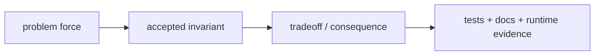
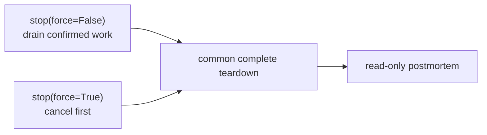
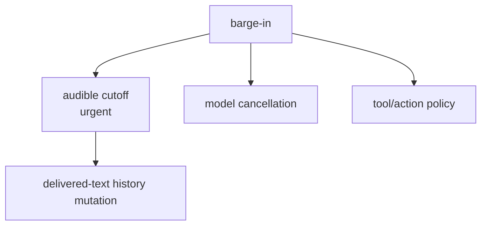
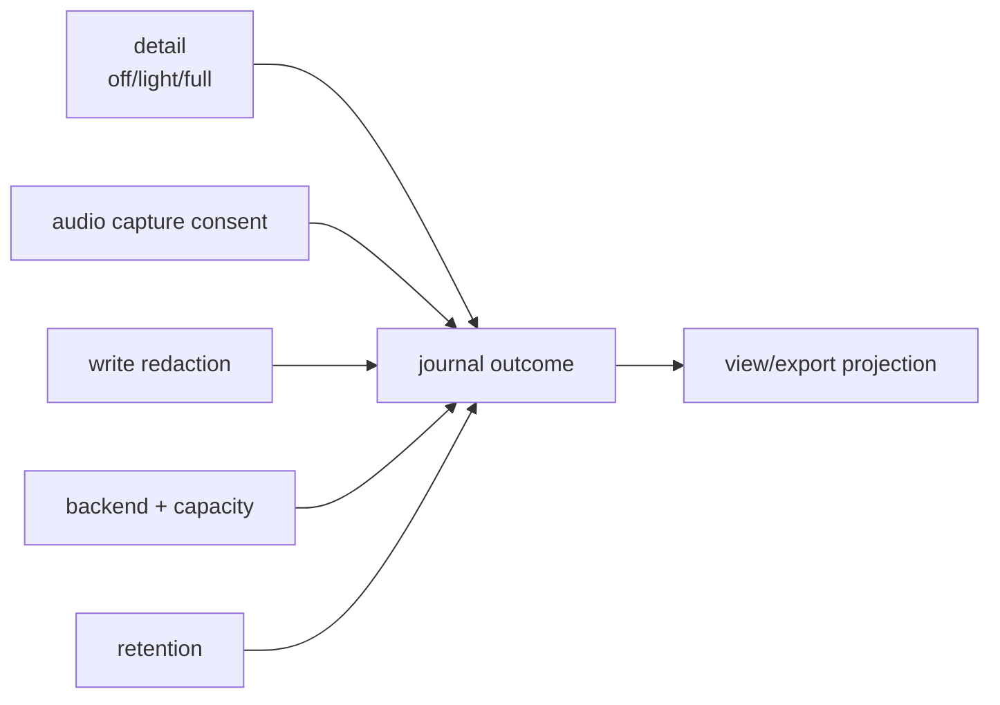
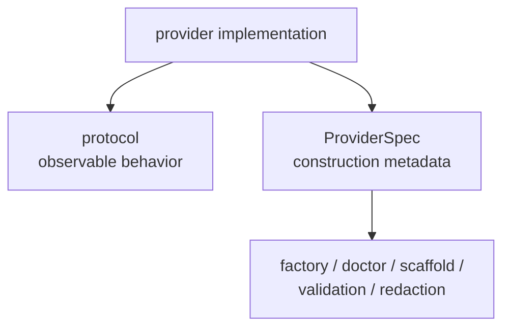
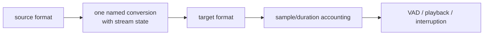
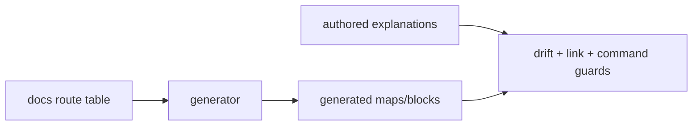
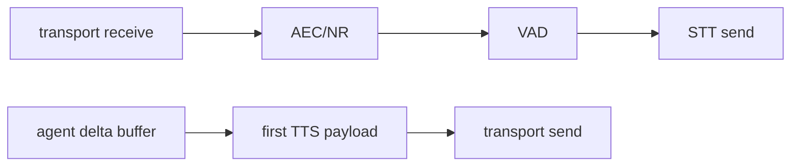

# Chapter 9 — Decisions and Pitfalls

Architecture is the set of choices a maintainer must preserve while changing
details. This chapter explains why EasyCat's accepted decisions exist, what
they cost, and which tempting implementation shortcuts reopen old failure
modes. The canonical decision wording remains
[`docs/architecture.md`](../architecture.md#firm-architecture-decisions).

## 9.1 How to Read an Accepted Decision

Each decision has four parts:

A local implementation test can show that new code works. It cannot by itself
reverse a cross-cutting compatibility contract. A reversal must update the
decision, migration, public behavior, and named contract tests together.

## 9.2 Decision: One Public Teardown Verb

**Problem force.** Sessions own many resources with different close methods,
and callers need both graceful drain and emergency cutoff.

**Decision.** `await session.stop(force=False|True)` is the sole public
teardown. It is idempotent and preserves postmortem reads. Async context exit
uses the force path.

**Consequence.** The implementation of `stop()` is necessarily careful and
larger than a thin transport disconnect. The benefit is one complete ownership
boundary rather than caller-dependent partial cleanup.

**Watch out for:**

- adding `close()` or `destroy()` aliases;
- closing the journal before late task cleanup;
- returning while cancellation-resistant tasks still own resources; and
- making `async with` graceful, which can hang a test/script exit.

**Evidence.** [`session/_session.py`](../../src/easycat/session/_session.py),
[`tests/session/test_session_lifecycle_teardown.py`](../../tests/session/test_session_lifecycle_teardown.py),
and
[`tests/integration/test_session_lifecycle_e2e.py`](../../tests/integration/test_session_lifecycle_e2e.py).

## 9.3 Decision: Audible Cutoff Is Independent

**Problem force.** A user hears playback buffers, not model task state.
Stopping model generation or waiting for a tool does not retract already
queued speech.

**Decision.** Barge-in cuts TTS and clearable playback promptly. Model, tool,
and action cancellation are separate policies. History commits only the best
known delivered text.

**Watch out for:**

- awaiting a non-interruptible tool before clearing audio;
- treating generated or synthesized text as heard;
- coupling a transport ack timeout to model cancellation;
- allowing old-turn cleanup to mutate a successor turn; and
- detaching cleanup to improve apparent cutoff latency.

**Evidence.**
[`session/_cancel_orchestrator.py`](../../src/easycat/session/_cancel_orchestrator.py),
[`session/interruption.py`](../../src/easycat/session/interruption.py),
[`tests/session/test_session_streaming_barge_in.py`](../../tests/session/test_session_streaming_barge_in.py),
and bridge cancellation suites under
[`tests/integrations/agents/`](../../tests/integrations/agents).

## 9.4 Decision: Journal Detail, Privacy, and Retention Are Orthogonal

**Problem force.** Debugging needs rich state, but rich state is sensitive and
expensive. A single “debug on” switch cannot encode durability, consent,
retention, and sharing policy.

**Decision.** `off`, `light`, and `full` have stable evidence meanings. Audio
capture consent, redaction, storage backend, capacity, durability, and
retention remain independent.

**Watch out for:**

- enabling audio capture because debug becomes `full`;
- claiming raw bundles are safe because secrets were redacted;
- using retention to silently change redaction;
- hiding light-ring-buffer eviction; and
- exporting a racing partial snapshot as complete.

**Evidence.** [`runtime/`](../../src/easycat/runtime),
[`validation/redaction.py`](../../src/easycat/validation/redaction.py),
[`tests/runtime/`](../../tests/runtime), and
[`tests/cli/test_bundles.py`](../../tests/cli/test_bundles.py).

## 9.5 Decision: Protocols and Catalogs Are the Extension Boundary

**Problem force.** Integrations need to be open to third parties while doctor,
scaffolding, validation, and redaction need consistent metadata.

**Decision.** Behavior is structural through protocols. Construction and
discovery metadata comes from role-specific provider catalogs. Runtime
dependencies are injected centrally.

**Watch out for:**

- hand-maintained provider lists in CLI modules;
- using provider display name without role qualification;
- requiring implementation inheritance;
- describing accepted commit requests as guaranteed output;
- mutating private `event_bus` attributes; and
- publishing application events from provider normal streams.

**Evidence.** [`providers.py`](../../src/easycat/providers.py),
[`_provider_catalog.py`](../../src/easycat/_provider_catalog.py),
[`tests/contracts/`](../../tests/contracts), and
[`tests/testing/`](../../tests/testing).

## 9.6 Decision: Audio Format and Position Are Explicit

**Problem force.** Voice providers disagree on sample rates and frame sizes,
while scheduler timing does not equal media progress.

**Decision.** `AudioChunk.format` is authoritative. Stateful conversion occurs
once at named boundaries. Turn and playback accounting use audio position.
The AEC reference is accepted playback.

**Watch out for:**

- module-level sample-rate assumptions;
- zero-padding every streaming chunk remainder;
- restarting resamplers per frame;
- repeated implicit conversion;
- feeding AEC raw TTS output; and
- timing media with event-loop sleeps.

**Evidence.** [`audio_format.py`](../../src/easycat/audio_format.py),
[`_audio_utils.py`](../../src/easycat/_audio_utils.py),
[`session/_audio_router.py`](../../src/easycat/session/_audio_router.py), and
[`tests/audio/`](../../tests/audio).

## 9.7 Decision: Optional Dependencies Stay Optional

**Problem force.** EasyCat supports many SDKs and audio backends, some heavy or
mutually incompatible by major version.

**Decision.** The quickstart remains small. Feature extras declare
dependencies, catalogs declare capabilities, and heavy imports are lazy.
Dependency majors have tested compatibility ranges.

**Watch out for:**

- importing aiohttp, aiortc, ONNX runtimes, or provider SDKs at package import;
- using an empty extra as provider discovery;
- widening an SDK range across a major without contract evidence;
- mixing dependency version lines with incompatible event grammar; and
- editing `all` extra membership by hand without its mechanical guard.

**Evidence.** [`pyproject.toml`](../../pyproject.toml),
[`tests/test_dependency_policy.py`](../../tests/test_dependency_policy.py),
install tests, and the release validation lane.

## 9.8 Decision: Generated Navigation Has One Source

**Problem force.** Human docs, CLI route output, generated machine maps, and
agent hints otherwise drift.

**Decision.** Explanations are authored prose. Route tables and generated
blocks have one generator and checked-in outputs. Guards check behavior,
links, anchors, schemas, and drift rather than freezing incidental sentences.

**Watch out for:**

- copying command tables into another hand-maintained file;
- editing `llms.txt` directly;
- exact-prose tests that make writing changes impossible;
- classifying runtime tests as docs guards to speed up quick validation; and
- in-process tests that leave imported modules/globals replaced.

**Evidence.** [`cli/_app.py`](../../src/easycat/cli/_app.py),
[`scripts/regen_llms_txt.py`](../../scripts/regen_llms_txt.py),
[`tests/docs/`](../../tests/docs), and
[`tests/test_regen_guard_commands.py`](../../tests/test_regen_guard_commands.py).

## 9.9 Decision: Public Ingress Is a Process Concern

**Problem force.** Multi-session endpoints can allocate expensive resources,
and graceful shutdown must span every transport type.

**Decision.** Authenticate and bound requests before allocation.
`VoiceServer` and shared helpers own admission, startup rollback, draining,
and shutdown. Queues are bounded, and hard shutdown deadlines terminate the
resource boundary when cooperative cancellation is insufficient.

**Watch out for:**

- authenticating after creating providers;
- separate capacity counters for WebSocket and WebRTC;
- publishing sessions during startup;
- unbounded frame/event queues;
- example-specific production server loops; and
- adding positional config fields in the middle of public dataclasses.

**Evidence.** [`server/`](../../src/easycat/server),
[`transports/`](../../src/easycat/transports),
[`tests/server/`](../../tests/server), and
[`tests/transports/`](../../tests/transports).

## 9.10 Hot Paths

Some code runs per frame or controls first audio. Small-looking work there can
be a latency regression:

Review hot-path changes for:

- blocking filesystem/network calls;
- regex or serialization work on every tiny delta;
- awaited application handlers;
- locks held across provider/event callbacks;
- repeated allocations proportional to session history;
- unbounded queues;
- logging or artifact writes per frame; and
- conversions that lose streaming state.

The heartbeat and stage metrics make some regressions visible, but prevention
is cheaper than postmortem detection.

## 9.11 Race Boundaries

The most failure-prone awaits cross ownership changes:

| Boundary | Stale-state risk | Guard |
| --- | --- | --- |
| VAD pause → delayed STT final | later pause receives old punctuation | exact pause lease |
| agent/TTS work → new barge-in turn | old task mutates successor | captured `TurnContext` + generation |
| dequeued audio → send lock | drain sees false idle | claim in-flight before await |
| graceful stop → force escalation | two teardown owners | stop-task ownership transfer |
| session start → failure/cancel | partial resources leak | shielded rollback |
| journal artifact → record append | dangling ref | artifact-first commit |
| session registry → start/stop | unreachable partial session | reserve the key before start; release it after failed start or successful stop |

Whenever adding an `await`, ask:

1. Which object/state was captured before the await?
2. Can a new turn, stop, reconnect, or provider swap happen while suspended?
3. How will the continuation prove it still owns the state?
4. Who retains the task if the caller is cancelled?

## 9.12 Compatibility Boundaries

Not all “private-looking” changes have private impact:

- Top-level exports and documented extension modules are public API.
- Provider protocol behavior is public even when implementations are internal.
- `JournalRecord` names/fields and bundle layout are persisted data contracts.
- CLI JSON envelopes and route entries are automation contracts.
- Event dataclass fields are application contracts.
- Public dataclass positional order is compatibility surface.
- Environment variable names and optional extras are install/deployment
  contracts.

Review [`docs/public-api.md`](../public-api.md),
[`docs/reference/events.md`](../reference/events.md), and
[`docs/reference/journal-records.md`](../reference/journal-records.md) before
calling a change internal.

## 9.13 “Looks Fine” Smells

Pause when a patch includes:

- another provider name dictionary;
- a bare `asyncio.create_task` without ownership;
- `except Exception: pass` around lifecycle work;
- a default mutable bridge shared by connection handlers;
- a fixed sleep standing in for media duration;
- an event handler doing disk/network I/O inline;
- an unbounded `asyncio.Queue`;
- a new `close` method on session-like public objects;
- a replay path that can invoke tools without an explicit policy;
- a direct edit to generated docs;
- a public config field inserted before existing fields; or
- a test that proves only that no exception was raised.

Each smell may have a legitimate exception, but the burden is to name the
owner, bound, failure behavior, and contract evidence.

## 9.14 Review Checklist

Before approving an architectural change, verify:

- **Ownership:** session, turn, process, provider, and task owners are explicit.
- **Bounds:** queues, buffers, retries, timeouts, artifacts, and histories are
  bounded or deliberately durable.
- **Cancellation:** audible cutoff, task cancellation, and resource close are
  distinguished.
- **Formats/clocks:** media uses explicit format and audio position.
- **Evidence:** events, journal, errors, and telemetry retain their distinct
  roles.
- **Privacy:** raw diagnostics and share-safe projections are not confused.
- **Compatibility:** imports, events, records, CLI JSON, configs, extras, and
  persisted files were considered.
- **Discovery:** catalogs/generators remain the single source.
- **Tests:** selected evidence actually covers the changed guarantee.
- **Docs:** architecture and developer guidance remain true.

## Checkpoint

1. Why can a passing local test not reverse an accepted decision?
2. Which three cancellation concerns must stay separate?
3. Name four independent journal/privacy/retention knobs.
4. What should you ask immediately after adding an `await`?
5. Why is a journal record name a compatibility boundary?
6. Which code regions deserve hot-path scrutiny?

Previous: [Chapter 8 — Development and Testing](08-development-and-testing.md).
Next: [Chapter 10 — Guided Change Recipes](10-guided-change-recipes.md).
