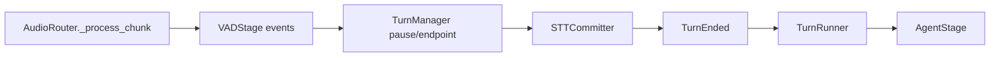
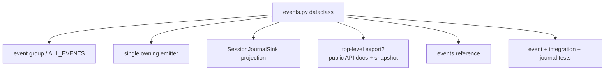
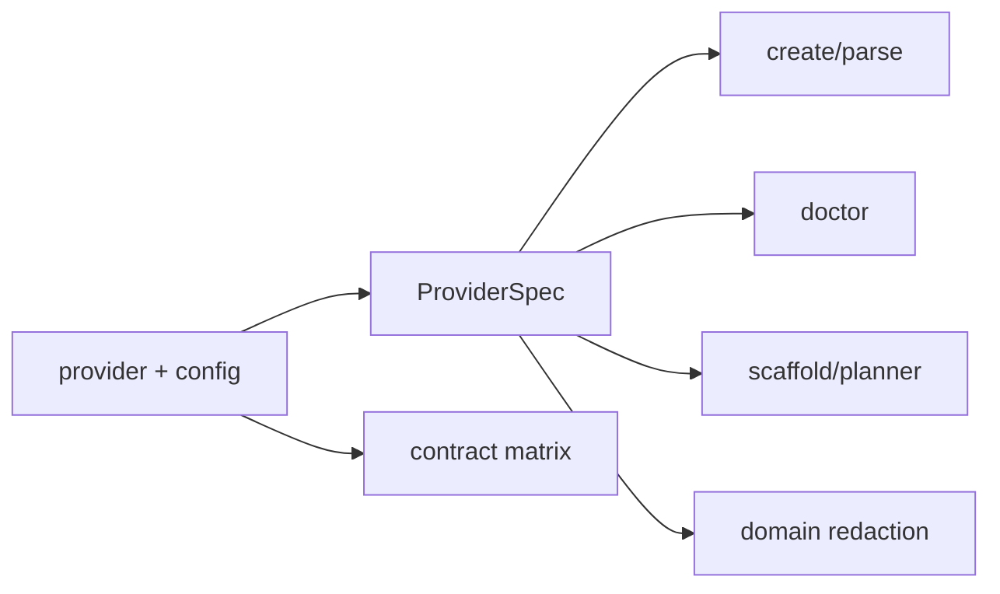
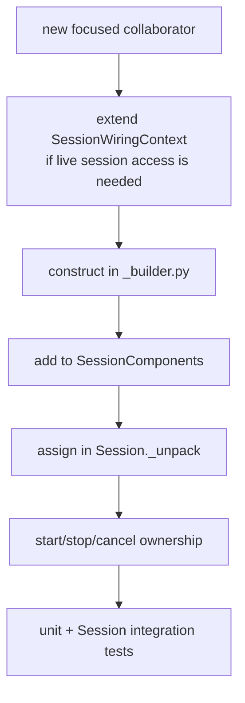
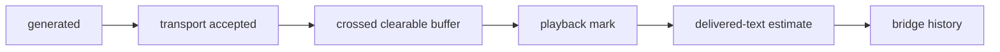
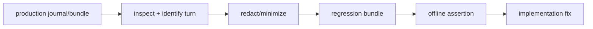

# Chapter 10 — Guided Change Recipes

This chapter turns the architecture into repeatable maintenance workflows.
Each recipe starts from an observable goal, identifies the owner and contract,
changes the smallest coherent set of files, and finishes with evidence. Use
the recipes as maps, not mechanical checklists: inspect the current code and
tests before editing.

## 10.1 The General Change Loop

```mermaid
flowchart LR
    REPORT["behavior or requirement"]
    TRACE["trace current owner"]
    CONTRACT["name observable contract"]
    TEST["write/select failing evidence"]
    CHANGE["implement coherent change"]
    FOCUSED["focused tests + lint"]
    LANE["validation/guard lane"]
    AUDIT["docs + compatibility audit"]

    REPORT --> TRACE --> CONTRACT --> TEST --> CHANGE --> FOCUSED --> LANE --> AUDIT
```



Write the contract as a sentence before code. Examples:

- “A final transcript carrying pause A's lease must not shorten pause B.”
- “A buffered transport emits `AudioOut` only after the chunk crosses its last
  clearable buffer.”
- “A second STT stream receives events from a fresh iterator.”
- “A clean stop retains a read-only journal view.”

A sentence with an observable subject and boundary leads to a better test than
“fix race.”

## 10.2 Recipe: Trace an End-to-End Turn Bug

Suppose a user reports that the agent answered an incomplete utterance.

### Trace

Follow this path:



Open, in order:

1. [`session/_audio_router.py`](../../src/easycat/session/_audio_router.py)
2. [`turn_manager.py`](../../src/easycat/turn_manager.py)
3. [`session/_stt_committer.py`](../../src/easycat/session/_stt_committer.py)
4. [`session/_turn_runner.py`](../../src/easycat/session/_turn_runner.py)

### Evidence

Inspect a bundle for `vad_stop_speaking`, `stt_final`,
`turn_state_changed`, smart-turn records, `turn_ended`, and task terminal
records. Determine whether the wrong evidence entered at VAD, segment commit,
endpoint policy, or stale generation.

Add the smallest deterministic case to
[`tests/turns/test_turn_manager.py`](../../tests/turns/test_turn_manager.py) or
[`tests/session/test_stt_committer.py`](../../tests/session/test_stt_committer.py).
Use a full pipeline test only if the failure depends on collaborator
interaction.

### Verify

```bash
uv run pytest tests/turns/test_turn_manager.py tests/session/test_stt_committer.py
uv run easycat validate quick
```

Do not begin by increasing `end_of_turn_silence_ms`; timing may only hide a
stale-final bug.

## 10.3 Recipe: Add or Change a Public Event

### Contract questions

1. Is this application control or forensic-only evidence?
2. Is it provider-scoped or session-scoped?
3. Which component can correlate session and turn ids correctly?
4. Does it belong in an existing semantic event group?
5. Does the journal need a stable projection?

### Change map



Implementation files:

- [`events.py`](../../src/easycat/events.py)
- the owning emitter, usually a session collaborator or transport;
- [`session/_journal_sink.py`](../../src/easycat/session/_journal_sink.py)
  when durable mirroring is required;
- [`docs/reference/events.md`](../reference/events.md); and
- [`_public_api.py`](../../src/easycat/_public_api.py) only if intentionally
  top-level public.

Tests:

- [`tests/events/test_events.py`](../../tests/events/test_events.py)
- [`tests/session/test_journal_sink.py`](../../tests/session/test_journal_sink.py)
- one behavior test at the actual emitter.

Preserve defaults on added dataclass fields when compatibility permits.
Provider normal streams should add `STTEvent`/`TTSEvent` metadata rather than
emitting the new public event themselves.

## 10.4 Recipe: Add an STT or TTS Provider

### Implement

1. Add one provider module with a typed config dataclass, then add that config
   to the built-in `STTConfig` or `TTSConfig` typing union in its factory.
2. Implement the protocol and `version_info()`.
3. Normalize all outputs to `STTEvent` or `TTSEvent`.
4. Implement prompt cancellation and resource teardown.
5. Publish provider failures through the injected bus without awaiting app
   handlers under lifecycle locks.

### Register

Add one `ProviderSpec` in
[`stt/factory.py`](../../src/easycat/stt/factory.py) or
[`tts/factory.py`](../../src/easycat/tts/factory.py). Include credential env,
API domains, probe module, capabilities, and an install-extra name when the
provider has optional dependencies. Two registration points live outside the
catalog:

- if the provider has optional dependencies, declare its install extra in
  `pyproject.toml` `[project.optional-dependencies]` and wire those dependency
  requirements into the `all` union; do not create empty marker extras; and
- add a `ProviderSurfaceContract` row in
  [`tests/contracts/provider_surface_matrix.py`](../../tests/contracts/provider_surface_matrix.py) —
  the matrix tests fail if a registered provider has no row.



### Test

- provider unit tests with a fake SDK/client;
- an offline cassette or scripted contract case;
- the installable provider contract suite;
- session factory/event-bus/format wiring;
- a separately marked live canary if supported.

Follow the in-tree checklist in
[CONTRIBUTING.md](../../CONTRIBUTING.md#adding-an-stt-or-tts-provider); the
[`docs/extending/stt.md`](../extending/stt.md) and
[`docs/extending/tts.md`](../extending/tts.md) guides cover out-of-tree
(pip-installed) providers. Then run:

```bash
just guard-contracts
uv run easycat validate contracts
```

Do not add parallel provider tables to doctor, scaffolding, or redaction.

## 10.5 Recipe: Add a New Optional Provider Capability

Before changing a core protocol, count implementations that can honestly
support the behavior.

If optional:

1. define a narrow runtime-checkable capability protocol or helper in
   [`runtime/capabilities.py`](../../src/easycat/runtime/capabilities.py);
2. make absence a documented no-op or conservative fallback;
3. use it at one central orchestration boundary;
4. add a fake with and without the capability; and
5. avoid adding stub methods to every provider merely to satisfy
   `isinstance`.

If universal, update the core protocol, every implementation/stub, contract
kit, extension docs, and compatibility policy together.

## 10.6 Recipe: Change Turn-Taking

Classify the change:

| Concern | Owner |
| --- | --- |
| speech/silence recognition | VAD provider/config |
| pre-roll and user/bot state | `TurnManager` |
| segment finalization | `STTCommitter` |
| semantic endpoint scoring | smart-turn provider + `TurnStage` |
| transcript-to-agent transition | `TurnRunner` |
| barge-in cutoff/history | Session + `CancelOrchestrator` |

### Required evidence

Test at least:

- normal speech start/stop;
- speech resume before endpoint;
- punctuation from the current and stale pause leases;
- smart complete, incomplete, and error;
- push-to-talk if shared code changed;
- speech during `PROCESSING` and `BOT_SPEAKING`;
- bounded pre-roll/turn audio; and
- successor turn protection after awaits.

Use audio duration in fakes rather than arbitrary sleeps whenever the contract
is media position.

## 10.7 Recipe: Add a Session Collaborator

A new collaborator is warranted when a coherent concern has:

- its own state/lifecycle;
- multiple methods or subscriptions;
- a narrow dependency surface; and
- tests that can exercise it without constructing every Session detail.

### Wiring steps



Do not pass the whole `Session` when a typed wiring getter/callback will do.
Do not create subscriptions before all callback dependencies exist. Add
teardown at the same time as construction; a collaborator without a lifecycle
owner is incomplete.

If the concern is only a pure transformation, prefer a leaf function/module
instead of a collaborator.

## 10.8 Recipe: Add a Journal Record

### Design

1. Choose a stable snake-case name.
2. Decide whether it is event, metric, control, framework transition,
   degraded, or recovery evidence.
3. Define JSON-safe fields and privacy classification.
4. Use session/turn correlation captured at scheduling time.
5. Store large content as artifacts, committing artifact first.
6. Add defaults to persisted typed fields.

### Keep producers and consumers aligned

Put shared names in [`runtime/records.py`](../../src/easycat/runtime/records.py)
and validation in
[`runtime/record_contracts.py`](../../src/easycat/runtime/record_contracts.py).
Update:

- the producer;
- serializer only if the generic walk cannot represent the value;
- bundle/replay/debugger/CLI rollups that interpret the record;
- [`docs/reference/journal-records.md`](../reference/journal-records.md); and
- schema, old-bundle, and projection tests.

Run focused runtime/debug tests and `just guard-ops` when operator
interpretation changes.

## 10.9 Recipe: Change Playback or Interruption Accounting

This area requires evidence at multiple delivery boundaries:



Inspect:

- [`session/_audio_router.py`](../../src/easycat/session/_audio_router.py)
- [`_turn_context.py`](../../src/easycat/_turn_context.py)
- [`session/interruption.py`](../../src/easycat/session/interruption.py)
- [`session/_cancel_orchestrator.py`](../../src/easycat/session/_cancel_orchestrator.py)

Test direct transports, delivery-reporting buffered transports, fresh and
stale marks, no-mark fallback, queue flush, bounded send-log eviction, and
history mutation. Property tests are valuable because monotonicity and prefix
bounds matter across many chunk/ack combinations.

Never use model tokens or characters as a substitute for audio-byte/duration
evidence without a documented mapping.

## 10.10 Recipe: Add a Transport or Server Mode

### Transport

Implement the core protocol, then decide which optional playback capabilities
are truthful. Bound every inbound/outbound queue. Normalize audio formats at a
named edge and surface nonfatal degradation.

### Serving

For a public multi-client mode:

1. authenticate and bound before allocation;
2. reserve shared capacity;
3. create a fresh per-connection transport;
4. call a per-transport config/session factory;
5. start fully before publishing as active;
6. register with the common manager/gate;
7. roll back every partial-start failure;
8. participate in draining and force escalation; and
9. keep `serve()` async and `run()` the sole loop owner.

Use shared helpers under [`server/`](../../src/easycat/server) rather than
copying an example loop. Add socket, auth, capacity, startup-failure, normal
disconnect, and shutdown tests, then run:

```bash
uv run easycat validate socket
```

## 10.11 Recipe: Promote a Production Failure

1. Treat the raw bundle as sensitive.
2. Inspect issues and locate the affected turn.
3. Export a share-safe context pack if external review is needed.
4. Promote the turn:

   ```bash
   uv run easycat journal promote PATH TURN_ID --out regression.bundle
   ```

5. Store only a redacted/minimized fixture appropriate for the repository.
6. Load it with [`easycat.debug.testing`](../../src/easycat/debug/testing.py).
7. Assert the failing record sequence, transcript, tool call, or latency.
8. Add a smaller unit/property test too when the root cause can be isolated.



This preserves the observed failure shape without making every regression test
a full provider integration.

## 10.12 Recipe: Change the Public API

For a top-level addition:

1. justify why common application code needs the name;
2. add it to [`_public_api.py`](../../src/easycat/_public_api.py);
3. keep the target module import-light;
4. update TYPE_CHECKING imports in
   [`__init__.py`](../../src/easycat/__init__.py);
5. update [`docs/public-api.md`](../public-api.md);
6. update the snapshot/lazy import assertions in
   [`tests/test_public_api.py`](../../tests/test_public_api.py); and
7. run `just guard-docs`.

For removal, design a deprecation and migration. Moving a name to a submodule
without that path is still a breaking removal.

For a new extension surface that is too specialized for top-level import,
document and test the submodule contract instead.

## 10.13 Recipe: Add a Documentation Route

1. Write the maintained page and link it from
   [`docs/README.md`](../README.md).
2. Register the page in the intended order and nesting under `nav` in
   [`mkdocs.yml`](../../mkdocs.yml).
3. Add one route entry in
   [`cli/_app.py`](../../src/easycat/cli/_app.py) with unique label/path,
   audience, Diátaxis category, useful description, and valid commands.
4. Add focused route-contract assertions when commands must track another
   source.
5. Regenerate:

   ```bash
   uv run python scripts/regen_llms_txt.py
   ```

6. Verify:

   ```bash
   uv run easycat docs --audience maintainers
   uv run python scripts/regen_llms_txt.py --check
   uv run --group docs mkdocs build --strict
   just guard-docs
   ```

Do not insert the route where it breaks the intentionally tested primary
reader prefix/suffix order.

## 10.14 Recipe: Prepare a Pull Request

Before declaring completion:

1. inspect the diff and unrelated worktree changes;
2. run formatting and lint;
3. run focused tests that demonstrate the changed contract;
4. run the appropriate guard and validation lane;
5. regenerate checked-in outputs;
6. review local Markdown links and public/persisted compatibility;
7. state problem, solution, and test evidence in the PR; and
8. include a usage note for user-visible transport/telephony/example changes.

```bash
uv run ruff format --check .
uv run ruff check .
just check
```

`just check` is the broad pre-PR gauntlet, not a substitute for the
change-specific lane when contracts, sockets, stress, live providers, or
release packaging are in scope.

## 10.15 Final Maintainer Exercise

Choose one recent bug fix and produce a one-page change brief:

- the observable contract;
- the process/session/turn/frame owner;
- the data, control, and evidence-plane path;
- the first stale-state boundary;
- the focused test that would fail before the fix;
- the validation lane;
- the public/persisted/documentation compatibility surfaces; and
- the journal records that would prove correct behavior in production.

If any item is hard to name, return to the corresponding chapter and trace the
implementation before editing.

## Closing Perspective

EasyCat's code is organized around one principle: make ownership and evidence
survive concurrency. Protocols make integrations replaceable, stages make
boundaries recordable, turn contexts make stale work detectable, scopes make
tasks owned, and a single session lifecycle makes cleanup complete. The best
maintainer changes reinforce those properties while making the public product
feel simpler.

Previous: [Chapter 9 — Decisions and Pitfalls](09-decisions-and-pitfalls.md).
Return to the [textbook contents](README.md).
