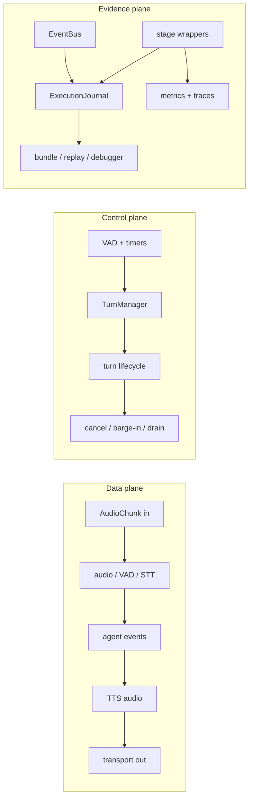

# Developing EasyCat: A Maintainer's Textbook

EasyCat is small at its public entrance and deliberately layered underneath.
That is excellent for application authors, but it means a new maintainer can
run a three-line voice app long before they know where a frame, turn, task, or
journal record is owned. This textbook closes that gap.

The intended reader has cloned the repository, can read typed asynchronous
Python, and expects to change EasyCat itself. The chapters explain the current
architecture, not a proposed rewrite. Links point to the implementation and to
the tests that preserve its contracts.

Use this book with three other kinds of documentation:

- [Architecture](../architecture.md) is the compact, authoritative architecture
  and accepted-decisions reference.
- [Contributing](../../CONTRIBUTING.md) is the command, marker, validation, and
  pull-request reference.
- The [teaching ladder](../teaching/) builds a voice pipeline from first
  principles; the [feature ladder](../using-easycat/) teaches EasyCat as an
  application product. This book instead teaches how the repository is
  implemented and maintained.

## What You Will Be Able to Do

After working through the chapters, you should be able to:

1. trace an inbound audio frame from a transport through agent output and back
   to playback;
2. explain the ownership and lifecycle of a `Session`, a `TurnContext`, a
   provider, a stage, and a background task;
3. distinguish live events, durable journal records, logs, and telemetry;
4. change a provider, bridge, turn-taking rule, transport, or public API
   without introducing a parallel source of truth;
5. diagnose interruption, latency, audio-format, and shutdown bugs from code
   and journal evidence; and
6. choose the smallest test and validation lanes that prove a change.

## The Central Mental Model

EasyCat carries three related flows through one session:



The data plane carries audio and text. The control plane decides when work
starts, ends, or is cancelled. The evidence plane makes both reconstructable.
Many subtle bugs come from mixing these planes: treating an event as durable,
treating a journal callback as application control, or assuming that
cancelling model generation has already stopped audible playback.

## Reading Order

| Chapter | Question it answers | Main code landmarks |
| --- | --- | --- |
| [1. System map](01-system-map.md) | What product and package am I looking at? | [`src/easycat`](../../src/easycat), [`_public_api.py`](../../src/easycat/_public_api.py) |
| [2. Session construction and lifecycle](02-session-lifecycle.md) | Who builds and owns the runtime? | [`config/_factory.py`](../../src/easycat/config/_factory.py), [`session/`](../../src/easycat/session) |
| [3. Audio and turn-taking](03-audio-and-turns.md) | How does a frame become a user turn? | [`audio_format.py`](../../src/easycat/audio_format.py), [`turn_manager.py`](../../src/easycat/turn_manager.py) |
| [4. Agents, streaming, and interruption](04-agents-and-interruption.md) | How does a transcript become interruptible speech? | [`integrations/agents/`](../../src/easycat/integrations/agents), [`session/_turn_runner.py`](../../src/easycat/session/_turn_runner.py) |
| [5. Providers, stages, and extensions](05-providers-and-extensions.md) | How do integrations plug in without hard coupling? | [`providers.py`](../../src/easycat/providers.py), [`stages/`](../../src/easycat/stages), [`_provider_catalog.py`](../../src/easycat/_provider_catalog.py) |
| [6. Runtime, journals, and debugging](06-runtime-and-debugging.md) | What evidence exists after a failure? | [`runtime/`](../../src/easycat/runtime), [`debug/`](../../src/easycat/debug), [`debugger/`](../../src/easycat/debugger) |
| [7. Transports and production servers](07-transports-and-production.md) | How does one session become a service? | [`transports/`](../../src/easycat/transports), [`server/`](../../src/easycat/server), [`telephony/`](../../src/easycat/telephony) |
| [8. Development and testing](08-development-and-testing.md) | How do I change this repository safely? | [`tests/`](../../tests), [`justfile`](../../justfile), [`pyproject.toml`](../../pyproject.toml) |
| [9. Decisions and pitfalls](09-decisions-and-pitfalls.md) | Which tempting shortcuts violate a contract? | [accepted decisions](../architecture.md#firm-architecture-decisions) |
| [10. Guided change recipes](10-guided-change-recipes.md) | Where do common changes begin and end? | source, tests, docs, and validation together |

Chapters 1–4 form the runtime spine and should be read in order. Chapters 5–8
can then be read according to the work at hand. Chapters 9 and 10 are the
review checklist and field manual.

## A Practical Study Loop

For each chapter:

1. read the explanation and redraw its main diagram from memory;
2. open the implementation files linked from the chapter in the order they
   appear (chapter 1's “Read the Code in This Order” seeds the wider tour);
3. locate the linked contract tests and state what failure each one prevents;
4. run the suggested inspection command from the repository root; and
5. answer the checkpoint questions without looking back.

Most chapters use read-only commands such as:

```bash
rg "class Session|def create_session" src/easycat tests
uv run easycat docs --audience maintainers
uv run pytest tests/session/test_session_lifecycle_teardown.py
```

If a named test file changes, use `rg` to find its current focused successor.
The code links and contract concepts are authoritative; the commands are
starting points.

## Repository Conventions Used in This Book

- Paths beginning with `src/easycat/` are library implementation.
- Paths beginning with `tests/` are executable contract evidence.
- “Provider” means a concrete integration behind a structural protocol.
- “Stage” means EasyCat's journal/replay wrapper around a provider or
  decision boundary.
- “Session” means one conversation. Multi-client process ownership belongs
  above it.
- “Turn” means one user input and the corresponding agent/playback work.
- “Accepted” means accepted for delivery by the next boundary, not
  necessarily heard by the user.

## Keep the Textbook Honest

When an architectural change makes a chapter false, update the implementation,
the relevant contract tests, this textbook, and the compact
[architecture reference](../architecture.md) in the same change. Then run:

```bash
uv run python scripts/regen_llms_txt.py
just guard-docs
just guard-contributing
```

The generated [`llms.txt`](../../llms.txt) and
[`llms-full.txt`](../../llms-full.txt) files are route indexes, not substitute
architecture prose. Edit the docs route map, regenerate them, and never patch
their generated entries by hand.
