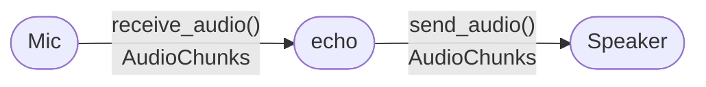

# Chapter 1 — Echo

> Mic to speaker, continuously, through the `Transport` protocol.
> First encounter with EasyCat and with async audio streams.

## Prerequisites

- [Chapter 0](../00-hello-audio/)
- `uv sync --extra quickstart --group dev`
- A mic and speakers. **Use headphones, or put the mic far from
  the speaker** — otherwise you will get a feedback loop the
  instant you press play.

> **Minimum to skip the ladder:** chapter 0 alone. This chapter
> assumes you can read raw PCM and nothing more.

## Diff from chapter 0

- **Added:** the `Transport` protocol (`src/easycat/providers.py`);
  `LocalTransport` driving the mic + speaker as async streams; the
  first `async for chunk in stream:` loop.
- **Removed:** chapter 0's synchronous `sd.rec` / `sd.play`.
  PortAudio now lives behind `LocalTransport`.

<!-- BEGIN auto:diff prev=00-hello-audio src=main.py -->
<details>
<summary>Full unified diff vs <code>00-hello-audio/main.py</code> (auto-generated)</summary>

```diff
--- docs/teaching/00-hello-audio/main.py
+++ docs/teaching/01-echo/main.py
@@ -1,8 +1,7 @@
-"""Chapter 0 — Hello, Audio.
+"""Chapter 1 — Echo.
 
-Record 3 seconds of mic audio, play it back, show the byte math,
-then replay at different chunk sizes so the reader can *hear* the
-latency difference.
+Mic → speaker, continuously, through EasyCat's ``Transport`` protocol.
+Runs until Ctrl-C.
 
 Dependency:
     uv sync --extra quickstart --group dev
@@ -10,100 +9,42 @@
 
 from __future__ import annotations
 
-import time
+import asyncio
 
-import numpy as np
-import sounddevice as sd
-
-SAMPLE_RATE = 16_000
-DURATION_S = 3
-CHANNELS = 1
-DTYPE = np.int16
+from easycat import LocalTransportConfig
+from easycat.transports.local import LocalTransport
 
 
-def record(seconds: int) -> np.ndarray:
-    """Block for `seconds` while capturing mono int16 at 16 kHz."""
-    print(f"Recording {seconds}s... speak now.")
-    samples = sd.rec(
-        frames=seconds * SAMPLE_RATE,
-        samplerate=SAMPLE_RATE,
-        channels=CHANNELS,
-        dtype="int16",
-    )
-    sd.wait()
-    return samples[:, 0]  # drop the channel dim; we're mono
+async def echo(transport) -> None:
+    """Pipe every inbound audio chunk straight to the outbound side.
+
+    ``transport`` is deliberately untyped. Any object that matches
+    the ``Transport`` protocol (the four methods in
+    ``easycat.providers.Transport``) will work — that is the whole
+    point of duck-typed protocols. Chapter 13 swaps in a different
+    transport without changing this function.
+
+    ``transport.receive_audio()`` is an *async generator* of audio
+    chunks. ``await transport.send_audio(chunk)`` hands the chunk to
+    the speaker. No buffer, no turn detection, no STT — the point
+    of this chapter is the shape of the loop itself.
+    """
+    async for chunk in transport.receive_audio():
+        await transport.send_audio(chunk)
 
 
-def play_one_shot(samples: np.ndarray) -> None:
-    """Play the whole buffer in a single blocking call."""
-    sd.play(samples, SAMPLE_RATE)
-    sd.wait()
-
-
-def play_chunked(samples: np.ndarray, chunk_ms: int) -> None:
-    """Play the buffer in fixed-size chunks so the reader can feel
-    the chunking tradeoff.
-
-    ``latency='low'`` and a matching ``blocksize`` keep PortAudio
-    from pre-buffering a full second of audio before it starts —
-    which would hide the whole point of the demo.
-    """
-    chunk_samples = SAMPLE_RATE * chunk_ms // 1000
-    stream = sd.OutputStream(
-        samplerate=SAMPLE_RATE,
-        channels=CHANNELS,
-        dtype="int16",
-        blocksize=chunk_samples,
-        latency="low",
-    )
-    stream.start()
-    open_time = time.monotonic()
-    first_chunk = samples[:chunk_samples].reshape(-1, CHANNELS)
-    stream.write(first_chunk)
-    first_sound = time.monotonic()
-    for offset in range(chunk_samples, len(samples), chunk_samples):
-        block = samples[offset : offset + chunk_samples].reshape(-1, CHANNELS)
-        stream.write(block)
-    stream.stop()
-    stream.close()
-    total = time.monotonic() - open_time
-    print(
-        f"  chunk_ms={chunk_ms:>4}  "
-        f"time-to-first-sound={1000 * (first_sound - open_time):6.1f}ms  "
-        f"total={total:.2f}s"
-    )
-
-
-def explain_bytes(samples: np.ndarray) -> None:
-    buffer = samples.tobytes()
-    predicted = DURATION_S * SAMPLE_RATE * np.dtype(DTYPE).itemsize * CHANNELS
-    print(
-        f"Math: {DURATION_S}s × {SAMPLE_RATE} samples/s × "
-        f"{np.dtype(DTYPE).itemsize} bytes/sample × {CHANNELS} ch "
-        f"= {predicted} B"
-    )
-    print(f"Actual: len(buffer.tobytes()) = {len(buffer)} B")
-    print(f"First 10 samples: {samples[:10].tolist()}")
-    mn, mx = int(samples.min()), int(samples.max())
-    print(f"Range: [{mn}, {mx}] (int16 clips at ±32767)")
-
-
-def main() -> None:
-    samples = record(DURATION_S)
-
-    print("\nBytes:")
-    explain_bytes(samples)
-
-    print("\nPlayback — one-shot:")
-    play_one_shot(samples)
-
-    # Chunk-size demo. 10ms feels instant; 200ms feels slow-start.
-    # We're not changing the audio — only how we *feed it* to the
-    # speaker. Perceived latency = chunk size + scheduling jitter.
-    print("\nPlayback — chunked:")
-    for chunk_ms in (10, 50, 200):
-        play_chunked(samples, chunk_ms)
+async def main() -> None:
+    transport = LocalTransport(LocalTransportConfig())
+    await transport.connect()
+    print("Echoing mic to speakers. Ctrl-C to stop.")
+    try:
+        await echo(transport)
+    finally:
+        await transport.disconnect()
 
 
 if __name__ == "__main__":
-    main()
+    try:
+        asyncio.run(main())
+    except KeyboardInterrupt:
+        pass
```

</details>
<!-- END auto:diff -->

## Run it

```bash
uv run python docs/teaching/01-echo/main.py
```

Talk to your computer. Hear yourself, delayed by a few frames.
Ctrl-C to stop.

## The whole script

<!-- BEGIN auto:snippet src=main.py symbol=echo -->
```python
async def echo(transport) -> None:
    """Pipe every inbound audio chunk straight to the outbound side.

    ``transport`` is deliberately untyped. Any object that matches
    the ``Transport`` protocol (the four methods in
    ``easycat.providers.Transport``) will work — that is the whole
    point of duck-typed protocols. Chapter 13 swaps in a different
    transport without changing this function.

    ``transport.receive_audio()`` is an *async generator* of audio
    chunks. ``await transport.send_audio(chunk)`` hands the chunk to
    the speaker. No buffer, no turn detection, no STT — the point
    of this chapter is the shape of the loop itself.
    """
    async for chunk in transport.receive_audio():
        await transport.send_audio(chunk)
```
<!-- END auto:snippet -->

Three lines of actual logic, wrapped in a docstring that names
what each line does. That's the point of this chapter. The rest
is the setup that gets you to "three lines."

## The Transport protocol

`Transport` is the first of EasyCat's provider protocols you will
meet. It lives at `src/easycat/providers.py`. In stripped-down
form:

```python
@runtime_checkable
class Transport(Protocol):
    async def connect(self) -> None: ...
    async def disconnect(self) -> None: ...
    def receive_audio(self) -> AsyncIterator[AudioChunk]: ...
    async def send_audio(self, chunk: AudioChunk) -> None: ...
```

Four methods. Any class that provides those four — with compatible
signatures — *is* a `Transport`. No inheritance, no registration,
no base class to inherit from. This is `typing.Protocol` doing
structural typing: "duck typing, but the type checker verifies."

`LocalTransport` (mic + speaker via PortAudio), `TwilioTransport`
(telephony), `WebRTCTransport` (browser), `WebSocketTransport`
(custom clients) all satisfy the same protocol. Your `echo`
function doesn't care which one it got. Chapter 13 will swap them
and you will not touch `echo` to do it.

## Why async, not callbacks

A callback API would look like:

```python
transport.on_audio(lambda chunk: transport.send_audio(chunk))
```

That works for echo. It starts falling over the instant you want
to "wait for STT to return, then send the transcript to an LLM,
then stream the response to TTS, all while still receiving mic
audio." Callbacks and `await` don't compose nicely; callbacks and
`async for` do. Every downstream chapter depends on being able to
write `async for chunk in stream:` — hence the choice at this layer.

## Architecture diagram



## Pocket note

`LocalTransport` handles its own sample-rate choice internally
(24 kHz mono by default). Keep the phrase "sample-rate mismatch"
in a pocket for chapter 13 — it's what goes wrong when you start
swapping transports.

## Try breaking it

Insert a 500ms buffer before forwarding:

```python
buffer = []
async for chunk in transport.receive_audio():
    buffer.append(chunk)
    if sum(c.duration_ms for c in buffer) >= 500:
        old = buffer.pop(0)
        await transport.send_audio(old)
```

Now you have a delay line. Why does that create the sensation of
an *echo* rather than just "a delay"? (Hint: your brain is
comparing direct sound reaching your skull with delayed sound
reaching your ears.)

## What's next

[Chapter 2 — Transcribe](../02-transcribe/) keeps the inbound
stream but sends it to an STT provider instead of back to the
speaker. First journal, first taste of batch-vs-streaming latency.
