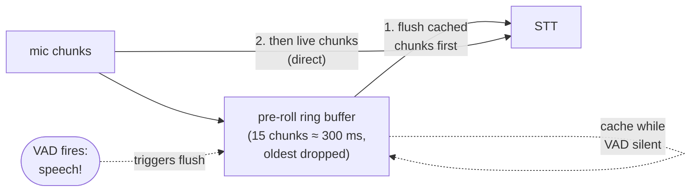

# Chapter 4 — VAD + Pre-roll

> Real speech detection. And why the buffer *before* the detection
> matters as much as the detection itself.

## Prerequisites

- [Chapter 3](../03-parrot-naive/) (ideally with breaker recordings
  in your ears)
- `uv sync --extra quickstart --group dev` — the `quickstart`
  extra pulls in `onnxruntime`, which Silero VAD needs.
- `OPENAI_API_KEY` (TTS) and `DEEPGRAM_API_KEY` (STT).

> **Minimum to skip the ladder:** chapter 2 (STT events). Chapter
> 3 is the motivation; you can read its README without running
> it. The bonus `naive_threshold.py` here is the wrong-version
> warm-up for this chapter — see "The naive predecessor" below.

## Diff from chapter 3

- **Added:** `create_vad()` + a `MiniTurnDetector` with a 300 ms
  pre-roll ring buffer; a `--no-preroll` flag to demonstrate
  start-of-utterance truncation; `naive_threshold.py` showing why
  an energy threshold isn't enough.
- **Modified:** turns now commit on VAD boundaries, not on a
  fixed-timeout absence of STT partials.
- **Removed:** the silence-timeout turn detector from chapter 3.

<!-- BEGIN auto:diff prev=03-parrot-naive src=main.py -->
<details>
<summary>Full unified diff vs <code>03-parrot-naive/main.py</code> (auto-generated)</summary>

```diff
--- docs/teaching/03-parrot-naive/main.py
+++ docs/teaching/04-vad-preroll/main.py
@@ -1,136 +1,183 @@
-"""Chapter 3 — Parrot, the naive way.
+"""Chapter 4 — VAD + pre-roll.
 
-A bot that parrots whatever it thinks you just said. Turn detection
-is a fixed silence timeout on STT partials. Deliberately broken.
+Replace chapter 3's fixed silence timeout with a real voice-activity
+detector plus a pre-roll ring buffer. The same parrot loop, now gated
+on VAD turn boundaries instead of "500 ms since the last STT event."
 
-Run it and break it — "The capital of France is... uh... Paris" is
-the canonical killer. Chapter 4 replaces this with a real VAD.
+Run with ``--no-preroll`` to hear the start-of-utterance truncation
+this chapter was designed to fix.
 
 Dependencies:
     uv sync --extra quickstart --group dev
     export OPENAI_API_KEY=...      # OpenAI TTS
-    export DEEPGRAM_API_KEY=...    # mid-speech STT partials
+    export DEEPGRAM_API_KEY=...    # Streaming STT
 """
 
 from __future__ import annotations
 
+import argparse
 import asyncio
+import collections
 import os
 import time
 import types
 from pathlib import Path
 
 from easycat import LocalTransportConfig
-from easycat.audio_format import PCM16_MONO_24K
+from easycat.audio_format import PCM16_MONO_24K, AudioChunk
 from easycat.debug.export import export_debug_bundle
-from easycat.events import EventBus, STTEventType
+from easycat.events import EventBus, STTEventType, VADStartSpeaking, VADStopSpeaking
 from easycat.quick import speak
 from easycat.runtime import InMemoryRingBuffer, JournalRecordKind
 from easycat.stt.factory import STTProviderConfig, create_stt_provider
 from easycat.transports.local import LocalTransport
+from easycat.vad import VADConfig
+from easycat.vad.factory import create_vad
 
-SILENCE_TIMEOUT_S = 0.5  # ← the magic number we will watch break things
+PREROLL_FRAMES = 15  # 15 × 20 ms = 300 ms of audio *before* VAD fires
 RUNS_DIR = Path(__file__).parent / "runs"
-SESSION_ID = f"ch03-parrot-{int(time.time())}"
+
+
+class MiniTurnDetector:
+    """Tiny turn detector: VAD + pre-roll buffer.
+
+    Consumes raw audio chunks, yields tagged events:
+
+        ("speech_started", first_chunk)  - once per turn, at VAD-on.
+                                           Emits pre-roll chunks too.
+        ("frame",          chunk)         - while VAD says "speech."
+        ("speech_ended",   None)          - once per turn, at VAD-off.
+
+    About 40 lines of real logic. EasyCat's production ``TurnManager``
+    (``src/easycat/turn_manager.py``) is a 5-state FSM with far more
+    responsibilities (bot-speech overlap, cancellation, actions); read
+    it once you understand why each extra state is there.
+    """
+
+    def __init__(self, vad, preroll_frames: int = PREROLL_FRAMES) -> None:
+        self._vad = vad
+        self._preroll: collections.deque[AudioChunk] = collections.deque(maxlen=preroll_frames)
+        self._speaking = False
+
+    async def frames(self, audio_iter):
+        async for chunk in audio_iter:
+            vad_events = [ev async for ev in self._vad.process(chunk)]
+
+            for ev in vad_events:
+                if isinstance(ev, VADStartSpeaking):
+                    # Flush the pre-roll buffer so STT sees the sounds
+                    # that arrived *before* the VAD decided to fire.
+                    while self._preroll:
+                        yield "speech_started", self._preroll.popleft()
+                    self._speaking = True
+                elif isinstance(ev, VADStopSpeaking):
+                    self._speaking = False
+                    yield "speech_ended", None
+
+            if self._speaking:
+                yield "frame", chunk
+            else:
+                self._preroll.append(chunk)
+
+
+async def parrot(
+    transport,
+    stt_factory,
+    detector: MiniTurnDetector,
+    journal: InMemoryRingBuffer,
+    session_id: str,
+) -> None:
+    """On each VAD turn, stream audio into STT, wait for final, speak it."""
+    stt = None
+    collected_final = ""
+
+    async for tag, chunk in detector.frames(transport.receive_audio()):
+        if tag == "speech_started":
+            if stt is None:
+                stt = stt_factory()
+                await stt.start_stream()
+                collected_final = ""
+                journal.append(
+                    kind=JournalRecordKind.EVENT,
+                    name="turn.started",
+                    session_id=session_id,
+                    data={"stage": "turn", "t_ms": time.monotonic() * 1000},
+                )
+            await stt.send_audio(chunk)
+
+        elif tag == "frame" and stt is not None:
+            await stt.send_audio(chunk)
+
+        elif tag == "speech_ended" and stt is not None:
+            # Drain the event queue until the sentinel from end_stream().
+            # A VADStop before STT saw any speech is harmless — we just
+            # close an empty stream and get no FINAL back.
+            await stt.end_stream()
+            async for event in stt.events():
+                if event.type == STTEventType.FINAL:
+                    collected_final = event.text
+            stt = None
+
+            journal.append(
+                kind=JournalRecordKind.EVENT,
+                name="turn.ended",
+                session_id=session_id,
+                data={
+                    "stage": "turn",
+                    "t_ms": time.monotonic() * 1000,
+                    "text": collected_final,
+                },
+            )
+
+            if collected_final.strip():
+                print(f"  → parrot: {collected_final!r}")
+                await speak(transport, collected_final)
 
 
 async def main() -> None:
+    parser = argparse.ArgumentParser()
+    parser.add_argument(
+        "--no-preroll",
+        action="store_true",
+        help="Disable pre-roll; start-of-utterance will be clipped.",
+    )
+    args = parser.parse_args()
+
     oai_key = os.getenv("OPENAI_API_KEY")
     dg_key = os.getenv("DEEPGRAM_API_KEY")
     if not oai_key or not dg_key:
-        raise SystemExit("Set OPENAI_API_KEY (for TTS) and DEEPGRAM_API_KEY (for STT).")
+        raise SystemExit("Set OPENAI_API_KEY (TTS) and DEEPGRAM_API_KEY (STT).")
+
+    preroll = 0 if args.no_preroll else PREROLL_FRAMES
+    session_id = f"ch04-vad-{'nopreroll' if args.no_preroll else 'preroll'}-{int(time.time())}"
+    print(f"Pre-roll: {preroll * 20} ms" if preroll else "Pre-roll: OFF")
 
     journal = InMemoryRingBuffer(capacity=10_000)
     transport = LocalTransport(LocalTransportConfig(audio_format=PCM16_MONO_24K))
+    vad = create_vad(VADConfig())
+    detector = MiniTurnDetector(vad, preroll_frames=preroll)
 
-    # Deepgram emits partials mid-speech, which is what this chapter needs
-    # to feel break. Its STT factory config takes provider-specific args via
-    # ``params``. ``sample_rate=24000`` matches our LocalTransport's mic
-    # format; ``event_bus`` is only used by Deepgram for WebSocket-reconnect
-    # telemetry — we wire a fresh bus here with no subscribers to satisfy
-    # the provider's constructor.
-    stt = create_stt_provider(
-        STTProviderConfig(
-            provider="deepgram",
-            api_key=dg_key,
-            params={"sample_rate": 24000, "event_bus": EventBus()},
+    def stt_factory():
+        return create_stt_provider(
+            STTProviderConfig(
+                provider="deepgram",
+                api_key=dg_key,
+                params={"sample_rate": 24000, "event_bus": EventBus()},
+            )
         )
-    )
 
     await transport.connect()
-    await stt.start_stream()
-    start = time.monotonic()
-    print("Naive parrot. Talk to it. Ctrl-C when you're sick of it.")
-
-    # Bridge STT events into an asyncio.Queue so the parrot loop can use
-    # ``asyncio.wait_for`` to implement "silence timeout since last event."
-    ev_queue: asyncio.Queue = asyncio.Queue()
-
-    async def feed_audio() -> None:
-        async for chunk in transport.receive_audio():
-            await stt.send_audio(chunk)
-
-    async def listen_stt() -> None:
-        async for event in stt.events():
-            await ev_queue.put(event)
-        await ev_queue.put(None)
-
-    async def parrot() -> None:
-        last_text = ""
-        while True:
-            try:
-                # If no new event arrives within SILENCE_TIMEOUT_S, we
-                # interpret silence as "user is done" — the whole bug.
-                event = await asyncio.wait_for(ev_queue.get(), timeout=SILENCE_TIMEOUT_S)
-            except TimeoutError:
-                if last_text:
-                    offset_ms = (time.monotonic() - start) * 1000
-                    print(f"  t+{offset_ms:6.0f}ms  PARROT → {last_text!r}")
-                    journal.append(
-                        kind=JournalRecordKind.EVENT,
-                        name="parrot.fire",
-                        session_id=SESSION_ID,
-                        data={
-                            "stage": "parrot",
-                            "committed_text": last_text,
-                            "silence_timeout_s": SILENCE_TIMEOUT_S,
-                            "offset_ms": offset_ms,
-                        },
-                    )
-                    await speak(transport, last_text)
-                    last_text = ""
-                continue
-            if event is None:
-                break
-            # Deliberately acting on partials — chapter 2's rule, broken
-            # on purpose. Chapter 4 restores it by waiting for a real
-            # turn boundary from the VAD.
-            last_text = event.text
-            kind = "FINAL" if event.type == STTEventType.FINAL else "part "
-            offset_ms = (time.monotonic() - start) * 1000
-            print(f"  t+{offset_ms:6.0f}ms  [{kind}] {event.text}")
-            journal.append(
-                kind=JournalRecordKind.EVENT,
-                name=f"stt.{event.type.value}",
-                session_id=SESSION_ID,
-                data={
-                    "stage": "stt",
-                    "event_type": event.type.value,
-                    "text": event.text,
-                    "offset_ms": offset_ms,
-                },
-            )
+    print("Speak. The bot parrots back after each VAD turn. Ctrl-C to stop.")
 
     try:
-        await asyncio.gather(feed_audio(), listen_stt(), parrot())
+        await parrot(transport, stt_factory, detector, journal, session_id)
     except (KeyboardInterrupt, asyncio.CancelledError):
         pass
     finally:
-        await stt.end_stream()
         await transport.disconnect()
 
     RUNS_DIR.mkdir(exist_ok=True)
-    bundle_path = RUNS_DIR / f"{SESSION_ID}.bundle"
+    bundle_path = RUNS_DIR / f"{session_id}.bundle"
     session_stub = types.SimpleNamespace(journal=journal)
     export_debug_bundle(session_stub, bundle_path, overwrite=True)
     print(f"\nWrote bundle → {bundle_path.relative_to(Path.cwd())}")
```

</details>
<!-- END auto:diff -->

## The naive predecessor

Before reaching for Silero, read `naive_threshold.py`:

```bash
uv run python docs/teaching/04-vad-preroll/naive_threshold.py
```

It classifies a chunk as speech if its RMS energy exceeds a fixed
threshold. **Wrong-version-first** warm-up: it fires on every
keyboard click, drops out mid-vowel for soft talkers, and never
fires at all next to a fan. The script logs each false-fire to
the journal so you can read the misclassifications back. Once
you've heard it fail on your own voice, the rest of this chapter
(real VAD + pre-roll) lands harder.

## Run it

```bash
# With pre-roll: the start of every word survives.
uv run python docs/teaching/04-vad-preroll/main.py

# Without pre-roll: "Hello" becomes "ello."
uv run python docs/teaching/04-vad-preroll/main.py --no-preroll
```

Say "Hello" ten times under each setting. Listen to the parrot.
That is the demo.

## What a VAD actually does

It classifies a small audio frame (10-30 ms) as **speech** or
**not-speech**. That's all. VAD is not a turn detector; it is the
primitive that makes a turn detector possible.

`easycat.vad.factory.create_vad()` picks a backend automatically:
Silero → FunASR → TEN → Krisp. Silero is the default; its ONNX
model is bundled.

## The pre-roll problem

A VAD is a decision made *after* it has seen enough audio. Fast
backends fire 100-200 ms late — you said "Hello," but the VAD's
"speech" verdict lands sometime during the "e." If you only forward
audio chunks that arrive *after* VAD-on, your STT hears "ello"
and confidently transcribes "Elo."

## The pre-roll fix

Keep a short ring buffer of recent audio (we use 300 ms, about 15
chunks of 20 ms at 24 kHz). When VAD fires, flush the buffer into
STT first, then forward live chunks. STT sees the full "Hello."



The mic feeds the ring buffer continuously (oldest chunk drops out
every 20 ms). When VAD fires, the whole buffer is flushed to STT
first — so STT sees the 300 ms that arrived *before* the VAD
decision — and live chunks then flow directly to STT.

## `MiniTurnDetector`

About 40 lines of actual logic. Three state transitions:

| From  | On              | Action                             |
|-------|-----------------|------------------------------------|
| idle  | VADStart        | Flush pre-roll, emit `speech_started` |
| speak | each chunk      | Emit `frame`                        |
| speak | VADStop         | Emit `speech_ended`, drop STT stream|
| idle  | each chunk      | Append to pre-roll ring             |

You are writing this yourself in ~40 lines. EasyCat's production
`TurnManager` (`src/easycat/turn_manager.py`) is a 5-state FSM
covering overlap with bot speech, cancellation, push-to-talk,
session actions. Every extra state defends against a specific
thing your `MiniTurnDetector` can't handle; after you finish this
chapter, open that file and pattern-match the extras to the
problems they solve.

<!-- BEGIN auto:snippet src=main.py symbol=MiniTurnDetector -->
```python
class MiniTurnDetector:
    """Tiny turn detector: VAD + pre-roll buffer.

    Consumes raw audio chunks, yields tagged events:

        ("speech_started", first_chunk)  - once per turn, at VAD-on.
                                           Emits pre-roll chunks too.
        ("frame",          chunk)         - while VAD says "speech."
        ("speech_ended",   None)          - once per turn, at VAD-off.

    About 40 lines of real logic. EasyCat's production ``TurnManager``
    (``src/easycat/turn_manager.py``) is a 5-state FSM with far more
    responsibilities (bot-speech overlap, cancellation, actions); read
    it once you understand why each extra state is there.
    """

    def __init__(self, vad, preroll_frames: int = PREROLL_FRAMES) -> None:
        self._vad = vad
        self._preroll: collections.deque[AudioChunk] = collections.deque(maxlen=preroll_frames)
        self._speaking = False

    async def frames(self, audio_iter):
        async for chunk in audio_iter:
            vad_events = [ev async for ev in self._vad.process(chunk)]

            for ev in vad_events:
                if isinstance(ev, VADStartSpeaking):
                    # Flush the pre-roll buffer so STT sees the sounds
                    # that arrived *before* the VAD decided to fire.
                    while self._preroll:
                        yield "speech_started", self._preroll.popleft()
                    self._speaking = True
                elif isinstance(ev, VADStopSpeaking):
                    self._speaking = False
                    yield "speech_ended", None

            if self._speaking:
                yield "frame", chunk
            else:
                self._preroll.append(chunk)
```
<!-- END auto:snippet -->

## Try breaking it

Say the same breakers you tortured chapter 3 with ("the capital
of France is... uh... Paris", "apples, bananas, pears", a yes/no
question) and run the script **twice** — once with pre-roll on,
once with `--no-preroll`. Open both bundles:

```python
from easycat.debug.testing import load_bundle
for which in ("preroll", "nopreroll"):
    for b in Path("docs/teaching/04-vad-preroll/runs/").glob(
        f"ch04-vad-{which}-*.bundle"
    ):
        bundle = load_bundle(b)
        print(which, [
            r["data"].get("text") for r in bundle.records()
            if r["name"] == "turn.ended"
        ])
```

You should see:

- Fewer chopped first syllables in the `preroll` run.
- The "uh… Paris" breaker now survives (the "uh" has speech energy,
  so VAD stays on straight through).
- Lists are still fragile: commas are often below the speech
  threshold and VAD fires `VADStopSpeaking` between items.
- New failures: a cough, a door slam, or keyboard clicks can
  trigger false VAD-ons.

VAD is still a threshold. It just trips on a much better feature
than "has the STT stream been quiet?" The remaining false-fires
are noise-reduction's job — [chapter 10](../10-cleaning-signal/).

## What's next

[Chapter 5 — The blocking agent](../05-blocking-agent/) drops the
parrot and puts a real LLM at the heart of the loop. The turn
latency problem we traded *away* in chapter 3 comes back, worse,
in a new form.
