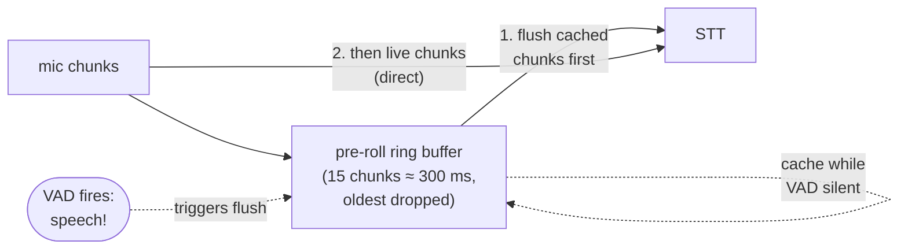

# Chapter 4 — VAD + Pre-roll

<!-- BEGIN auto:navigation -->
**Progress: 5 of 16** · [← Chapter 3 — Parrot, the Naive Way](../03-parrot-naive/) · [Ladder index](../) · [Exercises](./EXERCISES.md) · [Chapter 5 — The Blocking Agent →](../05-blocking-agent/)
<!-- END auto:navigation -->

> Real speech detection. And why the buffer *before* the detection
> matters as much as the detection itself.

## Prerequisites

- [Chapter 3](../03-parrot-naive/) (ideally with breaker recordings
  in your ears)
- `uv sync --extra quickstart --extra deepgram --group dev` — the `quickstart`
  extra pulls in `onnxruntime`, which Silero VAD needs.
- `OPENAI_API_KEY` (TTS) and `DEEPGRAM_API_KEY` (STT).
- Running this chapter makes live provider calls that may incur charges.
  Review your provider billing and usage limits first.
- Provider-backed scripts may send audio, transcripts, or prompts to configured
  services. Use non-sensitive test content and review provider data-handling
  policies first.
- After setting provider keys, run `uv run easycat doctor` from the repo root; if keys live in `.env`, run `uv run easycat doctor --env-file .env`. Use `uv run easycat doctor --env-file .env --json` for parseable checks.
- If keys live in `.env`, also add `--env-file .env` after `uv run`
  in the chapter command you run.

> **Minimum to skip the ladder:** chapter 2 (STT events). Chapter
> 3 is the motivation; you can read its README without running
> it. The bonus `naive_threshold.py` here is the wrong-version
> warm-up for this chapter — see "The naive predecessor" below.

## Diff from chapter 3

- **Added:** `create_vad()` + a `MiniTurnDetector` with a 300 ms
  pre-roll ring buffer; a `--no-preroll` flag to demonstrate
  start-of-utterance truncation; `naive_threshold.py` showing why
  an energy threshold isn't enough; `delivery_probe.py` for provider-free
  output-acceptance evidence.
- **Modified:** turns now commit on VAD boundaries, not on a
  fixed-timeout absence of STT partials.
- **Preserved:** `speak()` acceptance/rejection counts still become
  `parrot.delivery`; better input endpointing does not prove output playback.
- **Removed:** the silence-timeout turn detector from chapter 3.

<!-- BEGIN auto:diff prev=03-parrot-naive src=main.py trim_blank_context=true -->
<details>
<summary>Full unified diff vs <code>03-parrot-naive/main.py</code> (auto-generated)</summary>

```diff
--- docs/teaching/03-parrot-naive/main.py
+++ docs/teaching/04-vad-preroll/main.py
@@ -1,15 +1,16 @@
-"""Chapter 3 — Parrot, the naive way.
-
-A bot that parrots whatever it thinks you just said. Turn detection
-is a fixed silence timeout on STT partials. Deliberately broken.
-
-Run it and break it — "The capital of France is... uh... Paris" is
-the canonical killer. Chapter 4 replaces this with a real VAD.
+"""Chapter 4 — VAD + pre-roll.
+
+Replace chapter 3's fixed silence timeout with a real voice-activity
+detector plus a pre-roll ring buffer. The same parrot loop, now gated
+on VAD turn boundaries instead of "500 ms since the last STT event."
+
+Run with ``--no-preroll`` to compare a stream that omits cached audio
+received before VAD-on.

 Dependencies:
     uv sync --extra quickstart --extra deepgram --group dev
     export OPENAI_API_KEY=...      # OpenAI TTS
-    export DEEPGRAM_API_KEY=...    # mid-speech STT partials
+    export DEEPGRAM_API_KEY=...    # Streaming STT
     uv run easycat doctor
     uv run easycat doctor --env-file .env         # if keys live in .env
     uv run easycat doctor --env-file .env --json  # for parseable checks
@@ -18,7 +19,9 @@

 from __future__ import annotations

+import argparse
 import asyncio
+import collections
 import os
 import time
 import types
@@ -26,95 +29,87 @@
 from pathlib import Path

 from easycat import LocalTransportConfig
-from easycat.audio_format import PCM16_MONO_24K
+from easycat.audio_format import PCM16_MONO_24K, AudioChunk
 from easycat.debug.export import export_debug_bundle
-from easycat.events import Error, EventBus, STTEvent, STTEventType
+from easycat.events import EventBus, STTEventType, VADStartSpeaking, VADStopSpeaking
 from easycat.recipes import speak
 from easycat.runtime import InMemoryRingBuffer, JournalRecordKind
 from easycat.runtime.capabilities import close_if_supported
 from easycat.stt.factory import STTProviderConfig, create_stt_provider
 from easycat.transports.local import LocalTransport
-
-SILENCE_TIMEOUT_S = 0.5  # ← the magic number we will watch break things
+from easycat.vad import VADConfig
+from easycat.vad.factory import create_vad
+
+PREROLL_FRAMES = 15  # 15 × 20 ms = 300 ms of audio *before* VAD fires
 RUNS_DIR = Path(__file__).parent / "runs"
-SESSION_ID = f"ch03-parrot-{int(time.time())}"
-STTQueueItem = tuple[int, STTEvent, float] | None
-
-
-class ParrotEventStreamEndedError(RuntimeError):
-    """Private TaskGroup signal: the STT consumer drained its sentinel."""
-
-
-def record_stt_received(
-    journal: InMemoryRingBuffer,
-    *,
-    event_id: int,
-    event: STTEvent,
-    offset_ms: float,
-    queue_depth: int,
-) -> None:
-    """Record provider ingress before the consumer can be blocked by TTS."""
-    journal.append(
-        kind=JournalRecordKind.EVENT,
-        name="stt.received",
-        session_id=SESSION_ID,
-        data={
-            "stage": "stt",
-            "event_id": event_id,
-            "event_type": event.type.value,
-            "text": event.text,
-            "offset_ms": offset_ms,
-            "queue_depth_before_put": queue_depth,
-        },
-    )
-
-
-def record_stt_consumed(
-    journal: InMemoryRingBuffer,
-    *,
-    event_id: int,
-    event: STTEvent,
-    received_offset_ms: float,
-    consumed_offset_ms: float,
-    queue_depth: int,
-) -> None:
-    """Record when the parrot finally dequeues one provider event."""
-    journal.append(
-        kind=JournalRecordKind.EVENT,
-        name=f"stt.{event.type.value}",
-        session_id=SESSION_ID,
-        data={
-            "stage": "stt",
-            "event_id": event_id,
-            "event_type": event.type.value,
-            "text": event.text,
-            "offset_ms": consumed_offset_ms,
-            "received_offset_ms": received_offset_ms,
-            "consumer_lag_ms": consumed_offset_ms - received_offset_ms,
-            "queue_depth_after_get": queue_depth,
-        },
-    )
+
+
+class MiniTurnDetector:
+    """Tiny turn detector: VAD + pre-roll buffer.
+
+    Consumes raw audio chunks, yields tagged events:
+
+        ("speech_started", None)   - once per turn, at VAD-on.
+        ("frame",          chunk)  - cached pre-roll first, then live speech.
+        ("speech_ended",   None)   - once per turn, at VAD-off.
+
+    About 40 lines of real logic. EasyCat's production ``TurnManager``
+    (``src/easycat/turn_manager.py``) is a 5-state FSM with far more
+    responsibilities (bot-speech overlap, cancellation, actions); read
+    it once you understand why each extra state is there.
+    """
+
+    def __init__(self, vad, preroll_frames: int = PREROLL_FRAMES) -> None:
+        self._vad = vad
+        self._preroll: collections.deque[AudioChunk] = collections.deque(maxlen=preroll_frames)
+        self._speaking = False
+
+    async def frames(self, audio_iter):
+        async for chunk in audio_iter:
+            vad_events = [ev async for ev in self._vad.process(chunk)]
+
+            for ev in vad_events:
+                if isinstance(ev, VADStartSpeaking):
+                    self._speaking = True
+                    # Starting the turn is a state event, independent of
+                    # whether any pre-roll frames exist. This matters when
+                    # ``preroll_frames=0``: STT must still start before the
+                    # current live frame is emitted below.
+                    yield "speech_started", None
+
+                    # Flush cached frames in their original order so STT
+                    # sees the sounds that arrived before VAD fired.
+                    while self._preroll:
+                        yield "frame", self._preroll.popleft()
+                elif isinstance(ev, VADStopSpeaking):
+                    self._speaking = False
+                    yield "speech_ended", None
+
+            if self._speaking:
+                yield "frame", chunk
+            else:
+                self._preroll.append(chunk)


 def record_delivery(
     journal: InMemoryRingBuffer,
     *,
+    session_id: str,
     text: str,
     accepted_chunks: int,
     rejected_chunks: int,
-    offset_ms: float,
 ) -> None:
-    """Record transport acceptance without claiming speaker playback."""
+    """Preserve transport acceptance without claiming speaker playback."""
     journal.append(
         kind=JournalRecordKind.EVENT,
         name="parrot.delivery",
-        session_id=SESSION_ID,
+        session_id=session_id,
         data={
             "stage": "parrot",
             "committed_text": text,
             "accepted_chunks": accepted_chunks,
             "rejected_chunks": rejected_chunks,
-            "offset_ms": offset_ms,
+            "t_ms": time.monotonic() * 1000,
         },
     )
     if rejected_chunks:
@@ -124,183 +119,123 @@
         )


-async def speak_and_record(
-    transport, journal: InMemoryRingBuffer, text: str, start: float
+async def parrot(
+    transport,
+    stt_factory,
+    detector: MiniTurnDetector,
+    journal: InMemoryRingBuffer,
+    session_id: str,
 ) -> None:
-    """Speak once, then preserve every transport acceptance result."""
-    accepted_chunks, rejected_chunks = await speak(transport, text)
-    record_delivery(
-        journal,
-        text=text,
-        accepted_chunks=accepted_chunks,
-        rejected_chunks=rejected_chunks,
-        offset_ms=(time.monotonic() - start) * 1000,
-    )
-
-
-async def feed_audio(stt, transport) -> None:
-    async for chunk in transport.receive_audio():
-        await stt.send_audio(chunk)
-
-
-async def listen_stt(
-    stt,
-    ev_queue: asyncio.Queue[STTQueueItem],
-    journal: InMemoryRingBuffer,
-    start: float,
-    provider_errors: list[BaseException] | None = None,
-) -> None:
-    event_id = 0
-    async for event in stt.events():
-        event_id += 1
-        received_offset_ms = (time.monotonic() - start) * 1000
-        record_stt_received(
-            journal,
-            event_id=event_id,
-            event=event,
-            offset_ms=received_offset_ms,
-            queue_depth=ev_queue.qsize(),
-        )
-        await ev_queue.put((event_id, event, received_offset_ms))
-    # Provider errors are emitted on a task immediately before the terminal
-    # sentinel is queued. Yield once so the synchronous subscriber records an
-    # exhausted-socket failure before we classify stream exhaustion as normal.
-    await asyncio.sleep(0)
-    if provider_errors:
-        raise provider_errors[-1]
-    await ev_queue.put(None)
-
-
-async def parrot_events(
-    transport,
-    ev_queue: asyncio.Queue[STTQueueItem],
-    journal: InMemoryRingBuffer,
-    start: float,
-) -> None:
-    last_text = ""
-    while True:
-        try:
-            # If no new event arrives within SILENCE_TIMEOUT_S, we
-            # interpret silence as "user is done" — the whole bug.
-            item = await asyncio.wait_for(ev_queue.get(), timeout=SILENCE_TIMEOUT_S)
-        except TimeoutError:
-            if last_text:
-                offset_ms = (time.monotonic() - start) * 1000
-                print(f"  t+{offset_ms:6.0f}ms  PARROT → {last_text!r}")
+    """On each VAD turn, stream audio into STT, wait for final, speak it."""
+    stt = None
+    collected_final = ""
+
+    try:
+        async for tag, chunk in detector.frames(transport.receive_audio()):
+            if tag == "speech_started":
+                if stt is None:
+                    stt = stt_factory()
+                    await stt.start_stream()
+                    collected_final = ""
+                    journal.append(
+                        kind=JournalRecordKind.EVENT,
+                        name="turn.started",
+                        session_id=session_id,
+                        data={"stage": "turn", "t_ms": time.monotonic() * 1000},
+                    )
+
+            elif tag == "frame" and stt is not None:
+                await stt.send_audio(chunk)
+
+            elif tag == "speech_ended" and stt is not None:
+                # Drain the event queue until the sentinel from end_stream().
+                # A VADStop before STT saw any speech is harmless — we just
+                # close an empty stream and get no FINAL back.
+                active_stt = stt
+                try:
+                    await active_stt.end_stream()
+                    async for event in active_stt.events():
+                        if event.type == STTEventType.FINAL:
+                            collected_final = event.text
+                finally:
+                    stt = None
+                    await close_if_supported(active_stt)
+
                 journal.append(
                     kind=JournalRecordKind.EVENT,
-                    name="parrot.fire",
-                    session_id=SESSION_ID,
+                    name="turn.ended",
+                    session_id=session_id,
                     data={
-                        "stage": "parrot",
-                        "committed_text": last_text,
-                        "silence_timeout_s": SILENCE_TIMEOUT_S,
-                        "offset_ms": offset_ms,
+                        "stage": "turn",
+                        "t_ms": time.monotonic() * 1000,
+                        "text": collected_final,
                     },
                 )
-                await speak_and_record(transport, journal, last_text, start)
-                last_text = ""
-            continue
-        if item is None:
-            break
-        event_id, event, received_offset_ms = item
-        # Deliberately acting on partials — chapter 2's rule, broken
-        # on purpose. Chapter 4 restores it by waiting for a real
-        # turn boundary from the VAD.
-        last_text = event.text
-        kind = "FINAL" if event.type == STTEventType.FINAL else "part "
-        offset_ms = (time.monotonic() - start) * 1000
-        print(f"  t+{offset_ms:6.0f}ms  [{kind}] {event.text}")
-        record_stt_consumed(
-            journal,
-            event_id=event_id,
-            event=event,
-            received_offset_ms=received_offset_ms,
-            consumed_offset_ms=offset_ms,
-            queue_depth=ev_queue.qsize(),
-        )
-
-
-async def stop_when_parrot_ends(
-    transport,
-    ev_queue: asyncio.Queue[STTQueueItem],
-    journal: InMemoryRingBuffer,
-    start: float,
-) -> None:
-    """Turn normal queue exhaustion into a TaskGroup-wide stop signal."""
-    await parrot_events(transport, ev_queue, journal, start)
-    raise ParrotEventStreamEndedError
-
-
-async def run_parrot(
-    stt,
-    transport,
-    journal: InMemoryRingBuffer,
-    provider_errors: list[BaseException] | None = None,
-) -> None:
-    """Own one parrot stream until cancellation, failure, or STT exhaustion."""
-    async with AsyncExitStack() as resources:
-        # These objects exist before connect(), so register final cleanup
-        # before the first fallible acquisition step.
-        resources.push_async_callback(transport.disconnect)
-        resources.push_async_callback(close_if_supported, stt)
-        await transport.connect()
-
-        await stt.start_stream()
-        # A logical stream exists only after start_stream() succeeds.
-        resources.push_async_callback(stt.end_stream)
-
-        start = time.monotonic()
-        print("Naive parrot. Talk to it. Ctrl-C when you're sick of it.")
-        ev_queue: asyncio.Queue[STTQueueItem] = asyncio.Queue()
-        observed_provider_errors = provider_errors if provider_errors is not None else []
-
-        try:
-            async with asyncio.TaskGroup() as streams:
-                streams.create_task(feed_audio(stt, transport))
-                streams.create_task(
-                    listen_stt(stt, ev_queue, journal, start, observed_provider_errors)
-                )
-                streams.create_task(stop_when_parrot_ends(transport, ev_queue, journal, start))
-        except* ParrotEventStreamEndedError:
-            # ``parrot_events`` consumed the listener's None sentinel. Raising
-            # inside its wrapper makes TaskGroup cancel and join the infinite
-            # microphone feeder before resource teardown begins.
-            pass
+
+                if collected_final.strip():
+                    print(f"  → parrot: {collected_final!r}")
+                    accepted_chunks, rejected_chunks = await speak(transport, collected_final)
+                    record_delivery(
+                        journal,
+                        session_id=session_id,
+                        text=collected_final,
+                        accepted_chunks=accepted_chunks,
+                        rejected_chunks=rejected_chunks,
+                    )
+    finally:
+        if stt is not None:
+            try:
+                await stt.end_stream()
+            finally:
+                await close_if_supported(stt)


 async def main() -> None:
+    parser = argparse.ArgumentParser()
+    parser.add_argument(
+        "--no-preroll",
+        action="store_true",
+        help="Disable pre-roll; omit cached frames received before VAD-on.",
+    )
+    args = parser.parse_args()
+
     oai_key = os.getenv("OPENAI_API_KEY")
     dg_key = os.getenv("DEEPGRAM_API_KEY")
     if not oai_key or not dg_key:
-        raise SystemExit("Set OPENAI_API_KEY (for TTS) and DEEPGRAM_API_KEY (for STT).")
+        raise SystemExit("Set OPENAI_API_KEY (TTS) and DEEPGRAM_API_KEY (STT).")
+
+    preroll = 0 if args.no_preroll else PREROLL_FRAMES
+    session_id = f"ch04-vad-{'nopreroll' if args.no_preroll else 'preroll'}-{int(time.time())}"
+    print(f"Pre-roll: {preroll * 20} ms" if preroll else "Pre-roll: OFF")

     journal = InMemoryRingBuffer(capacity=10_000)
     transport = LocalTransport(LocalTransportConfig(audio_format=PCM16_MONO_24K))

-    # Deepgram emits partials mid-speech, which is what this chapter needs
-    # to feel break. Its STT factory config takes provider-specific args via
-    # ``params``. ``sample_rate=24000`` matches our LocalTransport's mic
-    # format. Capture terminal provider errors so an exhausted reconnect loop
-    # cannot look like an ordinary end of the STT event stream.
-    provider_errors: list[BaseException] = []
-    event_bus = EventBus()
-    event_bus.subscribe(Error, lambda event: provider_errors.append(event.exception))
-    stt = create_stt_provider(
-        STTProviderConfig(
-            provider="deepgram",
-            api_key=dg_key,
-            params={"sample_rate": 24000, "event_bus": event_bus},
+    def stt_factory():
+        return create_stt_provider(
+            STTProviderConfig(
+                provider="deepgram",
+                api_key=dg_key,
+                params={"sample_rate": 24000, "event_bus": EventBus()},
+            )
         )
-    )
-
-    try:
-        await run_parrot(stt, transport, journal, provider_errors)
-    except (KeyboardInterrupt, asyncio.CancelledError):
-        pass
+
+    async with AsyncExitStack() as resources:
+        resources.push_async_callback(transport.disconnect)
+        await transport.connect()
+
+        vad = create_vad(VADConfig())
+        resources.push_async_callback(close_if_supported, vad)
+        detector = MiniTurnDetector(vad, preroll_frames=preroll)
+
+        print("Speak. The bot parrots back after each VAD turn. Ctrl-C to stop.")
+        try:
+            await parrot(transport, stt_factory, detector, journal, session_id)
+        except (KeyboardInterrupt, asyncio.CancelledError):
+            pass

     RUNS_DIR.mkdir(exist_ok=True)
-    bundle_path = RUNS_DIR / f"{SESSION_ID}.bundle"
+    bundle_path = RUNS_DIR / f"{session_id}.bundle"
     session_stub = types.SimpleNamespace(journal=journal)
     export_debug_bundle(session_stub, bundle_path, overwrite=True)
     print(f"\nWrote bundle → {bundle_path.relative_to(Path.cwd())}")
```

</details>
<!-- END auto:diff -->

## The naive predecessor

Before reaching for Silero, read `naive_threshold.py`:

```bash
uv run python docs/teaching/04-vad-preroll/naive_threshold.py
```

It classifies a chunk as speech if its RMS energy exceeds a fixed
threshold. **Wrong-version-first** warm-up: it fires on every
keyboard click, drops out mid-vowel for soft talkers, and never
fires at all next to a fan. The script logs each false-fire to
the journal so you can read the misclassifications back. Once
you've heard it fail on your own voice, the rest of this chapter
(real VAD + pre-roll) lands harder.

## Run it

```bash
# With pre-roll: cached leading frames are included in the STT stream.
uv run python docs/teaching/04-vad-preroll/main.py

# Without pre-roll: compare the onset without those cached frames.
uv run python docs/teaching/04-vad-preroll/main.py --no-preroll
```

Say "Hello" ten times under each setting. Listen to the parrot.
That is the demo.

## What a VAD actually does

It classifies a small audio frame (10-30 ms) as **speech** or
**not-speech**. That's all. VAD is not a turn detector; it is the
primitive that makes a turn detector possible.

`easycat.vad.factory.create_vad()` picks a backend automatically:
Silero → FunASR → TEN → Krisp. Silero is the default; its ONNX
model is bundled.

## The pre-roll problem

A VAD is a decision made *after* it has seen enough audio. Its
"speech" verdict can land after the utterance has already started.
If you only forward chunks from VAD-on onward, the STT stream lacks
the earlier frames and may mis-hear the leading sound (for example,
a live run might turn "Hello" into "Elo"). The delay and transcript
effect depend on the utterance, VAD backend, chunking, and STT provider.

## The pre-roll fix

Keep a short ring buffer of recent audio (we use 300 ms, about 15
chunks of 20 ms at 24 kHz). When VAD fires, flush the buffer into
STT first, then forward live chunks. STT receives the missing onset
context as well; whether that changes a transcript is provider-dependent.


```mermaid
flowchart LR
    Mic[mic chunks] --> Ring["pre-roll ring buffer<br/>(15 chunks ≈ 300 ms,<br/>oldest dropped)"]
    Ring -. cache while<br/>VAD silent .-> Ring
    VAD([VAD fires:<br/>speech!]) -. triggers flush .-> Ring
    Ring -- "1. flush cached<br/>chunks first" --> STT
    Mic -- "2. then live chunks<br/>(direct)" --> STT
```

The mic feeds the ring buffer continuously (oldest chunk drops out
every 20 ms). When VAD fires, the whole buffer is flushed to STT
first — so STT sees the 300 ms that arrived *before* the VAD
decision — and live chunks then flow directly to STT.

## `MiniTurnDetector`

About 40 lines of actual logic. Three state transitions:

| From  | On              | Action                             |
|-------|-----------------|------------------------------------|
| idle  | VADStart        | Flush pre-roll, emit `speech_started` |
| speak | each chunk      | Emit `frame`                        |
| speak | VADStop         | Emit `speech_ended`, drop STT stream|
| idle  | each chunk      | Append to pre-roll ring             |

You are writing this yourself in ~40 lines. EasyCat's production
`TurnManager` (`src/easycat/turn_manager.py`) is a 5-state FSM
covering overlap with bot speech, cancellation, push-to-talk,
session actions. Every extra state defends against a specific
thing your `MiniTurnDetector` can't handle; after you finish this
chapter, open that file and pattern-match the extras to the
problems they solve.

<!-- BEGIN auto:snippet src=main.py symbol=MiniTurnDetector -->
```python
class MiniTurnDetector:
    """Tiny turn detector: VAD + pre-roll buffer.

    Consumes raw audio chunks, yields tagged events:

        ("speech_started", None)   - once per turn, at VAD-on.
        ("frame",          chunk)  - cached pre-roll first, then live speech.
        ("speech_ended",   None)   - once per turn, at VAD-off.

    About 40 lines of real logic. EasyCat's production ``TurnManager``
    (``src/easycat/turn_manager.py``) is a 5-state FSM with far more
    responsibilities (bot-speech overlap, cancellation, actions); read
    it once you understand why each extra state is there.
    """

    def __init__(self, vad, preroll_frames: int = PREROLL_FRAMES) -> None:
        self._vad = vad
        self._preroll: collections.deque[AudioChunk] = collections.deque(maxlen=preroll_frames)
        self._speaking = False

    async def frames(self, audio_iter):
        async for chunk in audio_iter:
            vad_events = [ev async for ev in self._vad.process(chunk)]

            for ev in vad_events:
                if isinstance(ev, VADStartSpeaking):
                    self._speaking = True
                    # Starting the turn is a state event, independent of
                    # whether any pre-roll frames exist. This matters when
                    # ``preroll_frames=0``: STT must still start before the
                    # current live frame is emitted below.
                    yield "speech_started", None

                    # Flush cached frames in their original order so STT
                    # sees the sounds that arrived before VAD fired.
                    while self._preroll:
                        yield "frame", self._preroll.popleft()
                elif isinstance(ev, VADStopSpeaking):
                    self._speaking = False
                    yield "speech_ended", None

            if self._speaking:
                yield "frame", chunk
            else:
                self._preroll.append(chunk)
```
<!-- END auto:snippet -->

## A VAD turn does not own the provider process

Each `speech_started` creates an STT provider in this deliberately explicit
pipeline. `speech_ended` ends that provider's logical stream, drains its final
events, and then calls `close_if_supported()` because this script also owns the
provider object. Cancellation needs the same final cleanup even when no
`speech_ended` tag arrives.

Run both normal and cancelled paths without credentials:

```bash
uv run python docs/teaching/04-vad-preroll/stt_cleanup_probe.py
```

Both paths report one start, one logical end, and one provider close. The
`try/finally` around the detector loop is what makes cancellation obey the
same ownership contract instead of leaking the active per-turn provider.

## Better input does not prove output

VAD and pre-roll improve what reaches STT. They do not change the outbound
transport contract introduced in chapter 3. `speak()` still returns one
acceptance decision per synthesized chunk, and the Chapter 4 parrot preserves
the totals in `parrot.delivery`:

- `rejected_chunks > 0` is direct evidence that synthesized audio was dropped
  before delivery.
- `accepted_chunks > 0` means the transport scheduled those chunks. It does
  not prove a speaker rendered them or a person heard them.
- `turn.ended.data.text` proves the input turn produced final text;
  `parrot.delivery.data.committed_text` links that text to its separate output
  attempt.

Run the real VAD-turn parrot path with scripted STT, TTS, and transport results:

```bash
uv run python docs/teaching/04-vad-preroll/delivery_probe.py
```

The probe's STT starts, receives one frame, ends, and closes before TTS returns
two accepted chunks and one rejection. Its journal order is `turn.started`,
`turn.ended`, then `parrot.delivery`. That order is evidence of three distinct
boundaries—not proof that the final accepted chunk reached a device.

## Try breaking it

Before involving a microphone or provider, run the deterministic frame
trace:

```bash
uv run python docs/teaching/04-vad-preroll/preroll_probe.py
```

Both traces include the frame that triggered `VADStartSpeaking` and the
following live frame. Only `with_preroll` replays `cached-1` and
`cached-2` first. That frame inclusion is the contract; any particular
transcript change is a provider-dependent observation.

Say the same breakers you tortured chapter 3 with ("the capital
of France is... uh... Paris", "apples, bananas, pears", a yes/no
question) and run the script **twice** — once with pre-roll on,
once with `--no-preroll`. Open both bundles:

```python
from easycat.debug.testing import load_bundle
for which in ("preroll", "nopreroll"):
    for b in Path("docs/teaching/04-vad-preroll/runs/").glob(
        f"ch04-vad-{which}-*.bundle"
    ):
        bundle = load_bundle(b)
        print(which, [
            r["data"].get("text") for r in bundle.records()
            if r["name"] == "turn.ended"
        ])
```

You should see:

- The `preroll` run contains the cached leading audio; whether that
  changes the transcript depends on what VAD initially missed and how
  the STT provider decodes both versions.
- The "uh… Paris" breaker remains one turn only when VAD stays active
  through the pause. Pre-roll does not change the stop decision.
- Lists are still fragile: commas are often below the speech
  threshold and VAD fires `VADStopSpeaking` between items.
- New failures: a cough, a door slam, or keyboard clicks can
  trigger false VAD-ons.

VAD is still a threshold. It just trips on a much better feature
than "has the STT stream been quiet?" The remaining false-fires
are noise-reduction's job — [chapter 10](../10-cleaning-signal/).

## What's next

[Chapter 5 — The blocking agent](../05-blocking-agent/) drops the
parrot and puts a real LLM at the heart of the loop. The turn
latency problem we traded *away* in chapter 3 comes back, worse,
in a new form.
