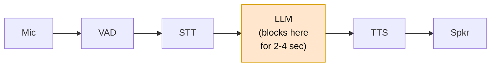

# Chapter 5 — The Blocking Agent

> Swap the parrot for an LLM. The bot falls silent for three
> seconds. This is on purpose.

**Wrong-version-first chapter.** Do not skip. The rest of the
build movement (chapters 6-9) exists to close this gap.

## Prerequisites

- [Chapter 4](../04-vad-preroll/)
- `OPENAI_API_KEY` (LLM + TTS) and `DEEPGRAM_API_KEY` (STT)

> **Minimum to skip the ladder:** chapter 4 alone (VAD-gated
> turns). You can read this chapter without chapter 3's
> wrong-version parrot.

## Diff from chapter 4

- **Added:** an `AsyncOpenAI` client + `blocking_agent` function
  between STT and TTS; three `turn.gap` sub-spans
  (`stt_to_agent_ms`, `agent_ms`, `tts_ms`) journaled per turn.
- **Removed:** the parrot — the bot now answers, instead of
  repeating.

<!-- BEGIN auto:diff prev=04-vad-preroll src=main.py -->
<details>
<summary>Full unified diff vs <code>04-vad-preroll/main.py</code> (auto-generated)</summary>

```diff
--- docs/teaching/04-vad-preroll/main.py
+++ docs/teaching/05-blocking-agent/main.py
@@ -1,21 +1,18 @@
-"""Chapter 4 — VAD + pre-roll.
-
-Replace chapter 3's fixed silence timeout with a real voice-activity
-detector plus a pre-roll ring buffer. The same parrot loop, now gated
-on VAD turn boundaries instead of "500 ms since the last STT event."
-
-Run with ``--no-preroll`` to hear the start-of-utterance truncation
-this chapter was designed to fix.
+"""Chapter 5 — The blocking agent.
+
+Same pipeline as chapter 4, but instead of parroting the transcript
+back, we send it to an LLM and wait for the complete response before
+handing it to TTS. The bot falls silent for 2-4 seconds per turn.
+That silence is the whole point of this chapter.
 
 Dependencies:
     uv sync --extra quickstart --group dev
-    export OPENAI_API_KEY=...      # OpenAI TTS
-    export DEEPGRAM_API_KEY=...    # Streaming STT
+    export OPENAI_API_KEY=...
+    export DEEPGRAM_API_KEY=...
 """
 
 from __future__ import annotations
 
-import argparse
 import asyncio
 import collections
 import os
@@ -23,10 +20,17 @@
 import types
 from pathlib import Path
 
+from openai import AsyncOpenAI
+
 from easycat import LocalTransportConfig
 from easycat.audio_format import PCM16_MONO_24K, AudioChunk
 from easycat.debug.export import export_debug_bundle
-from easycat.events import EventBus, STTEventType, VADStartSpeaking, VADStopSpeaking
+from easycat.events import (
+    EventBus,
+    STTEventType,
+    VADStartSpeaking,
+    VADStopSpeaking,
+)
 from easycat.quick import speak
 from easycat.runtime import InMemoryRingBuffer, JournalRecordKind
 from easycat.stt.factory import STTProviderConfig, create_stt_provider
@@ -34,25 +38,14 @@
 from easycat.vad import VADConfig
 from easycat.vad.factory import create_vad
 
-PREROLL_FRAMES = 15  # 15 × 20 ms = 300 ms of audio *before* VAD fires
+PREROLL_FRAMES = 15
+MODEL = "gpt-4o-mini"
 RUNS_DIR = Path(__file__).parent / "runs"
+SESSION_ID = f"ch05-blocking-{int(time.time())}"
 
 
 class MiniTurnDetector:
-    """Tiny turn detector: VAD + pre-roll buffer.
-
-    Consumes raw audio chunks, yields tagged events:
-
-        ("speech_started", first_chunk)  - once per turn, at VAD-on.
-                                           Emits pre-roll chunks too.
-        ("frame",          chunk)         - while VAD says "speech."
-        ("speech_ended",   None)          - once per turn, at VAD-off.
-
-    About 40 lines of real logic. EasyCat's production ``TurnManager``
-    (``src/easycat/turn_manager.py``) is a 5-state FSM with far more
-    responsibilities (bot-speech overlap, cancellation, actions); read
-    it once you understand why each extra state is there.
-    """
+    """Same as chapter 4."""
 
     def __init__(self, vad, preroll_frames: int = PREROLL_FRAMES) -> None:
         self._vad = vad
@@ -62,122 +55,157 @@
     async def frames(self, audio_iter):
         async for chunk in audio_iter:
             vad_events = [ev async for ev in self._vad.process(chunk)]
-
             for ev in vad_events:
                 if isinstance(ev, VADStartSpeaking):
-                    # Flush the pre-roll buffer so STT sees the sounds
-                    # that arrived *before* the VAD decided to fire.
                     while self._preroll:
                         yield "speech_started", self._preroll.popleft()
                     self._speaking = True
                 elif isinstance(ev, VADStopSpeaking):
                     self._speaking = False
                     yield "speech_ended", None
-
             if self._speaking:
                 yield "frame", chunk
             else:
                 self._preroll.append(chunk)
 
 
-async def parrot(
-    transport,
-    stt_factory,
-    detector: MiniTurnDetector,
-    journal: InMemoryRingBuffer,
-    session_id: str,
-) -> None:
-    """On each VAD turn, stream audio into STT, wait for final, speak it."""
-    stt = None
-    collected_final = ""
-
-    async for tag, chunk in detector.frames(transport.receive_audio()):
-        if tag == "speech_started":
-            if stt is None:
-                stt = stt_factory()
-                await stt.start_stream()
-                collected_final = ""
-                journal.append(
-                    kind=JournalRecordKind.EVENT,
-                    name="turn.started",
-                    session_id=session_id,
-                    data={"stage": "turn", "t_ms": time.monotonic() * 1000},
-                )
-            await stt.send_audio(chunk)
-
-        elif tag == "frame" and stt is not None:
-            await stt.send_audio(chunk)
-
-        elif tag == "speech_ended" and stt is not None:
-            # Drain the event queue until the sentinel from end_stream().
-            # A VADStop before STT saw any speech is harmless — we just
-            # close an empty stream and get no FINAL back.
-            await stt.end_stream()
-            async for event in stt.events():
-                if event.type == STTEventType.FINAL:
-                    collected_final = event.text
-            stt = None
-
-            journal.append(
-                kind=JournalRecordKind.EVENT,
-                name="turn.ended",
-                session_id=session_id,
-                data={
-                    "stage": "turn",
-                    "t_ms": time.monotonic() * 1000,
-                    "text": collected_final,
-                },
-            )
-
-            if collected_final.strip():
-                print(f"  → parrot: {collected_final!r}")
-                await speak(transport, collected_final)
+def span(journal: InMemoryRingBuffer, name: str, t0: float, **extra) -> None:
+    """Record a closed span with start→end wall time in ms."""
+    elapsed_ms = (time.monotonic() - t0) * 1000
+    journal.append(
+        kind=JournalRecordKind.EVENT,
+        name=name,
+        session_id=SESSION_ID,
+        data={"stage": name.split(".")[1], "elapsed_ms": elapsed_ms, **extra},
+    )
+
+
+async def blocking_agent(client: AsyncOpenAI, user_text: str) -> str:
+    """One LLM call. Wait for the full response. Return the string."""
+    resp = await client.chat.completions.create(
+        model=MODEL,
+        messages=[
+            {"role": "system", "content": "You are a helpful voice assistant. Keep it brief."},
+            {"role": "user", "content": user_text},
+        ],
+    )
+    return resp.choices[0].message.content or ""
+
+
+async def run_turn(transport, stt, client, journal) -> None:
+    """Finalize the current STT stream, run the LLM, speak the reply.
+
+    The STT stream has been receiving chunks from the parent caller's
+    VAD loop already — we just close it here and drain the FINAL.
+    """
+    final_text = ""
+    stt_final_t = None
+    async for event in stt.events():
+        if event.type == STTEventType.FINAL:
+            final_text = event.text
+            stt_final_t = time.monotonic()
+
+    if not final_text.strip() or stt_final_t is None:
+        return
+
+    print(f"  user: {final_text!r}")
+
+    # Sub-gap 1: STT final → we start the LLM call. Just our own
+    # dispatch overhead; should be under a millisecond.
+    agent_dispatch = time.monotonic()
+    span(
+        journal,
+        "stage.stt_to_agent",
+        stt_final_t,
+        at_ms=(agent_dispatch - stt_final_t) * 1000,
+    )
+
+    # Sub-gap 2: the LLM call itself. The biggest sub-gap — usually
+    # 1-3 seconds of silence on a small model, more on a large one.
+    agent_start = time.monotonic()
+    reply = await blocking_agent(client, final_text)
+    agent_end = time.monotonic()
+    span(
+        journal,
+        "stage.agent.execute",
+        agent_start,
+        prompt=final_text,
+        reply=reply,
+    )
+
+    # Sub-gap 3: agent response → first TTS audio reaches the speaker.
+    # The OpenAI TTS provider streams PCM back, so ``speak`` blocks
+    # until the whole file is enqueued on the transport. For teaching
+    # purposes we report the full synth-and-enqueue duration.
+    tts_start = time.monotonic()
+    print(f"  bot:  {reply!r}")
+    await speak(transport, reply)
+    span(journal, "stage.tts.execute", tts_start, text=reply)
+
+    total_gap = (time.monotonic() - stt_final_t) * 1000
+    journal.append(
+        kind=JournalRecordKind.EVENT,
+        name="turn.gap",
+        session_id=SESSION_ID,
+        data={
+            "stage": "turn",
+            "total_gap_ms": total_gap,
+            "stt_to_agent_ms": (agent_dispatch - stt_final_t) * 1000,
+            "agent_ms": (agent_end - agent_start) * 1000,
+            "tts_ms": (time.monotonic() - tts_start) * 1000,
+            "text": reply,
+        },
+    )
+    print(f"  (turn gap: {total_gap:.0f} ms — STT final → bot done speaking)")
 
 
 async def main() -> None:
-    parser = argparse.ArgumentParser()
-    parser.add_argument(
-        "--no-preroll",
-        action="store_true",
-        help="Disable pre-roll; start-of-utterance will be clipped.",
-    )
-    args = parser.parse_args()
-
-    oai_key = os.getenv("OPENAI_API_KEY")
-    dg_key = os.getenv("DEEPGRAM_API_KEY")
-    if not oai_key or not dg_key:
-        raise SystemExit("Set OPENAI_API_KEY (TTS) and DEEPGRAM_API_KEY (STT).")
-
-    preroll = 0 if args.no_preroll else PREROLL_FRAMES
-    session_id = f"ch04-vad-{'nopreroll' if args.no_preroll else 'preroll'}-{int(time.time())}"
-    print(f"Pre-roll: {preroll * 20} ms" if preroll else "Pre-roll: OFF")
+    if not (os.getenv("OPENAI_API_KEY") and os.getenv("DEEPGRAM_API_KEY")):
+        raise SystemExit("Set OPENAI_API_KEY and DEEPGRAM_API_KEY.")
 
     journal = InMemoryRingBuffer(capacity=10_000)
     transport = LocalTransport(LocalTransportConfig(audio_format=PCM16_MONO_24K))
     vad = create_vad(VADConfig())
-    detector = MiniTurnDetector(vad, preroll_frames=preroll)
+    detector = MiniTurnDetector(vad)
+    client = AsyncOpenAI()
 
     def stt_factory():
         return create_stt_provider(
             STTProviderConfig(
                 provider="deepgram",
-                api_key=dg_key,
+                api_key=os.environ["DEEPGRAM_API_KEY"],
                 params={"sample_rate": 24000, "event_bus": EventBus()},
             )
         )
 
     await transport.connect()
-    print("Speak. The bot parrots back after each VAD turn. Ctrl-C to stop.")
+    print("Talk. Each turn will feel slow. That is the lesson.\n")
+
+    async def collect_turns():
+        """Same shape as chapter 4: stream live into STT per turn."""
+        stt = None
+        async for tag, chunk in detector.frames(transport.receive_audio()):
+            if tag == "speech_started":
+                if stt is None:
+                    stt = stt_factory()
+                    await stt.start_stream()
+                await stt.send_audio(chunk)
+            elif tag == "frame" and stt is not None:
+                await stt.send_audio(chunk)
+            elif tag == "speech_ended" and stt is not None:
+                await stt.end_stream()
+                await run_turn(transport, stt, client, journal)
+                stt = None
 
     try:
-        await parrot(transport, stt_factory, detector, journal, session_id)
+        await collect_turns()
     except (KeyboardInterrupt, asyncio.CancelledError):
         pass
     finally:
         await transport.disconnect()
 
     RUNS_DIR.mkdir(exist_ok=True)
-    bundle_path = RUNS_DIR / f"{session_id}.bundle"
+    bundle_path = RUNS_DIR / f"{SESSION_ID}.bundle"
     session_stub = types.SimpleNamespace(journal=journal)
     export_debug_bundle(session_stub, bundle_path, overwrite=True)
     print(f"\nWrote bundle → {bundle_path.relative_to(Path.cwd())}")
```

</details>
<!-- END auto:diff -->

## Run it

```bash
uv run python docs/teaching/05-blocking-agent/main.py
```

Ask it something simple: *"What is the capital of France?"* Keep
your stopwatch handy. There will be a long, empty silence between
your voice and the bot's.

## The obvious architecture



The <!-- auto:linkhash src=main.py symbol=blocking_agent -->[`blocking_agent`](./main.py#L83-L92)
function in [`main.py`](./main.py) is the only new moving part — about ten lines:

<!-- BEGIN auto:snippet src=main.py symbol=blocking_agent -->
```python
async def blocking_agent(client: AsyncOpenAI, user_text: str) -> str:
    """One LLM call. Wait for the full response. Return the string."""
    resp = await client.chat.completions.create(
        model=MODEL,
        messages=[
            {"role": "system", "content": "You are a helpful voice assistant. Keep it brief."},
            {"role": "user", "content": user_text},
        ],
    )
    return resp.choices[0].message.content or ""
```
<!-- END auto:snippet -->

It is also unshippable. This is what most naïve voice demos do.

> **Pointer.** In production, EasyCat wraps an agent like this
> behind the `Agent` protocol and `AgentRunner` (timeouts,
> cancellation, history). We are staying one level below on
> purpose — the point here is "agent is just an async function
> from text to text." [Chapter 7](../07-tools/) introduces tools
> via the real `Agent` surface.

## Decompose the gap

The journal records three sub-spans between STT-final and the bot
speaking. Open the bundle and list them:

```python
from pathlib import Path
from easycat.debug.testing import load_bundle
b = next(iter(Path("docs/teaching/05-blocking-agent/runs/").glob("*.bundle")))
bundle = load_bundle(b)
for r in bundle.records():
    if r["name"] == "turn.gap":
        d = r["data"]
        print(f"  STT final → agent dispatch  {d['stt_to_agent_ms']:6.1f} ms")
        print(f"  agent (LLM call)            {d['agent_ms']:6.1f} ms")
        print(f"  TTS synth + first audio     {d['tts_ms']:6.1f} ms")
        print(f"  TOTAL                       {d['total_gap_ms']:6.1f} ms")
```

You will see something like:

```
  STT final → agent dispatch     0.4 ms
  agent (LLM call)            2134.0 ms
  TTS synth + first audio      812.0 ms
  TOTAL                       2946.4 ms
```

Three sub-gaps, in order:

1. **STT final → agent dispatch** (~0-50 ms): just your own code
   overhead. You can't optimise this; it doesn't matter.
2. **Agent / LLM call** (~1-4 s): most of the silence. The
   dominant term. Model choice dominates.
3. **Agent response → first TTS audio** (~300-800 ms): not
   trivial either. Synth + network + first-chunk playback.

Total `turn.gap` is what the user *feels*. Humans turn-take in
100-300 ms. We are an order of magnitude worse. That is why
voice LLM products feel off when they do.

## The two axes we'll attack

We can't make the LLM faster — but we can start TTS sooner and
start the LLM sooner:

| Chapter | What we attack |
|---|---|
| [6](../06-streaming-agent/) | Stream the LLM's tokens; start TTS on the first sentence instead of the last. The `tts.execute` span moves to overlap the `agent.execute` span. |
| [8](../08-smart-turn/) | Predict end-of-turn earlier than VAD silence. The `turn.gap` starts sooner. |

## Try breaking it

Three experiments, all quick:

1. Change `MODEL = "gpt-4o-mini"` to `"gpt-4o"`. Re-run the same
   question. Which span grew?
2. Add a system prompt: *"Answer in one word."* Total gap drops.
   Which span shrank — and which did *not*?
3. Insert `await asyncio.sleep(0.5)` inside `blocking_agent`. Watch
   `stage.agent.execute` grow by ~500 ms while the others stay
   put.

## Success criteria

You should be able to name the three sub-gaps in order without
looking them up, and you should actively *want* the streaming
version. If you don't yet: try the "uh, what was I going to say"
flow where a user asks a 3-second question and waits 3 seconds
for an answer. Six seconds of one human standing in the room
holding their breath.

## What's next

[Chapter 6 — Streaming agent + sentence TTS](../06-streaming-agent/)
cuts the gap by roughly 3× on the same inputs, by overlapping the
LLM and TTS spans.
