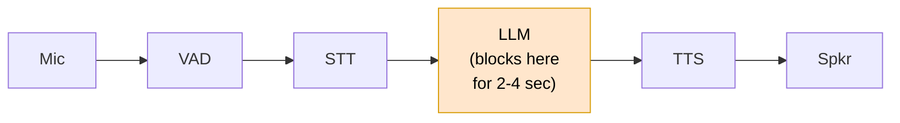

# Chapter 5 — The Blocking Agent

<!-- BEGIN auto:navigation -->
**Progress: 6 of 16** · [← Chapter 4 — VAD + Pre-roll](../04-vad-preroll/) · [Ladder index](../) · [Exercises](./EXERCISES.md) · [Chapter 6 — Streaming Agent + Sentence TTS →](../06-streaming-agent/)
<!-- END auto:navigation -->

> Swap the parrot for an LLM. The bot falls silent for three
> seconds. This is on purpose.

<!-- BEGIN auto:offline-checkpoint -->
> **Hardware-free checkpoint:** prove `first-audio outcomes` without a microphone,
> speakers, or provider credentials:
>
> ```bash
> uv run python docs/teaching/05-blocking-agent/tts_outcome_probe.py
> ```
>
> [See all 16 checkpoints](../#hardware-free-checkpoint-spine).
<!-- END auto:offline-checkpoint -->

**Wrong-version-first chapter.** Do not skip. The rest of the
build movement (chapters 6-9) exists to close this gap.

## Prerequisites

- [Chapter 4](../04-vad-preroll/)
- `uv sync --extra quickstart --extra deepgram --group dev`
- `OPENAI_API_KEY` (LLM + TTS) and `DEEPGRAM_API_KEY` (STT)
- Running this chapter makes live provider calls that may incur charges.
  Review your provider billing and usage limits first.
- Provider-backed scripts may send audio, transcripts, or prompts to configured
  services. Use non-sensitive test content and review provider data-handling
  policies first.
- After setting provider keys, run `uv run easycat doctor` from the repo root; if keys live in `.env`, run `uv run easycat doctor --env-file .env`. Use `uv run easycat doctor --env-file .env --json` for parseable checks.
- If keys live in `.env`, also add `--env-file .env` after `uv run`
  in the chapter command you run.

> **Minimum to skip the ladder:** chapter 4 alone (VAD-gated
> turns). You can read this chapter without chapter 3's
> wrong-version parrot.

## Diff from chapter 4

- **Added:** an `AsyncOpenAI` client + `blocking_agent` function
  between STT and TTS; three `turn.gap` sub-spans
  (`stt_to_agent_ms`, `agent_ms`, `tts_ms`) journaled per turn;
  `tts_outcome_probe.py` for first-audio failure attribution.
- **Preserved:** TTS accepted/rejected chunk counts from chapter 4 now appear
  in both `stage.tts.execute` and `turn.gap`.
- **Removed:** the parrot — the bot now answers, instead of
  repeating.

<!-- BEGIN auto:diff prev=04-vad-preroll src=main.py -->
<details>
<summary>Full unified diff vs <code>04-vad-preroll/main.py</code> (auto-generated)</summary>

```diff
--- docs/teaching/04-vad-preroll/main.py
+++ docs/teaching/05-blocking-agent/main.py
@@ -1,16 +1,14 @@
-"""Chapter 4 — VAD + pre-roll.
-
-Replace chapter 3's fixed silence timeout with a real voice-activity
-detector plus a pre-roll ring buffer. The same parrot loop, now gated
-on VAD turn boundaries instead of "500 ms since the last STT event."
-
-Run with ``--no-preroll`` to compare a stream that omits cached audio
-received before VAD-on.
+"""Chapter 5 — The blocking agent.
+
+Same pipeline as chapter 4, but instead of parroting the transcript
+back, we send it to an LLM and wait for the complete response before
+handing it to TTS. The bot falls silent for 2-4 seconds per turn.
+That silence is the whole point of this chapter.
 
 Dependencies:
     uv sync --extra quickstart --extra deepgram --group dev
-    export OPENAI_API_KEY=...      # OpenAI TTS
-    export DEEPGRAM_API_KEY=...    # Streaming STT
+    export OPENAI_API_KEY=...
+    export DEEPGRAM_API_KEY=...
     uv run easycat doctor
     uv run easycat doctor --env-file .env         # if keys live in .env
     uv run easycat doctor --env-file .env --json  # for parseable checks
@@ -19,7 +17,6 @@
 
 from __future__ import annotations
 
-import argparse
 import asyncio
 import collections
 import os
@@ -28,10 +25,17 @@
 from contextlib import AsyncExitStack
 from pathlib import Path
 
+from openai import AsyncOpenAI
+
 from easycat import LocalTransportConfig
 from easycat.audio_format import PCM16_MONO_24K, AudioChunk
 from easycat.debug.export import export_debug_bundle
-from easycat.events import EventBus, STTEventType, VADStartSpeaking, VADStopSpeaking
+from easycat.events import (
+    EventBus,
+    STTEventType,
+    VADStartSpeaking,
+    VADStopSpeaking,
+)
 from easycat.recipes import speak
 from easycat.runtime import InMemoryRingBuffer, JournalRecordKind
 from easycat.runtime.capabilities import close_if_supported
@@ -40,24 +44,14 @@
 from easycat.vad import VADConfig
 from easycat.vad.factory import create_vad
 
-PREROLL_FRAMES = 15  # 15 × 20 ms = 300 ms of audio *before* VAD fires
+PREROLL_FRAMES = 15
+MODEL = "gpt-4o-mini"
 RUNS_DIR = Path(__file__).parent / "runs"
+SESSION_ID = f"ch05-blocking-{int(time.time())}"
 
 
 class MiniTurnDetector:
-    """Tiny turn detector: VAD + pre-roll buffer.
-
-    Consumes raw audio chunks, yields tagged events:
-
-        ("speech_started", None)   - once per turn, at VAD-on.
-        ("frame",          chunk)  - cached pre-roll first, then live speech.
-        ("speech_ended",   None)   - once per turn, at VAD-off.
-
-    About 40 lines of real logic. EasyCat's production ``TurnManager``
-    (``src/easycat/turn_manager.py``) is a 5-state FSM with far more
-    responsibilities (bot-speech overlap, cancellation, actions); read
-    it once you understand why each extra state is there.
-    """
+    """Same as chapter 4."""
 
     def __init__(self, vad, preroll_frames: int = PREROLL_FRAMES) -> None:
         self._vad = vad
@@ -67,121 +61,171 @@
     async def frames(self, audio_iter):
         async for chunk in audio_iter:
             vad_events = [ev async for ev in self._vad.process(chunk)]
-
             for ev in vad_events:
                 if isinstance(ev, VADStartSpeaking):
                     self._speaking = True
-                    # Starting the turn is a state event, independent of
-                    # whether any pre-roll frames exist. This matters when
-                    # ``preroll_frames=0``: STT must still start before the
-                    # current live frame is emitted below.
                     yield "speech_started", None
-
-                    # Flush cached frames in their original order so STT
-                    # sees the sounds that arrived before VAD fired.
                     while self._preroll:
                         yield "frame", self._preroll.popleft()
                 elif isinstance(ev, VADStopSpeaking):
                     self._speaking = False
                     yield "speech_ended", None
-
             if self._speaking:
                 yield "frame", chunk
             else:
                 self._preroll.append(chunk)
 
 
-def record_delivery(
-    journal: InMemoryRingBuffer,
-    *,
-    session_id: str,
-    text: str,
-    accepted_chunks: int,
-    rejected_chunks: int,
-) -> None:
-    """Preserve transport acceptance without claiming speaker playback."""
+class FirstAudioProbe:
+    """Forward audio while recording when the first chunk is accepted."""
+
+    def __init__(self, transport) -> None:
+        self._transport = transport
+        self.first_audio_at: float | None = None
+
+    async def send_audio(self, chunk: AudioChunk) -> bool:
+        accepted = await self._transport.send_audio(chunk)
+        normalized = accepted is None or bool(accepted)
+        if normalized and self.first_audio_at is None:
+            self.first_audio_at = time.monotonic()
+        return normalized
+
+
+def span(journal: InMemoryRingBuffer, name: str, t0: float, **extra) -> None:
+    """Record a closed span with start→end wall time in ms."""
+    elapsed_ms = (time.monotonic() - t0) * 1000
     journal.append(
         kind=JournalRecordKind.EVENT,
-        name="parrot.delivery",
-        session_id=session_id,
+        name=name,
+        session_id=SESSION_ID,
+        data={"stage": name.split(".")[1], "elapsed_ms": elapsed_ms, **extra},
+    )
+
+
+async def blocking_agent(client: AsyncOpenAI, user_text: str) -> str:
+    """One LLM call. Wait for the full response. Return the string."""
+    resp = await client.chat.completions.create(
+        model=MODEL,
+        messages=[
+            {"role": "system", "content": "You are a helpful voice assistant. Keep it brief."},
+            {"role": "user", "content": user_text},
+        ],
+    )
+    return resp.choices[0].message.content or ""
+
+
+async def run_turn(transport, stt, client, journal) -> None:
+    """Finalize the current STT stream, run the LLM, speak the reply.
+
+    The STT stream has been receiving chunks from the parent caller's
+    VAD loop already — we just close it here and drain the FINAL.
+    """
+    final_text = ""
+    stt_final_t = None
+    async for event in stt.events():
+        if event.type == STTEventType.FINAL:
+            final_text = event.text
+            stt_final_t = time.monotonic()
+
+    if not final_text.strip() or stt_final_t is None:
+        return
+
+    print(f"  user: {final_text!r}")
+
+    # Sub-gap 1: STT final → we start the LLM call. Just our own
+    # dispatch overhead; should be under a millisecond.
+    agent_dispatch = time.monotonic()
+    span(
+        journal,
+        "stage.stt_to_agent",
+        stt_final_t,
+        at_ms=(agent_dispatch - stt_final_t) * 1000,
+    )
+
+    # Sub-gap 2: the LLM call itself. The biggest sub-gap — usually
+    # 1-3 seconds of silence on a small model, more on a large one.
+    agent_start = time.monotonic()
+    reply = await blocking_agent(client, final_text)
+    agent_end = time.monotonic()
+    span(
+        journal,
+        "stage.agent.execute",
+        agent_start,
+        prompt=final_text,
+        reply=reply,
+    )
+
+    # Sub-gap 3: agent response → the first TTS audio chunk the transport
+    # accepts. ``speak`` returns after every produced chunk has been offered,
+    # so a forwarding probe captures the earlier first-accepted milestone.
+    tts_start = time.monotonic()
+    print(f"  bot:  {reply!r}")
+    audio_probe = FirstAudioProbe(transport)
+    accepted_chunks, rejected_chunks = await speak(audio_probe, reply)
+    tts_end = time.monotonic()
+    first_audio_t = audio_probe.first_audio_at
+    tts_first_audio_ms = None if first_audio_t is None else (first_audio_t - tts_start) * 1000
+    tts_enqueue_ms = (tts_end - tts_start) * 1000
+    span(
+        journal,
+        "stage.tts.execute",
+        tts_start,
+        text=reply,
+        first_audio_ms=tts_first_audio_ms,
+        enqueue_ms=tts_enqueue_ms,
+        accepted_chunks=accepted_chunks,
+        rejected_chunks=rejected_chunks,
+    )
+
+    total_gap = None if first_audio_t is None else (first_audio_t - stt_final_t) * 1000
+    journal.append(
+        kind=JournalRecordKind.EVENT,
+        name="turn.gap",
+        session_id=SESSION_ID,
         data={
-            "stage": "parrot",
-            "committed_text": text,
-            "accepted_chunks": accepted_chunks,
-            "rejected_chunks": rejected_chunks,
-            "t_ms": time.monotonic() * 1000,
+            "stage": "turn",
+            "total_gap_ms": total_gap,
+            "stt_to_agent_ms": (agent_dispatch - stt_final_t) * 1000,
+            "agent_ms": (agent_end - agent_start) * 1000,
+            "tts_ms": tts_first_audio_ms,
+            "tts_enqueue_ms": tts_enqueue_ms,
+            "tts_accepted_chunks": accepted_chunks,
+            "tts_rejected_chunks": rejected_chunks,
+            "text": reply,
         },
     )
-    if rejected_chunks:
-        print(
-            "  transport rejected "
-            f"{rejected_chunks}/{accepted_chunks + rejected_chunks} audio chunks"
-        )
-
-
-async def parrot(
-    transport,
-    stt_factory,
-    detector: MiniTurnDetector,
-    journal: InMemoryRingBuffer,
-    session_id: str,
-) -> None:
-    """On each VAD turn, stream audio into STT, wait for final, speak it."""
+    if total_gap is None:
+        if accepted_chunks:
+            print("  (turn gap unavailable — accepted TTS audio had no timestamp)")
+        elif rejected_chunks:
+            print(
+                f"  (turn gap unavailable — transport rejected all {rejected_chunks} TTS chunks)"
+            )
+        else:
+            print("  (turn gap unavailable — TTS produced no audio)")
+    else:
+        print(f"  (turn gap: {total_gap:.0f} ms — STT final → first audio accepted)")
+
+
+async def collect_turns(transport, detector, stt_factory, client, journal) -> None:
+    """Stream turns and close every per-turn STT, including on cancellation."""
     stt = None
-    collected_final = ""
-
     try:
         async for tag, chunk in detector.frames(transport.receive_audio()):
             if tag == "speech_started":
                 if stt is None:
                     stt = stt_factory()
                     await stt.start_stream()
-                    collected_final = ""
-                    journal.append(
-                        kind=JournalRecordKind.EVENT,
-                        name="turn.started",
-                        session_id=session_id,
-                        data={"stage": "turn", "t_ms": time.monotonic() * 1000},
-                    )
-
             elif tag == "frame" and stt is not None:
                 await stt.send_audio(chunk)
-
             elif tag == "speech_ended" and stt is not None:
-                # Drain the event queue until the sentinel from end_stream().
-                # A VADStop before STT saw any speech is harmless — we just
-                # close an empty stream and get no FINAL back.
                 active_stt = stt
                 try:
                     await active_stt.end_stream()
-                    async for event in active_stt.events():
-                        if event.type == STTEventType.FINAL:
-                            collected_final = event.text
+                    await run_turn(transport, active_stt, client, journal)
                 finally:
                     stt = None
                     await close_if_supported(active_stt)
-
-                journal.append(
-                    kind=JournalRecordKind.EVENT,
-                    name="turn.ended",
-                    session_id=session_id,
-                    data={
-                        "stage": "turn",
-                        "t_ms": time.monotonic() * 1000,
-                        "text": collected_final,
-                    },
-                )
-
-                if collected_final.strip():
-                    print(f"  → parrot: {collected_final!r}")
-                    accepted_chunks, rejected_chunks = await speak(transport, collected_final)
-                    record_delivery(
-                        journal,
-                        session_id=session_id,
-                        text=collected_final,
-                        accepted_chunks=accepted_chunks,
-                        rejected_chunks=rejected_chunks,
-                    )
     finally:
         if stt is not None:
             try:
@@ -191,22 +235,8 @@
 
 
 async def main() -> None:
-    parser = argparse.ArgumentParser()
-    parser.add_argument(
-        "--no-preroll",
-        action="store_true",
-        help="Disable pre-roll; omit cached frames received before VAD-on.",
-    )
-    args = parser.parse_args()
-
-    oai_key = os.getenv("OPENAI_API_KEY")
-    dg_key = os.getenv("DEEPGRAM_API_KEY")
-    if not oai_key or not dg_key:
-        raise SystemExit("Set OPENAI_API_KEY (TTS) and DEEPGRAM_API_KEY (STT).")
-
-    preroll = 0 if args.no_preroll else PREROLL_FRAMES
-    session_id = f"ch04-vad-{'nopreroll' if args.no_preroll else 'preroll'}-{int(time.time())}"
-    print(f"Pre-roll: {preroll * 20} ms" if preroll else "Pre-roll: OFF")
+    if not (os.getenv("OPENAI_API_KEY") and os.getenv("DEEPGRAM_API_KEY")):
+        raise SystemExit("Set OPENAI_API_KEY and DEEPGRAM_API_KEY.")
 
     journal = InMemoryRingBuffer(capacity=10_000)
     transport = LocalTransport(LocalTransportConfig(audio_format=PCM16_MONO_24K))
@@ -215,7 +245,7 @@
         return create_stt_provider(
             STTProviderConfig(
                 provider="deepgram",
-                api_key=dg_key,
+                api_key=os.environ["DEEPGRAM_API_KEY"],
                 params={"sample_rate": 24000, "event_bus": EventBus()},
             )
         )
@@ -226,16 +256,19 @@
 
         vad = create_vad(VADConfig())
         resources.push_async_callback(close_if_supported, vad)
-        detector = MiniTurnDetector(vad, preroll_frames=preroll)
-
-        print("Speak. The bot parrots back after each VAD turn. Ctrl-C to stop.")
+        detector = MiniTurnDetector(vad)
+
+        client = AsyncOpenAI()
+        resources.push_async_callback(close_if_supported, client)
+
+        print("Talk. Each turn will feel slow. That is the lesson.\n")
         try:
-            await parrot(transport, stt_factory, detector, journal, session_id)
+            await collect_turns(transport, detector, stt_factory, client, journal)
         except (KeyboardInterrupt, asyncio.CancelledError):
             pass
 
     RUNS_DIR.mkdir(exist_ok=True)
-    bundle_path = RUNS_DIR / f"{session_id}.bundle"
+    bundle_path = RUNS_DIR / f"{SESSION_ID}.bundle"
     session_stub = types.SimpleNamespace(journal=journal)
     export_debug_bundle(session_stub, bundle_path, overwrite=True)
     print(f"\nWrote bundle → {bundle_path.relative_to(Path.cwd())}")
```

</details>
<!-- END auto:diff -->

## Run it

```bash
uv run python docs/teaching/05-blocking-agent/main.py
```

Ask it something simple: *"What is the capital of France?"* Keep
your stopwatch handy. There will be a long, empty silence between
your voice and the bot's.

## The obvious architecture


```mermaid
flowchart LR
    Mic --> VAD --> STT --> LLM["LLM<br/>(blocks here<br/>for 2-4 sec)"]
    LLM --> TTS --> Spkr
    style LLM fill:#ffe6cc,stroke:#d79b00,color:#000
```

The <!-- auto:linkhash src=main.py symbol=blocking_agent -->[`blocking_agent`](./main.py#L105-L114)
function in [`main.py`](./main.py) is the only new moving part — about ten lines:

<!-- BEGIN auto:snippet src=main.py symbol=blocking_agent -->
```python
async def blocking_agent(client: AsyncOpenAI, user_text: str) -> str:
    """One LLM call. Wait for the full response. Return the string."""
    resp = await client.chat.completions.create(
        model=MODEL,
        messages=[
            {"role": "system", "content": "You are a helpful voice assistant. Keep it brief."},
            {"role": "user", "content": user_text},
        ],
    )
    return resp.choices[0].message.content or ""
```
<!-- END auto:snippet -->

It is also unshippable. This is what most naïve voice demos do.

> **Pointer.** In production, EasyCat wraps an agent like this
> behind the `Agent` protocol and `AgentRunner` (timeouts,
> cancellation, history). We are staying one level below on
> purpose — the point here is "agent is just an async function
> from text to text." [Chapter 7](../07-tools/) introduces tools
> via the real `Agent` surface.

## Decompose the gap

The journal records three sub-spans between STT-final and the first
bot-audio chunk, plus the time required to enqueue the complete reply.
Open the bundle and list them:

```python
from pathlib import Path
from easycat.debug.testing import load_bundle
b = next(iter(Path("docs/teaching/05-blocking-agent/runs/").glob("*.bundle")))
bundle = load_bundle(b)

def format_ms(value):
    return "unavailable" if value is None else f"{value:6.1f} ms"

for r in bundle.records():
    if r["name"] == "turn.gap":
        d = r["data"]
        print(f"  STT final → agent dispatch  {format_ms(d['stt_to_agent_ms'])}")
        print(f"  agent (LLM call)            {format_ms(d['agent_ms'])}")
        print(f"  TTS → first audio           {format_ms(d['tts_ms'])}")
        print(f"  TOTAL → first audio         {format_ms(d['total_gap_ms'])}")
        print(f"  full TTS synth + enqueue    {format_ms(d['tts_enqueue_ms'])}")
        print(
            f"  chunks accepted / rejected  {d['tts_accepted_chunks']} / "
            f"{d['tts_rejected_chunks']}"
        )
```

You will see something like:

```
  STT final → agent dispatch     0.4 ms
  agent (LLM call)            2134.0 ms
  TTS → first audio            312.0 ms
  TOTAL → first audio         2446.4 ms
  full TTS synth + enqueue     812.0 ms
```

Three sub-gaps, in order:

1. **STT final → agent dispatch** (~0-50 ms): just your own code
   overhead. You can't optimise this; it doesn't matter.
2. **Agent / LLM call** (~1-4 s): most of the silence. The
   dominant term. Model choice dominates.
3. **Agent response → first TTS audio** (~100-400 ms): not
   trivial either. Synth + network + the first transport send.

`turn.gap` stops when the first audio chunk is accepted by the
transport. That is the software milestone closest to what the user
feels, not an acoustic measurement: `LocalTransport` still has a
small speaker buffer, and measuring sound at the ear requires a
loopback. `tts_enqueue_ms` ends later, after the complete reply has
been synthesized and queued; it is useful for throughput and memory
diagnosis but is not part of the silence before the bot starts.

### A missing first-audio timestamp has multiple causes

`total_gap_ms=null` means no chunk was accepted, not necessarily that TTS
produced nothing. Chapter 5 preserves accepted/rejected totals in both the TTS
span and turn-gap record so postmortem analysis can distinguish:

| Counts | Interpretation |
|---|---|
| accepted > 0 | A first-acceptance timestamp should exist; if it does not, the instrumentation contract failed. |
| accepted = 0, rejected > 0 | TTS produced chunks, but the transport rejected all of them. |
| accepted = 0, rejected = 0 | TTS produced no chunks. |

Run every branch without credentials:

```bash
uv run python docs/teaching/05-blocking-agent/tts_outcome_probe.py
```

The probe reports `first_audio_accepted`, `all_chunks_rejected`, and
`no_chunks_produced` separately. The earlier message “TTS produced no audio”
for every missing timestamp collapsed the last two causes and could send an
operator toward the wrong provider.

Acceptance still means scheduled for delivery, not rendered or heard. These
counts improve failure attribution; they do not turn `turn.gap` into an
acoustic measurement.

Humans turn-take in 100-300 ms. Even before device buffering, we are
an order of magnitude worse. That is why voice LLM products feel off
when they do.

## The two axes we'll attack

We can't make the LLM faster — but we can start TTS sooner and
start the LLM sooner:

| Chapter | What we attack |
|---|---|
| [6](../06-streaming-agent/) | Stream the LLM's tokens; start TTS on the first sentence instead of the last. The `tts.execute` span moves to overlap the `agent.execute` span. |
| [8](../08-smart-turn/) | Predict end-of-turn earlier than VAD silence. The `turn.gap` starts sooner. |

## Try breaking it

Three experiments, all quick:

1. Change `MODEL = "gpt-4o-mini"` to `"gpt-4o"`. Re-run the same
   question. Which span grew?
2. Add a system prompt: *"Answer in one word."* Total gap drops.
   Which span shrank — and which did *not*?
3. Insert `await asyncio.sleep(0.5)` inside `blocking_agent`. Watch
   `stage.agent.execute` grow by ~500 ms while the others stay
   put.

## Success criteria

You should be able to name the three sub-gaps in order without
looking them up, and you should actively *want* the streaming
version. If you don't yet: try the "uh, what was I going to say"
flow where a user asks a 3-second question and waits 3 seconds
for an answer. Six seconds of one human standing in the room
holding their breath.

## What's next

[Chapter 6 — Streaming agent + sentence TTS](../06-streaming-agent/)
cuts the gap by roughly 3× on the same inputs, by overlapping the
LLM and TTS spans.
