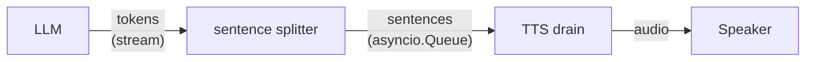

# Chapter 6 — Streaming Agent + Sentence TTS

> Start speaking before the LLM is done thinking. First real
> pipeline overlap.

## Prerequisites

- [Chapter 5](../05-blocking-agent/) and its bundles — we will
  diff against them.
- `OPENAI_API_KEY`, `DEEPGRAM_API_KEY`.

> **Minimum to skip the ladder:** chapter 5 — you need to have
> felt the blocking-agent gap in your ears for this chapter to
> land.

## Diff from chapter 5

- **Added:** a sentence-splitter coroutine + drain coroutine
  connected by an `asyncio.Queue`; `stream=True` on the LLM call;
  `easycat.strip_markdown.strip_markdown` on every sentence; the
  `split_at_sentence_boundaries` helper from `easycat.session`.
- **Modified:** `blocking_agent` becomes `stream_sentences_to_tts`
  — the LLM stream and TTS synth now overlap.
- **Sidebar adds:** SSML / pronunciation, backpressure, and a
  reprise of "partials can flap; act on FINAL only."

<!-- BEGIN auto:diff prev=05-blocking-agent src=main.py -->
<details>
<summary>Full unified diff vs <code>05-blocking-agent/main.py</code> (auto-generated)</summary>

```diff
--- docs/teaching/05-blocking-agent/main.py
+++ docs/teaching/06-streaming-agent/main.py
@@ -1,9 +1,11 @@
-"""Chapter 5 — The blocking agent.
-
-Same pipeline as chapter 4, but instead of parroting the transcript
-back, we send it to an LLM and wait for the complete response before
-handing it to TTS. The bot falls silent for 2-4 seconds per turn.
-That silence is the whole point of this chapter.
+"""Chapter 6 — Streaming agent + sentence-boundary TTS.
+
+Instead of waiting for the whole LLM response, stream tokens as
+they arrive, split on sentence boundaries, and hand each sentence
+to TTS as soon as it's complete. Sentence N+1 synthesises while
+sentence N is still playing.
+
+First-audio latency drops by ~3× versus chapter 5.
 
 Dependencies:
     uv sync --extra quickstart --group dev
@@ -28,24 +30,28 @@
 from easycat.events import (
     EventBus,
     STTEventType,
+    TTSEventType,
     VADStartSpeaking,
     VADStopSpeaking,
 )
-from easycat.quick import speak
 from easycat.runtime import InMemoryRingBuffer, JournalRecordKind
+from easycat.session import split_at_sentence_boundaries
+from easycat.strip_markdown import strip_markdown
 from easycat.stt.factory import STTProviderConfig, create_stt_provider
 from easycat.transports.local import LocalTransport
+from easycat.tts.factory import TTSProviderConfig, create_tts_provider
+from easycat.tts.input import TTSInput
 from easycat.vad import VADConfig
 from easycat.vad.factory import create_vad
 
 PREROLL_FRAMES = 15
 MODEL = "gpt-4o-mini"
 RUNS_DIR = Path(__file__).parent / "runs"
-SESSION_ID = f"ch05-blocking-{int(time.time())}"
+SESSION_ID = f"ch06-streaming-{int(time.time())}"
 
 
 class MiniTurnDetector:
-    """Same as chapter 4."""
+    """Same as chapters 4 & 5."""
 
     def __init__(self, vad, preroll_frames: int = PREROLL_FRAMES) -> None:
         self._vad = vad
@@ -69,35 +75,109 @@
                 self._preroll.append(chunk)
 
 
-def span(journal: InMemoryRingBuffer, name: str, t0: float, **extra) -> None:
-    """Record a closed span with start→end wall time in ms."""
-    elapsed_ms = (time.monotonic() - t0) * 1000
-    journal.append(
-        kind=JournalRecordKind.EVENT,
-        name=name,
-        session_id=SESSION_ID,
-        data={"stage": name.split(".")[1], "elapsed_ms": elapsed_ms, **extra},
-    )
-
-
-async def blocking_agent(client: AsyncOpenAI, user_text: str) -> str:
-    """One LLM call. Wait for the full response. Return the string."""
-    resp = await client.chat.completions.create(
+async def stream_sentences_to_tts(
+    client: AsyncOpenAI,
+    user_text: str,
+    sentence_queue: asyncio.Queue[str | None],
+    journal: InMemoryRingBuffer,
+) -> None:
+    """Iterate the LLM's token stream; flush sentence-by-sentence to the queue.
+
+    We accumulate tokens, then after each delta check whether a complete
+    sentence exists at the start of the buffer. If so, push it to the
+    sentence queue so the TTS drain coroutine can start synth immediately.
+    """
+    stream = await client.chat.completions.create(
         model=MODEL,
         messages=[
             {"role": "system", "content": "You are a helpful voice assistant. Keep it brief."},
             {"role": "user", "content": user_text},
         ],
-    )
-    return resp.choices[0].message.content or ""
-
-
-async def run_turn(transport, stt, client, journal) -> None:
-    """Finalize the current STT stream, run the LLM, speak the reply.
-
-    The STT stream has been receiving chunks from the parent caller's
-    VAD loop already — we just close it here and drain the FINAL.
+        stream=True,
+    )
+
+    buffer = ""
+    first_token_t: float | None = None
+    async for chunk in stream:
+        delta = chunk.choices[0].delta.content or ""
+        if not delta:
+            continue
+        if first_token_t is None:
+            first_token_t = time.monotonic()
+            journal.append(
+                kind=JournalRecordKind.EVENT,
+                name="agent.first_token",
+                session_id=SESSION_ID,
+                data={"stage": "agent", "t_ms": first_token_t * 1000},
+            )
+        buffer += delta
+
+        # split_at_sentence_boundaries returns (ready, leftover). ``ready``
+        # is a prefix of complete sentences; ``leftover`` is the dangling
+        # tail we keep buffering.
+        ready, buffer = split_at_sentence_boundaries(buffer)
+        if ready.strip():
+            spoken = strip_markdown(ready).strip()
+            if spoken:
+                await sentence_queue.put(spoken)
+                journal.append(
+                    kind=JournalRecordKind.EVENT,
+                    name="agent.sentence",
+                    session_id=SESSION_ID,
+                    data={"stage": "agent", "text": spoken},
+                )
+
+    # Flush any trailing text the LLM ended mid-sentence (no terminal
+    # punctuation). The production consume_agent_stream also guards with
+    # has_unclosed_markdown_delimiters; we keep the toy simple.
+    if buffer.strip():
+        spoken = strip_markdown(buffer).strip()
+        if spoken:
+            await sentence_queue.put(spoken)
+    await sentence_queue.put(None)
+
+
+async def drain_sentences_to_speaker(
+    tts, transport, sentence_queue: asyncio.Queue[str | None], journal: InMemoryRingBuffer
+) -> None:
+    """Take one sentence at a time, synthesise, stream audio to speaker.
+
+    Because ``transport.send_audio`` returns as soon as the chunk is
+    enqueued for playback, the next ``tts.synthesize`` can start while
+    the current sentence is still audible. That is the pipeline overlap.
     """
+    first_audio_t: float | None = None
+    while True:
+        sentence = await sentence_queue.get()
+        if sentence is None:
+            break
+
+        synth_start = time.monotonic()
+        async for event in tts.synthesize(TTSInput(text=sentence)):
+            if event.type == TTSEventType.AUDIO and event.audio is not None:
+                if first_audio_t is None:
+                    first_audio_t = time.monotonic()
+                    journal.append(
+                        kind=JournalRecordKind.EVENT,
+                        name="tts.first_audio",
+                        session_id=SESSION_ID,
+                        data={"stage": "tts", "t_ms": first_audio_t * 1000},
+                    )
+                await transport.send_audio(event.audio)
+        journal.append(
+            kind=JournalRecordKind.EVENT,
+            name="stage.tts.execute",
+            session_id=SESSION_ID,
+            data={
+                "stage": "tts",
+                "elapsed_ms": (time.monotonic() - synth_start) * 1000,
+                "text": sentence,
+            },
+        )
+
+
+async def run_turn(transport, stt, client, tts, journal) -> None:
+    """STT-final → fan out to LLM-stream → sentence-queue → TTS-drain."""
     final_text = ""
     stt_final_t = None
     async for event in stt.events():
@@ -108,55 +188,26 @@
     if not final_text.strip() or stt_final_t is None:
         return
 
+    journal.append(
+        kind=JournalRecordKind.EVENT,
+        name="stt.final",
+        session_id=SESSION_ID,
+        data={"stage": "stt", "text": final_text, "t_ms": stt_final_t * 1000},
+    )
     print(f"  user: {final_text!r}")
-
-    # Sub-gap 1: STT final → we start the LLM call. Just our own
-    # dispatch overhead; should be under a millisecond.
-    agent_dispatch = time.monotonic()
-    span(
-        journal,
-        "stage.stt_to_agent",
-        stt_final_t,
-        at_ms=(agent_dispatch - stt_final_t) * 1000,
-    )
-
-    # Sub-gap 2: the LLM call itself. The biggest sub-gap — usually
-    # 1-3 seconds of silence on a small model, more on a large one.
-    agent_start = time.monotonic()
-    reply = await blocking_agent(client, final_text)
-    agent_end = time.monotonic()
-    span(
-        journal,
-        "stage.agent.execute",
-        agent_start,
-        prompt=final_text,
-        reply=reply,
-    )
-
-    # Sub-gap 3: agent response → first TTS audio reaches the speaker.
-    # The OpenAI TTS provider streams PCM back, so ``speak`` blocks
-    # until the whole file is enqueued on the transport. For teaching
-    # purposes we report the full synth-and-enqueue duration.
-    tts_start = time.monotonic()
-    print(f"  bot:  {reply!r}")
-    await speak(transport, reply)
-    span(journal, "stage.tts.execute", tts_start, text=reply)
-
+    sentence_queue: asyncio.Queue[str | None] = asyncio.Queue()
+    await asyncio.gather(
+        stream_sentences_to_tts(client, final_text, sentence_queue, journal),
+        drain_sentences_to_speaker(tts, transport, sentence_queue, journal),
+    )
     total_gap = (time.monotonic() - stt_final_t) * 1000
+    print(f"  (turn gap: {total_gap:.0f} ms — STT final → bot done speaking)")
     journal.append(
         kind=JournalRecordKind.EVENT,
         name="turn.gap",
         session_id=SESSION_ID,
-        data={
-            "stage": "turn",
-            "total_gap_ms": total_gap,
-            "stt_to_agent_ms": (agent_dispatch - stt_final_t) * 1000,
-            "agent_ms": (agent_end - agent_start) * 1000,
-            "tts_ms": (time.monotonic() - tts_start) * 1000,
-            "text": reply,
-        },
-    )
-    print(f"  (turn gap: {total_gap:.0f} ms — STT final → bot done speaking)")
+        data={"stage": "turn", "total_gap_ms": total_gap, "text": final_text},
+    )
 
 
 async def main() -> None:
@@ -168,6 +219,9 @@
     vad = create_vad(VADConfig())
     detector = MiniTurnDetector(vad)
     client = AsyncOpenAI()
+    tts = create_tts_provider(
+        TTSProviderConfig(provider="openai", settings={"api_key": os.environ["OPENAI_API_KEY"]})
+    )
 
     def stt_factory():
         return create_stt_provider(
@@ -179,10 +233,9 @@
         )
 
     await transport.connect()
-    print("Talk. Each turn will feel slow. That is the lesson.\n")
+    print("Streaming agent. Ctrl-C to stop.\n")
 
     async def collect_turns():
-        """Same shape as chapter 4: stream live into STT per turn."""
         stt = None
         async for tag, chunk in detector.frames(transport.receive_audio()):
             if tag == "speech_started":
@@ -194,7 +247,7 @@
                 await stt.send_audio(chunk)
             elif tag == "speech_ended" and stt is not None:
                 await stt.end_stream()
-                await run_turn(transport, stt, client, journal)
+                await run_turn(transport, stt, client, tts, journal)
                 stt = None
 
     try:
```

</details>
<!-- END auto:diff -->

## Run it

```bash
uv run python docs/teaching/06-streaming-agent/main.py
```

Ask the same question you asked chapter 5. The first syllable
arrives *seconds* earlier.

## The sentence is the right unit

You have three choices for when to hand text to TTS:

| Unit | First-audio latency | Prosody |
|---|---|---|
| **Token** | Near-zero | Terrible — each word is its own breath |
| **Sentence** | ~1× sentence duration | Natural, matches what TTS was trained on |
| **Paragraph** | Back to chapter 5 | Fine, but we defeated the point |

Goldilocks: the **sentence**. Short enough to start speaking fast,
long enough to sound like a human who thought before opening
their mouth.

## Architecture



The splitter, the drain, and the LLM stream all run **concurrently**:
while one sentence is being synthesised and played, the splitter is
already accumulating the next sentence's tokens, and the drain is
already pulling the sentence after that off the queue.

Two coroutines. The splitter accumulates tokens and calls
`split_at_sentence_boundaries(buffer)` after every delta. When
pySBD finds a complete sentence prefix, it's pushed to an
`asyncio.Queue`. The drain coroutine pulls sentences and streams
TTS audio to the transport. Because `transport.send_audio`
returns as soon as the chunk is enqueued on the speaker, sentence
N+1 can begin synthesising while sentence N is **still playing**
from the speaker queue. (Only one TTS synth runs at a time — but
playback and the next synth overlap, and so does the next token
arriving at the splitter.)

The splitter half:

<!-- BEGIN auto:snippet src=main.py symbol=stream_sentences_to_tts -->
```python
async def stream_sentences_to_tts(
    client: AsyncOpenAI,
    user_text: str,
    sentence_queue: asyncio.Queue[str | None],
    journal: InMemoryRingBuffer,
) -> None:
    """Iterate the LLM's token stream; flush sentence-by-sentence to the queue.

    We accumulate tokens, then after each delta check whether a complete
    sentence exists at the start of the buffer. If so, push it to the
    sentence queue so the TTS drain coroutine can start synth immediately.
    """
    stream = await client.chat.completions.create(
        model=MODEL,
        messages=[
            {"role": "system", "content": "You are a helpful voice assistant. Keep it brief."},
            {"role": "user", "content": user_text},
        ],
        stream=True,
    )

    buffer = ""
    first_token_t: float | None = None
    async for chunk in stream:
        delta = chunk.choices[0].delta.content or ""
        if not delta:
            continue
        if first_token_t is None:
            first_token_t = time.monotonic()
            journal.append(
                kind=JournalRecordKind.EVENT,
                name="agent.first_token",
                session_id=SESSION_ID,
                data={"stage": "agent", "t_ms": first_token_t * 1000},
            )
        buffer += delta

        # split_at_sentence_boundaries returns (ready, leftover). ``ready``
        # is a prefix of complete sentences; ``leftover`` is the dangling
        # tail we keep buffering.
        ready, buffer = split_at_sentence_boundaries(buffer)
        if ready.strip():
            spoken = strip_markdown(ready).strip()
            if spoken:
                await sentence_queue.put(spoken)
                journal.append(
                    kind=JournalRecordKind.EVENT,
                    name="agent.sentence",
                    session_id=SESSION_ID,
                    data={"stage": "agent", "text": spoken},
                )

    # Flush any trailing text the LLM ended mid-sentence (no terminal
    # punctuation). The production consume_agent_stream also guards with
    # has_unclosed_markdown_delimiters; we keep the toy simple.
    if buffer.strip():
        spoken = strip_markdown(buffer).strip()
        if spoken:
            await sentence_queue.put(spoken)
    await sentence_queue.put(None)
```
<!-- END auto:snippet -->

…feeding the drain half:

<!-- BEGIN auto:snippet src=main.py symbol=drain_sentences_to_speaker -->
```python
async def drain_sentences_to_speaker(
    tts, transport, sentence_queue: asyncio.Queue[str | None], journal: InMemoryRingBuffer
) -> None:
    """Take one sentence at a time, synthesise, stream audio to speaker.

    Because ``transport.send_audio`` returns as soon as the chunk is
    enqueued for playback, the next ``tts.synthesize`` can start while
    the current sentence is still audible. That is the pipeline overlap.
    """
    first_audio_t: float | None = None
    while True:
        sentence = await sentence_queue.get()
        if sentence is None:
            break

        synth_start = time.monotonic()
        async for event in tts.synthesize(TTSInput(text=sentence)):
            if event.type == TTSEventType.AUDIO and event.audio is not None:
                if first_audio_t is None:
                    first_audio_t = time.monotonic()
                    journal.append(
                        kind=JournalRecordKind.EVENT,
                        name="tts.first_audio",
                        session_id=SESSION_ID,
                        data={"stage": "tts", "t_ms": first_audio_t * 1000},
                    )
                await transport.send_audio(event.audio)
        journal.append(
            kind=JournalRecordKind.EVENT,
            name="stage.tts.execute",
            session_id=SESSION_ID,
            data={
                "stage": "tts",
                "elapsed_ms": (time.monotonic() - synth_start) * 1000,
                "text": sentence,
            },
        )
```
<!-- END auto:snippet -->

## The toy vs. the production version

About 40 lines for `stream_sentences_to_tts`, another 20 for the
drain coroutine. EasyCat's real implementation lives in
`src/easycat/session/_streaming.py::consume_agent_stream`. Read
it once. It takes nine parameters: `CancelToken` (for chapter 9),
`TurnContext` (per-turn timing), `emit` (EasyCat event bus),
`prepare_tts_payload` (custom envelopes), `strip_md`, `voice`,
and more. Every parameter is defending against something the toy
ducks. When you can look at a parameter and name the scenario —
"ah, `CancelToken` is there so `await cancel_token.check()`
inside the stream loop can abort a reply mid-sentence on
barge-in" — you understand the production code.

## Measure the win

Same bundle format as chapter 5. Compare first-audio latency on
the same prompt:

```python
from pathlib import Path
from easycat.debug.testing import load_bundle

def first_audio_gap_ms(bundle_path):
    b = load_bundle(bundle_path)
    stt_t = next(
        (r["data"]["t_ms"] for r in b.records() if r["name"] == "stt.final"),
        None,
    )
    tts_t = next(
        (r["data"]["t_ms"] for r in b.records() if r["name"] == "tts.first_audio"),
        None,
    )
    return None if stt_t is None or tts_t is None else tts_t - stt_t

for b in Path("docs/teaching/06-streaming-agent/runs/").glob("*.bundle"):
    print(b.name, f"first-audio gap = {first_audio_gap_ms(b):.0f} ms")
```

On a typical 3-sentence reply with `gpt-4o-mini`, expect
first-audio to drop from ~3000 ms (blocking) to ~800-1200 ms
(streaming) — roughly 3×.

## Sidebar — speech-friendly output

Three things bite every voice agent the instant it ships:

1. **Markdown.** The agent says `**bold**`. Without stripping,
   TTS literally reads *"asterisks bold asterisks."* We apply
   `easycat.strip_markdown.strip_markdown` to every sentence
   before enqueuing it. Try removing that call and hear the
   damage.
2. **Numbers and dates.** `2024` reads as "twenty twenty-four",
   "two thousand twenty-four", "two oh twenty-four"… the
   provider picks one, and it's often wrong for your domain.
   Production uses `easycat.llm_output_processing` with
   `PhoneticReplacementProcessor` for fixed corrections.
3. **SSML.** `TTSInput(text=..., format="ssml")` accepts
   `<break time="500ms"/>` and `<phoneme>` tags **when the
   provider advertises `supports_ssml = True`**. *Heads up:* none
   of the providers bundled with EasyCat today (OpenAI,
   ElevenLabs, Deepgram, Cartesia) return `True` from that property
   — the `_tts_scheduler` will downgrade SSML to plain text and
   journal `ssml_downgraded: true`. To actually pronounce
   `<break>` you need a custom provider that returns `True`.
   Chapter 14's `PauseProcessor` demonstrates the insertion side;
   the playback side is currently provider-gated.

## Sidebar — backpressure

Our `asyncio.Queue` is unbounded. If the agent streams faster
than TTS+playback drains it, the queue grows without limit —
fine for short exchanges, a slow leak in a long-running session.
Production uses `easycat._bounded_queue.BoundedAudioQueue` with a
`DropPolicy`:

- `DROP_OLDEST` — shed stale audio first. Good for live
  conversation.
- `DROP_NEWEST` — refuse new audio until the queue drains. Good
  for transactional flows.
- `BLOCK` — apply backpressure to the producer. Safest, but if
  the producer can't slow down (an LLM stream doesn't negotiate),
  it stalls.

## Sidebar — partials can flap (reprise)

Chapter 2 named the rule: agents fire on `STTFinal`, never on
`STTPartial`. This is the chapter where it bites: we are finally
wiring the agent in. `run_turn` only drains `STTEventType.FINAL`
from the STT event stream. A naïve implementation that kicked
off `stream_sentences_to_tts` on a partial would commit — in
audio, audibly — to a guess the provider may have revised away
by the time the final arrived.

## Try breaking it

Add `MODEL = "gpt-4o"` (bigger, slower). Re-run. The per-sentence
synth stays overlapping, but the *first* sentence now takes
longer to complete because the first token arrives later. The
`agent.first_token → tts.first_audio` span in the journal grows;
everything downstream stays overlapping. This isolates which
knob buys you what.

## What's next

[Chapter 7 — Tools, mid-stream](../07-tools/) adds tool calls
into the same streaming surface. A tool call is a new kind of
sentence boundary — one that triggers work instead of speech.
