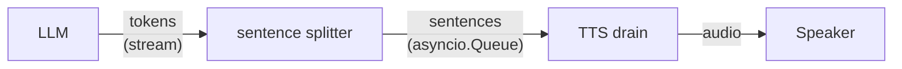

# Chapter 6 — Streaming Agent + Sentence TTS

<!-- BEGIN auto:navigation -->
**Progress: 7 of 16** · [← Chapter 5 — The Blocking Agent](../05-blocking-agent/) · [Ladder index](../) · [Progress worksheet](../PROGRESS.md) · [Exercises](./EXERCISES.md) · [Chapter 7 — Tools, Mid-stream →](../07-tools/)
<!-- END auto:navigation -->

> Start speaking before the LLM is done thinking. First real
> pipeline overlap.

<!-- BEGIN auto:spaced-retrieval -->
## Recall before reading

> **Following the ladder? Spaced retrieval — Chapter 4 — VAD + Pre-roll**
>
> Close earlier chapters and answer from memory before reading further. If this
> chapter is your starting point, skip this block.
>
> **Answer from memory:**
>
> Which frames disappear when pre-roll is disabled, and does the trigger frame itself remain?
>
> After recording your answer, explain one way `VAD pre-roll frame order` changes how you
> reason about `sentence-level TTS handoff`. Keep the first answer visible.
>
> **Check only after answering:**
>
> ```bash
> uv run python docs/teaching/04-vad-preroll/preroll_probe.py
> ```
>
> Cite one observed field, measurement, or behavior; repair only the part your
> evidence disproved.
<!-- END auto:spaced-retrieval -->

<!-- BEGIN auto:offline-checkpoint -->
> **Hardware-free checkpoint:** prove `sentence-level TTS handoff` without a microphone,
> speakers, or provider credentials:
>
> **Predict first:** Do per-sentence acceptance counts stay independent, and do they add up to
> the turn totals?
>
> ```bash
> uv run python docs/teaching/06-streaming-agent/tts_delivery_probe.py
> ```
>
> **Evidence to find:** sentence delivery rows preserve acceptance separately and roll up to one
> matching turn.
>
> **Explain the result:** Trace one sentence row into the turn totals and explain what a rejected
> chunk changes.
>
> [See all 16 checkpoints](../#hardware-free-checkpoint-spine).
<!-- END auto:offline-checkpoint -->

## Prerequisites

- [Chapter 5](../05-blocking-agent/) and its bundles — we will
  diff against them.
- `uv sync --extra quickstart --extra deepgram --group dev`
- `OPENAI_API_KEY`, `DEEPGRAM_API_KEY`.
- Running this chapter makes live provider calls that may incur charges.
  Review your provider billing and usage limits first.
- Provider-backed scripts may send audio, transcripts, or prompts to configured
  services. Use non-sensitive test content and review provider data-handling
  policies first.
- After setting provider keys, run `uv run easycat doctor` from the repo root; if keys live in `.env`, run `uv run easycat doctor --env-file .env`. Use `uv run easycat doctor --env-file .env --json` for parseable checks.
- If keys live in `.env`, also add `--env-file .env` after `uv run`
  in the chapter command you run.

> **Minimum to skip the ladder:** chapter 5 — you need to have
> felt the blocking-agent gap in your ears for this chapter to
> land.

## Diff from chapter 5

- **Added:** a sentence-splitter coroutine + drain coroutine
  connected by an `asyncio.Queue`; `stream=True` on the LLM call;
  `easycat.strip_markdown.strip_markdown` on every sentence; the
  `split_at_sentence_boundaries` helper from `easycat.session`.
- **Modified:** `blocking_agent` becomes `stream_sentences_to_tts`
  — the LLM stream and TTS synth now overlap.
- **Sidebar adds:** SSML / pronunciation, backpressure, and a
  reprise of "partials can flap; commit spoken output on FINAL only."

<!-- BEGIN auto:diff prev=05-blocking-agent src=main.py trim_blank_context=true -->
<details>
<summary>Full unified diff vs <code>05-blocking-agent/main.py</code> (auto-generated)</summary>

```diff
--- docs/teaching/05-blocking-agent/main.py
+++ docs/teaching/06-streaming-agent/main.py
@@ -1,9 +1,11 @@
-"""Chapter 5 — The blocking agent.
-
-Same pipeline as chapter 4, but instead of parroting the transcript
-back, we send it to an LLM and wait for the complete response before
-handing it to TTS. The bot falls silent for 2-4 seconds per turn.
-That silence is the whole point of this chapter.
+"""Chapter 6 — Streaming agent + sentence-boundary TTS.
+
+Instead of waiting for the whole LLM response, stream tokens as
+they arrive, split on sentence boundaries, and hand each sentence
+to TTS as soon as it's complete. Sentence N+1 synthesises while
+sentence N is still playing.
+
+First-audio latency drops by ~3× versus chapter 5.

 Dependencies:
     uv sync --extra quickstart --extra deepgram --group dev
@@ -33,25 +35,29 @@
 from easycat.events import (
     EventBus,
     STTEventType,
+    TTSEventType,
     VADStartSpeaking,
     VADStopSpeaking,
 )
-from easycat.recipes import speak
 from easycat.runtime import InMemoryRingBuffer, JournalRecordKind
 from easycat.runtime.capabilities import close_if_supported
+from easycat.session import split_at_sentence_boundaries
+from easycat.strip_markdown import strip_markdown
 from easycat.stt.factory import STTProviderConfig, create_stt_provider
 from easycat.transports.local import LocalTransport
+from easycat.tts.factory import TTSProviderConfig, create_tts_provider
+from easycat.tts.input import TTSInput
 from easycat.vad import VADConfig
 from easycat.vad.factory import create_vad

 PREROLL_FRAMES = 15
 MODEL = "gpt-5.6-luna"
 RUNS_DIR = Path(__file__).parent / "runs"
-SESSION_ID = f"ch05-blocking-{int(time.time())}"
+SESSION_ID = f"ch06-streaming-{int(time.time())}"


 class MiniTurnDetector:
-    """Same as chapter 4."""
+    """Same as chapters 4 & 5."""

     def __init__(self, vad, preroll_frames: int = PREROLL_FRAMES) -> None:
         self._vad = vad
@@ -76,51 +82,121 @@
                 self._preroll.append(chunk)


-class FirstAudioProbe:
-    """Forward audio while recording when the first chunk is accepted."""
-
-    def __init__(self, transport) -> None:
-        self._transport = transport
-        self.first_audio_at: float | None = None
-
-    async def send_audio(self, chunk: AudioChunk) -> bool:
-        accepted = await self._transport.send_audio(chunk)
-        normalized = accepted is None or bool(accepted)
-        if normalized and self.first_audio_at is None:
-            self.first_audio_at = time.monotonic()
-        return normalized
-
-
-def span(journal: InMemoryRingBuffer, name: str, t0: float, **extra) -> None:
-    """Record a closed span with start→end wall time in ms."""
-    elapsed_ms = (time.monotonic() - t0) * 1000
-    journal.append(
-        kind=JournalRecordKind.EVENT,
-        name=name,
-        session_id=SESSION_ID,
-        data={"stage": name.split(".")[1], "elapsed_ms": elapsed_ms, **extra},
-    )
-
-
-async def blocking_agent(client: AsyncOpenAI, user_text: str) -> str:
-    """One LLM call. Wait for the full response. Return the string."""
-    resp = await client.chat.completions.create(
+async def stream_sentences_to_tts(
+    client: AsyncOpenAI,
+    user_text: str,
+    sentence_queue: asyncio.Queue[str | None],
+    journal: InMemoryRingBuffer,
+) -> None:
+    """Iterate the LLM's token stream; flush sentence-by-sentence to the queue.
+
+    We accumulate tokens, then after each delta check whether a complete
+    sentence exists at the start of the buffer. If so, push it to the
+    sentence queue so the TTS drain coroutine can start synth immediately.
+    """
+    stream = await client.chat.completions.create(
         model=MODEL,
         reasoning_effort="none",
         messages=[
             {"role": "system", "content": "You are a helpful voice assistant. Keep it brief."},
             {"role": "user", "content": user_text},
         ],
+        stream=True,
     )
-    return resp.choices[0].message.content or ""
-
-
-async def run_turn(transport, stt, client, journal) -> None:
-    """Finalize the current STT stream, run the LLM, speak the reply.
-
-    The STT stream has been receiving chunks from the parent caller's
-    VAD loop already — we just close it here and drain the FINAL.
+
+    buffer = ""
+    first_token_t: float | None = None
+    async for chunk in stream:
+        delta = chunk.choices[0].delta.content or ""
+        if not delta:
+            continue
+        if first_token_t is None:
+            first_token_t = time.monotonic()
+            journal.append(
+                kind=JournalRecordKind.EVENT,
+                name="agent.first_token",
+                session_id=SESSION_ID,
+                data={"stage": "agent", "t_ms": first_token_t * 1000},
+            )
+        buffer += delta
+
+        # split_at_sentence_boundaries returns (ready, leftover). ``ready``
+        # is a prefix of complete sentences; ``leftover`` is the dangling
+        # tail we keep buffering.
+        ready, buffer = split_at_sentence_boundaries(buffer)
+        if ready.strip():
+            spoken = strip_markdown(ready).strip()
+            if spoken:
+                await sentence_queue.put(spoken)
+                journal.append(
+                    kind=JournalRecordKind.EVENT,
+                    name="agent.sentence",
+                    session_id=SESSION_ID,
+                    data={"stage": "agent", "text": spoken},
+                )
+
+    # Flush any trailing text the LLM ended mid-sentence (no terminal
+    # punctuation). The production consume_agent_stream also guards with
+    # has_unclosed_markdown_delimiters; we keep the toy simple.
+    if buffer.strip():
+        spoken = strip_markdown(buffer).strip()
+        if spoken:
+            await sentence_queue.put(spoken)
+    await sentence_queue.put(None)
+
+
+async def drain_sentences_to_speaker(
+    tts, transport, sentence_queue: asyncio.Queue[str | None], journal: InMemoryRingBuffer
+) -> tuple[float | None, int, int]:
+    """Take one sentence at a time, synthesise, stream audio to speaker.
+
+    Because ``transport.send_audio`` returns as soon as the chunk is
+    enqueued for playback, the next ``tts.synthesize`` can start while
+    the current sentence is still audible. That is the pipeline overlap.
     """
+    first_audio_t: float | None = None
+    accepted_chunks = rejected_chunks = 0
+    while True:
+        sentence = await sentence_queue.get()
+        if sentence is None:
+            break
+
+        synth_start = time.monotonic()
+        sentence_accepted = sentence_rejected = 0
+        async for event in tts.synthesize(TTSInput(text=sentence)):
+            if event.type == TTSEventType.AUDIO and event.audio is not None:
+                accepted = await transport.send_audio(event.audio)
+                if accepted:
+                    accepted_chunks += 1
+                    sentence_accepted += 1
+                    if first_audio_t is None:
+                        first_audio_t = time.monotonic()
+                        journal.append(
+                            kind=JournalRecordKind.EVENT,
+                            name="tts.first_audio",
+                            session_id=SESSION_ID,
+                            data={"stage": "tts", "t_ms": first_audio_t * 1000},
+                        )
+                else:
+                    rejected_chunks += 1
+                    sentence_rejected += 1
+        journal.append(
+            kind=JournalRecordKind.EVENT,
+            name="stage.tts.execute",
+            session_id=SESSION_ID,
+            data={
+                "stage": "tts",
+                "elapsed_ms": (time.monotonic() - synth_start) * 1000,
+                "accepted_chunks": sentence_accepted,
+                "rejected_chunks": sentence_rejected,
+                "text": sentence,
+            },
+        )
+    return first_audio_t, accepted_chunks, rejected_chunks
+
+
+async def run_turn(transport, stt, client, tts, journal) -> None:
+    """STT-final → fan out to LLM-stream → sentence-queue → TTS-drain."""
     final_text = ""
     stt_final_t = None
     async for event in stt.events():
@@ -131,53 +207,20 @@
     if not final_text.strip() or stt_final_t is None:
         return

+    journal.append(
+        kind=JournalRecordKind.EVENT,
+        name="stt.final",
+        session_id=SESSION_ID,
+        data={"stage": "stt", "text": final_text, "t_ms": stt_final_t * 1000},
+    )
     print(f"  user: {final_text!r}")
-
-    # Sub-gap 1: STT final → we start the LLM call. Just our own
-    # dispatch overhead; should be under a millisecond.
-    agent_dispatch = time.monotonic()
-    span(
-        journal,
-        "stage.stt_to_agent",
-        stt_final_t,
-        at_ms=(agent_dispatch - stt_final_t) * 1000,
+    sentence_queue: asyncio.Queue[str | None] = asyncio.Queue()
+    _, delivery = await asyncio.gather(
+        stream_sentences_to_tts(client, final_text, sentence_queue, journal),
+        drain_sentences_to_speaker(tts, transport, sentence_queue, journal),
     )
-
-    # Sub-gap 2: the LLM call itself. The biggest sub-gap — usually
-    # 1-3 seconds of silence on a small model, more on a large one.
-    agent_start = time.monotonic()
-    reply = await blocking_agent(client, final_text)
-    agent_end = time.monotonic()
-    span(
-        journal,
-        "stage.agent.execute",
-        agent_start,
-        prompt=final_text,
-        reply=reply,
-    )
-
-    # Sub-gap 3: agent response → the first TTS audio chunk the transport
-    # accepts. ``speak`` returns after every produced chunk has been offered,
-    # so a forwarding probe captures the earlier first-accepted milestone.
-    tts_start = time.monotonic()
-    print(f"  bot:  {reply!r}")
-    audio_probe = FirstAudioProbe(transport)
-    accepted_chunks, rejected_chunks = await speak(audio_probe, reply)
-    tts_end = time.monotonic()
-    first_audio_t = audio_probe.first_audio_at
-    tts_first_audio_ms = None if first_audio_t is None else (first_audio_t - tts_start) * 1000
-    tts_enqueue_ms = (tts_end - tts_start) * 1000
-    span(
-        journal,
-        "stage.tts.execute",
-        tts_start,
-        text=reply,
-        first_audio_ms=tts_first_audio_ms,
-        enqueue_ms=tts_enqueue_ms,
-        accepted_chunks=accepted_chunks,
-        rejected_chunks=rejected_chunks,
-    )
-
+    first_audio_t, accepted_chunks, rejected_chunks = delivery
+    reply_enqueue_gap = (time.monotonic() - stt_final_t) * 1000
     total_gap = None if first_audio_t is None else (first_audio_t - stt_final_t) * 1000
     journal.append(
         kind=JournalRecordKind.EVENT,
@@ -186,13 +229,10 @@
         data={
             "stage": "turn",
             "total_gap_ms": total_gap,
-            "stt_to_agent_ms": (agent_dispatch - stt_final_t) * 1000,
-            "agent_ms": (agent_end - agent_start) * 1000,
-            "tts_ms": tts_first_audio_ms,
-            "tts_enqueue_ms": tts_enqueue_ms,
+            "reply_enqueue_gap_ms": reply_enqueue_gap,
             "tts_accepted_chunks": accepted_chunks,
             "tts_rejected_chunks": rejected_chunks,
-            "text": reply,
+            "text": final_text,
         },
     )
     if total_gap is None:
@@ -208,7 +248,7 @@
         print(f"  (turn gap: {total_gap:.0f} ms — STT final → first audio accepted)")


-async def collect_turns(transport, detector, stt_factory, client, journal) -> None:
+async def collect_turns(transport, detector, stt_factory, client, tts, journal) -> None:
     """Stream turns and close every per-turn STT, including on cancellation."""
     stt = None
     try:
@@ -221,11 +261,11 @@
                 await stt.send_audio(chunk)
             elif tag == "speech_ended" and stt is not None:
                 active_stt = stt
+                stt = None
                 try:
                     await active_stt.end_stream()
-                    await run_turn(transport, active_stt, client, journal)
+                    await run_turn(transport, active_stt, client, tts, journal)
                 finally:
-                    stt = None
                     await close_if_supported(active_stt)
     finally:
         if stt is not None:
@@ -261,10 +301,15 @@

         client = AsyncOpenAI()
         resources.push_async_callback(close_if_supported, client)
-
-        print("Talk. Each turn will feel slow. That is the lesson.\n")
+        tts = create_tts_provider(
+            TTSProviderConfig(provider="openai", api_key=os.environ["OPENAI_API_KEY"])
+        )
+        resources.push_async_callback(close_if_supported, tts)
+
+        print("Streaming agent. Ctrl-C to stop.\n")
+
         try:
-            await collect_turns(transport, detector, stt_factory, client, journal)
+            await collect_turns(transport, detector, stt_factory, client, tts, journal)
         except (KeyboardInterrupt, asyncio.CancelledError):
             pass
```

</details>
<!-- END auto:diff -->

## Run it

```bash
uv run python docs/teaching/06-streaming-agent/main.py
```

Ask the same question you asked chapter 5. The first syllable
arrives *seconds* earlier.

## The sentence is the right unit

You have three choices for when to hand text to TTS:

| Unit | First-audio latency | Prosody |
|---|---|---|
| **Token** | Near-zero | Terrible — each word is its own breath |
| **Sentence** | ~1× sentence duration | Natural, matches what TTS was trained on |
| **Paragraph** | Back to chapter 5 | Fine, but we defeated the point |

Goldilocks: the **sentence**. Short enough to start speaking fast,
long enough to sound like a human who thought before opening
their mouth.

## Architecture


```mermaid
flowchart LR
    LLM -- "tokens<br/>(stream)" --> Splitter[sentence splitter]
    Splitter -- "sentences<br/>(asyncio.Queue)" --> Drain[TTS drain]
    Drain -- audio --> Spkr[Speaker]
```

The splitter, the drain, and the LLM stream all run **concurrently**:
while one sentence is being synthesised and played, the splitter is
already accumulating the next sentence's tokens, and the drain is
already pulling the sentence after that off the queue.

Two coroutines. The splitter accumulates tokens and calls
`split_at_sentence_boundaries(buffer)` after every delta. When
the `sentencesplit` segmenter finds a complete sentence prefix, it's pushed to
an `asyncio.Queue`. The drain coroutine pulls sentences and streams
TTS audio to the transport. Because `transport.send_audio`
returns as soon as the chunk is enqueued on the speaker, sentence
N+1 can begin synthesising while sentence N is **still playing**
from the speaker queue. (Only one TTS synth runs at a time — but
playback and the next synth overlap, and so does the next token
arriving at the splitter.)

The splitter half:

<!-- BEGIN auto:snippet src=main.py symbol=stream_sentences_to_tts -->
```python
async def stream_sentences_to_tts(
    client: AsyncOpenAI,
    user_text: str,
    sentence_queue: asyncio.Queue[str | None],
    journal: InMemoryRingBuffer,
) -> None:
    """Iterate the LLM's token stream; flush sentence-by-sentence to the queue.

    We accumulate tokens, then after each delta check whether a complete
    sentence exists at the start of the buffer. If so, push it to the
    sentence queue so the TTS drain coroutine can start synth immediately.
    """
    stream = await client.chat.completions.create(
        model=MODEL,
        reasoning_effort="none",
        messages=[
            {"role": "system", "content": "You are a helpful voice assistant. Keep it brief."},
            {"role": "user", "content": user_text},
        ],
        stream=True,
    )

    buffer = ""
    first_token_t: float | None = None
    async for chunk in stream:
        delta = chunk.choices[0].delta.content or ""
        if not delta:
            continue
        if first_token_t is None:
            first_token_t = time.monotonic()
            journal.append(
                kind=JournalRecordKind.EVENT,
                name="agent.first_token",
                session_id=SESSION_ID,
                data={"stage": "agent", "t_ms": first_token_t * 1000},
            )
        buffer += delta

        # split_at_sentence_boundaries returns (ready, leftover). ``ready``
        # is a prefix of complete sentences; ``leftover`` is the dangling
        # tail we keep buffering.
        ready, buffer = split_at_sentence_boundaries(buffer)
        if ready.strip():
            spoken = strip_markdown(ready).strip()
            if spoken:
                await sentence_queue.put(spoken)
                journal.append(
                    kind=JournalRecordKind.EVENT,
                    name="agent.sentence",
                    session_id=SESSION_ID,
                    data={"stage": "agent", "text": spoken},
                )

    # Flush any trailing text the LLM ended mid-sentence (no terminal
    # punctuation). The production consume_agent_stream also guards with
    # has_unclosed_markdown_delimiters; we keep the toy simple.
    if buffer.strip():
        spoken = strip_markdown(buffer).strip()
        if spoken:
            await sentence_queue.put(spoken)
    await sentence_queue.put(None)
```
<!-- END auto:snippet -->

…feeding the drain half:

<!-- BEGIN auto:snippet src=main.py symbol=drain_sentences_to_speaker -->
```python
async def drain_sentences_to_speaker(
    tts, transport, sentence_queue: asyncio.Queue[str | None], journal: InMemoryRingBuffer
) -> tuple[float | None, int, int]:
    """Take one sentence at a time, synthesise, stream audio to speaker.

    Because ``transport.send_audio`` returns as soon as the chunk is
    enqueued for playback, the next ``tts.synthesize`` can start while
    the current sentence is still audible. That is the pipeline overlap.
    """
    first_audio_t: float | None = None
    accepted_chunks = rejected_chunks = 0
    while True:
        sentence = await sentence_queue.get()
        if sentence is None:
            break

        synth_start = time.monotonic()
        sentence_accepted = sentence_rejected = 0
        async for event in tts.synthesize(TTSInput(text=sentence)):
            if event.type == TTSEventType.AUDIO and event.audio is not None:
                accepted = await transport.send_audio(event.audio)
                if accepted:
                    accepted_chunks += 1
                    sentence_accepted += 1
                    if first_audio_t is None:
                        first_audio_t = time.monotonic()
                        journal.append(
                            kind=JournalRecordKind.EVENT,
                            name="tts.first_audio",
                            session_id=SESSION_ID,
                            data={"stage": "tts", "t_ms": first_audio_t * 1000},
                        )
                else:
                    rejected_chunks += 1
                    sentence_rejected += 1
        journal.append(
            kind=JournalRecordKind.EVENT,
            name="stage.tts.execute",
            session_id=SESSION_ID,
            data={
                "stage": "tts",
                "elapsed_ms": (time.monotonic() - synth_start) * 1000,
                "accepted_chunks": sentence_accepted,
                "rejected_chunks": sentence_rejected,
                "text": sentence,
            },
        )
    return first_audio_t, accepted_chunks, rejected_chunks
```
<!-- END auto:snippet -->

### Delivery evidence survives the sentence queue

Streaming creates a second aggregation problem. Each
`stage.tts.execute` record belongs to one sentence, but the
`turn.gap` record belongs to the whole reply. The drain therefore
keeps accepted and rejected chunk counts at both scopes. Per-sentence
records explain where delivery changed; the turn totals explain why a
first-audio gap is or is not available.

Run the provider-free probe:

```bash
uv run python docs/teaching/06-streaming-agent/tts_delivery_probe.py
```

It exercises rejection in both queued sentences, mixed delivery where
the first accepted chunk may arrive in a later sentence, and an empty
TTS stream. The outcomes stay distinct:

| Outcome | Evidence |
|---|---|
| `first_audio_accepted` | At least one chunk was accepted and `tts.first_audio` exists. |
| `all_chunks_rejected` | TTS produced chunks, but the transport accepted none. |
| `no_chunks_produced` | No audio chunks reached the transport. |

The first-accepted timestamp still marks audio scheduled for delivery,
not rendered or heard. The counts add diagnosis; they do not change
that boundary.

## Two ownership scopes

This is the first chapter where the manual example owns a complete
voice stack. The resources have two different lifetimes:

- A **per-turn STT** begins at `speech_started`. On a normal turn, the
  script ends its logical stream, drains the final event, and then
  closes the provider. If cancellation arrives before `speech_ended`,
  the detector loop's `finally` arm still ends and closes it.
- The **process-wide stack**—TTS, the OpenAI client, VAD, and the
  transport—lives until the outer loop exits. `AsyncExitStack`
  registers each cleanup when ownership begins and runs callbacks in
  LIFO order: TTS → client → VAD → transport.

That stack is more than compact syntax. If one callback raises,
`AsyncExitStack` still attempts every registered cleanup before it
propagates the error. A hand-written sequence of `await close(...)`
calls would stop at the first failure unless it repeated nested
`try/finally` blocks.

Run the provider-free probe to see the normal, cancelled, and failing
cleanup paths:

```bash
uv run python docs/teaching/06-streaming-agent/voice_stack_cleanup_probe.py
```

All three paths end with the same resource order. The failure case
still reaches `client.close`, `vad.close`, and `transport.disconnect`
after `tts.close` raises. `AsyncExitStack` owns final cleanup; it does
not replace the separate `end_stream()` step that finishes the active
STT protocol.

## The toy vs. the production version

About 40 lines for `stream_sentences_to_tts`, another 20 for the
drain coroutine. EasyCat's real implementation lives in
`src/easycat/session/_streaming.py::consume_agent_stream`. Read
it once. It takes nine parameters: `CancelToken` (for chapter 9),
`TurnContext` (per-turn timing), `emit` (EasyCat event bus),
`prepare_tts_payload` (custom envelopes), `strip_md`, `voice`,
and more. Every parameter is defending against something the toy
ducks. When you can look at a parameter and name the scenario —
"ah, `CancelToken` is there so `await cancel_token.check()`
inside the stream loop can abort a reply mid-sentence on
barge-in" — you understand the production code.

## Measure the win

Same bundle format as chapter 5. Compare first-audio latency on
the same prompt:

```python
from pathlib import Path
from easycat.debug.testing import load_bundle


def first_audio_gap_ms(bundle_path):
    b = load_bundle(bundle_path)
    stt_t = next(
        (r["data"]["t_ms"] for r in b.records() if r["name"] == "stt.final"),
        None,
    )
    tts_t = next(
        (r["data"]["t_ms"] for r in b.records() if r["name"] == "tts.first_audio"),
        None,
    )
    return None if stt_t is None or tts_t is None else tts_t - stt_t


for b in Path("docs/teaching/06-streaming-agent/runs/").glob("*.bundle"):
    print(b.name, f"first-audio gap = {first_audio_gap_ms(b):.0f} ms")
```

The bundle's `turn.gap.data["total_gap_ms"]` stores that same
STT-final → first-accepted-audio interval. The drain continues after
that milestone; `reply_enqueue_gap_ms` preserves the later time when
the complete reply has been synthesized and handed to the transport.
Neither value is acoustic playback time — measuring that needs a
loopback, as chapter 5 explains.

Measure this on your own provider, model tier, prompt, and region.
Streaming should move first accepted audio earlier than the blocking
version because it no longer waits for the complete reply, but the
millisecond delta and ratio are workload-specific.

## Sidebar — speech-friendly output

Three things bite every voice agent the instant it ships:

1. **Markdown.** The agent says `**bold**`. Without stripping,
   TTS literally reads *"asterisks bold asterisks."* We apply
   `easycat.strip_markdown.strip_markdown` to every sentence
   before enqueuing it. Try removing that call and hear the
   damage.
2. **Numbers and dates.** `2024` reads as "twenty twenty-four",
   "two thousand twenty-four", "two oh twenty-four"… the
   provider picks one, and it's often wrong for your domain.
   Production uses `easycat.llm_output_processing` with
   `PhoneticReplacementProcessor` for fixed corrections.
3. **SSML.** `TTSInput(text=..., format="ssml")` accepts
   `<break time="500ms"/>` and `<phoneme>` tags **when the
   provider advertises an `input_policy` that accepts SSML**. *Heads
   up:* none of the providers bundled with EasyCat today (OpenAI,
   ElevenLabs, Deepgram, Cartesia) advertise native SSML support,
   so the `_tts_scheduler` will downgrade SSML to plain text and
   journal `ssml_downgraded: true`. To actually pronounce
   `<break>` you need a custom provider with
   `TTSInputPolicy.native_ssml()`.
   Chapter 14's `PauseProcessor` demonstrates the insertion side;
   the playback side is currently provider-gated.

## Sidebar — backpressure

Our `asyncio.Queue` is unbounded. If the agent streams faster
than TTS+playback drains it, the queue grows without limit —
fine for short exchanges, a slow leak in a long-running session.
Production uses `easycat._bounded_queue.BoundedAudioQueue` with a
`DropPolicy`:

- `DROP_OLDEST` — shed stale audio first. Good for live
  conversation.
- `DROP_NEWEST` — refuse new audio until the queue drains. Good
  for transactional flows.
- `BLOCK` — apply backpressure to the producer. Safest, but if
  the producer can't slow down (an LLM stream doesn't negotiate),
  it stalls.

## Sidebar — partials can flap (reprise)

Chapter 2 named the boundary: reversible consumers such as live
captions or cancellable speculation may react to `STTPartial`, but
irreversible agent commits and spoken output wait for `STTFinal`.
This is the chapter where that boundary bites: we are finally wiring
the agent to TTS. `run_turn` only drains `STTEventType.FINAL` from the
STT event stream because a naïve implementation that kicked off
`stream_sentences_to_tts` on a partial would commit — in audio,
audibly — to a guess the provider may have revised away by the time
the final arrived.

## Try breaking it

Change `MODEL` from latency-first `gpt-5.6-luna` to quality-first
`gpt-5.6-sol`. Re-run, then decompose each bundle:

```bash
uv run python docs/teaching/06-streaming-agent/measure_start.py PATH
```

The model's startup belongs to `stt_final_to_first_token_ms`, before
the first non-empty delta exists. `first_token_to_first_audio_ms`
starts after that milestone and covers sentence accumulation plus the
first TTS audio. Their sum is `stt_final_to_first_audio_ms`, the
software milestone closest to when the bot starts replying. Compare
`sentence_tts_ms` separately; response wording may change those values
even when the TTS provider does not.

<!-- BEGIN auto:practice-handoff -->
## Practice and self-check

Work through [the chapter exercises](./EXERCISES.md), then try their closing
self-check from memory. If an answer is weak, rerun the hardware-free
checkpoint or revisit the section that owns the gap.
<!-- END auto:practice-handoff -->

## What's next

[Chapter 7 — Tools, mid-stream](../07-tools/) adds tool calls
into the same streaming surface. A tool call is a new kind of
sentence boundary — one that triggers work instead of speech.
