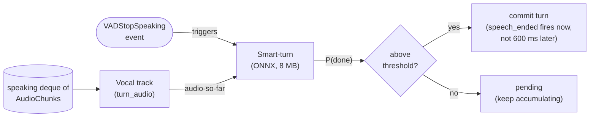
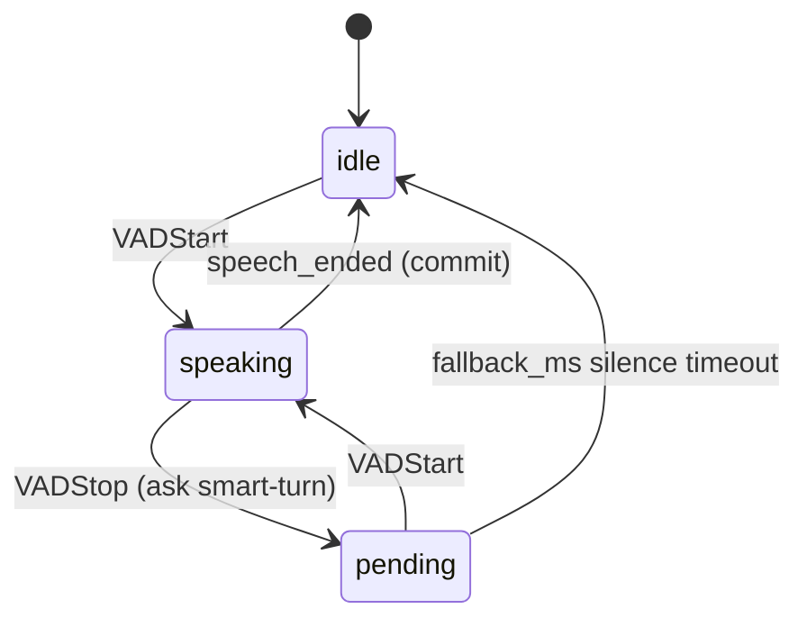

# Chapter 8 — Smart-turn

> A tiny ML model that knows you're done talking before the silence
> confirms it.

## Prerequisites

- [Chapter 7](../07-tools/)
- `uv sync --extra quickstart --group dev` — the `quickstart`
  extra installs `numpy` + `onnxruntime`, which smart-turn needs.
  The 8 MB ONNX model ships bundled in `src/easycat/models/`.
- `OPENAI_API_KEY`, `DEEPGRAM_API_KEY`.

> **Minimum to skip the ladder:** chapter 4 (VAD basics).
> Smart-turn is independent of chapters 5-7 — drop it on top of
> any VAD-gated pipeline.

## Diff from chapter 7

- **Added:** `SmartTurnONNX.detect()` invocation on every
  `VADStopSpeaking`; a `pending` state in `MiniTurnDetector`;
  `smart_turn.classify` journal records; `--backend {vad,smart}`
  CLI for an A/B comparison; `SMART_THRESHOLD` / `SMART_FALLBACK_MS`
  knobs.
- **Modified:** turn commits on classifier probability instead of
  a fixed silence wait.
- **Removed:** tools — to isolate the endpoint-classification
  concept (one axis per chapter).

<!-- BEGIN auto:diff prev=07-tools src=main.py -->
<details>
<summary>Full unified diff vs <code>07-tools/main.py</code> (auto-generated)</summary>

```diff
--- docs/teaching/07-tools/main.py
+++ docs/teaching/08-smart-turn/main.py
@@ -1,34 +1,35 @@
-"""Chapter 7 — Tools, mid-stream.
-
-Same streaming pipeline as chapter 6, plus two demo tools:
-
-- ``get_weather(city)`` — a slow (~1.5s) async tool.
-- ``set_timer(minutes)`` — a fast (~50ms) tool.
-
-The slow one triggers a filler utterance so the user doesn't hear
-a void. The fast one doesn't — fillers only help when the gap
-would otherwise feel broken.
+"""Chapter 8 — Smart-turn.
+
+Replace the "wait 800 ms of silence to be sure they're done" rule with
+an ONNX endpoint classifier. When the model is confident the user is
+done, we commit the turn immediately.
+
+Two modes:
+
+    --backend vad           # baseline: long silence timeout, no model
+    --backend smart         # short timeout + smart-turn confirmation
+
+Run with each and compare the bundle timings.
 
 Dependencies:
-    uv sync --extra quickstart --group dev
+    uv sync --extra quickstart --group dev     # includes smart-turn
     export OPENAI_API_KEY=...
     export DEEPGRAM_API_KEY=...
 """
 
 from __future__ import annotations
 
+import argparse
 import asyncio
 import collections
-import json
 import os
-import random
 import time
 import types
 from pathlib import Path
 
 from openai import AsyncOpenAI
 
-from easycat import LocalTransportConfig
+from easycat import LocalTransportConfig, SmartTurnConfig
 from easycat.audio_format import PCM16_MONO_24K, AudioChunk
 from easycat.debug.export import export_debug_bundle
 from easycat.events import (
@@ -40,6 +41,7 @@
 )
 from easycat.runtime import InMemoryRingBuffer, JournalRecordKind
 from easycat.session import split_at_sentence_boundaries
+from easycat.smart_turn import create_smart_turn
 from easycat.strip_markdown import strip_markdown
 from easycat.stt.factory import STTProviderConfig, create_stt_provider
 from easycat.transports.local import LocalTransport
@@ -51,221 +53,161 @@
 PREROLL_FRAMES = 15
 MODEL = "gpt-4o-mini"
 RUNS_DIR = Path(__file__).parent / "runs"
-SESSION_ID = f"ch07-tools-{int(time.time())}"
-
-# ── Demo tools ────────────────────────────────────────────────────
-
-EXPECTED_LATENCIES_MS = {"get_weather": 1500, "set_timer": 50}
-
-
-async def get_weather(city: str) -> str:
-    await asyncio.sleep(1.5)
-    return f"The weather in {city} is {random.choice(['sunny', 'cloudy', 'rainy'])} and 17°C."
-
-
-async def set_timer(minutes: int) -> str:
-    await asyncio.sleep(0.05)
-    return f"Timer set for {minutes} minutes."
-
-
-TOOLS = [
-    {
-        "type": "function",
-        "function": {
-            "name": "get_weather",
-            "description": "Get the current weather for a city.",
-            "parameters": {
-                "type": "object",
-                "properties": {"city": {"type": "string"}},
-                "required": ["city"],
-            },
-        },
-    },
-    {
-        "type": "function",
-        "function": {
-            "name": "set_timer",
-            "description": "Set a timer for a number of minutes.",
-            "parameters": {
-                "type": "object",
-                "properties": {"minutes": {"type": "integer"}},
-                "required": ["minutes"],
-            },
-        },
-    },
-]
-
-TOOL_IMPLS = {"get_weather": get_weather, "set_timer": set_timer}
+
+# Baseline: VAD waits a long silence before calling the turn over.
+# Smart: VAD fires early (short silence), then smart-turn *gates* the
+# commit. If the model says "not done," we stay in the turn and let
+# a hard fallback timeout catch actual long silences.
+VAD_BASELINE_SILENCE_MS = 800
+SMART_EARLY_SILENCE_MS = 200
+SMART_FALLBACK_MS = 800  # if smart-turn keeps saying "not done"
+SMART_THRESHOLD = 0.5
+
+# ── MiniTurnDetector with optional smart-turn ─────────────────────
 
 
 class MiniTurnDetector:
-    """Same as chapters 4-6."""
-
-    def __init__(self, vad, preroll_frames: int = PREROLL_FRAMES) -> None:
+    """VAD + optional smart-turn gating.
+
+    Without smart-turn, every ``VADStopSpeaking`` becomes
+    ``speech_ended``. With smart-turn we gate the commit:
+
+    - VAD fires after a *short* silence.
+    - Classifier looks at the turn so far. Above threshold → commit
+      now. Below → enter a ``pending`` state where a new
+      ``VADStartSpeaking`` resumes the turn (the user was just
+      thinking). A hard ``fallback_ms`` fallback commits if neither
+      happens.
+    """
+
+    def __init__(
+        self,
+        vad,
+        *,
+        smart_turn=None,
+        threshold: float = SMART_THRESHOLD,
+        fallback_ms: int = SMART_FALLBACK_MS,
+        journal: InMemoryRingBuffer | None = None,
+        session_id: str = "",
+        preroll_frames: int = PREROLL_FRAMES,
+    ) -> None:
         self._vad = vad
+        self._smart = smart_turn
+        self._threshold = threshold
+        self._fallback_ms = fallback_ms
+        self._journal = journal
+        self._session_id = session_id
         self._preroll: collections.deque[AudioChunk] = collections.deque(maxlen=preroll_frames)
-        self._speaking = False
+        self._state: str = "idle"  # idle | speaking | pending
+        self._pending_since: float | None = None
+        self._turn_audio: list[AudioChunk] = []
 
     async def frames(self, audio_iter):
         async for chunk in audio_iter:
             vad_events = [ev async for ev in self._vad.process(chunk)]
+
             for ev in vad_events:
                 if isinstance(ev, VADStartSpeaking):
-                    while self._preroll:
-                        yield "speech_started", self._preroll.popleft()
-                    self._speaking = True
-                elif isinstance(ev, VADStopSpeaking):
-                    self._speaking = False
-                    yield "speech_ended", None
-            if self._speaking:
+                    if self._state == "pending":
+                        # The user was just thinking — resume without a
+                        # new speech_started boundary.
+                        self._state = "speaking"
+                        self._pending_since = None
+                    else:
+                        while self._preroll:
+                            buf = self._preroll.popleft()
+                            self._turn_audio.append(buf)
+                            yield "speech_started", buf
+                        self._state = "speaking"
+                elif isinstance(ev, VADStopSpeaking) and self._state == "speaking":
+                    confirmed = await self._classify()
+                    if self._smart is None or confirmed:
+                        self._state = "idle"
+                        self._turn_audio = []
+                        yield "speech_ended", None
+                    else:
+                        self._state = "pending"
+                        self._pending_since = time.monotonic()
+
+            # Fallback commit — smart-turn kept saying "not done" but no
+            # new speech arrived. Force the turn over.
+            if (
+                self._state == "pending"
+                and self._pending_since is not None
+                and (time.monotonic() - self._pending_since) * 1000 >= self._fallback_ms
+            ):
+                self._state = "idle"
+                self._pending_since = None
+                self._turn_audio = []
+                yield "speech_ended", None
+
+            if self._state == "speaking":
+                self._turn_audio.append(chunk)
                 yield "frame", chunk
+            elif self._state == "pending":
+                self._turn_audio.append(chunk)
             else:
                 self._preroll.append(chunk)
 
-
-# ── Filler utterance heuristic ────────────────────────────────────
-
-FILLER_PHRASES = {
-    "get_weather": "Let me check the weather for you.",
-    "set_timer": "",
-}
-
-
-def should_play_filler(tool_name: str) -> bool:
-    """Fillers only help for 300 ms–2 s gaps.
-
-    Shorter: the filler ends up racing the result.
-    Longer: one filler alone isn't enough; you'd need periodic updates.
-    """
-    expected_ms = EXPECTED_LATENCIES_MS.get(tool_name, 0)
-    return 300 <= expected_ms <= 2000 and bool(FILLER_PHRASES.get(tool_name))
-
-
-# ── Tool-bearing stream consumer ──────────────────────────────────
-
-
-async def run_agent_streaming(
-    client: AsyncOpenAI,
-    user_text: str,
-    sentence_queue: asyncio.Queue,
-    journal: InMemoryRingBuffer,
-) -> None:
-    """Run the agent, call tools if requested, push sentences to TTS.
-
-    ``sentence_queue`` carries ``(kind, text)`` tuples. ``kind`` is
-    ``"reply"`` for normal agent text and ``"filler"`` for tool-gap
-    fillers — the drain side tags them separately in the journal.
-    """
-    messages = [
-        {"role": "system", "content": "You are a helpful voice assistant. Keep replies brief."},
-        {"role": "user", "content": user_text},
-    ]
-
-    # Up to two iterations: first call may ask for tools, second produces
-    # the final spoken reply.
-    for _ in range(2):
-        stream = await client.chat.completions.create(
-            model=MODEL,
-            messages=messages,
-            tools=TOOLS,
-            stream=True,
-        )
-
-        buffer = ""
-        tool_calls: dict[int, dict] = {}
-
-        async for chunk in stream:
-            choice = chunk.choices[0]
-            delta = choice.delta
-
-            if delta.content:
-                buffer += delta.content
-                ready, buffer = split_at_sentence_boundaries(buffer)
-                if ready.strip():
-                    spoken = strip_markdown(ready).strip()
-                    if spoken:
-                        await sentence_queue.put(("reply", spoken))
-
-            for tc in delta.tool_calls or []:
-                entry = tool_calls.setdefault(tc.index, {"id": None, "name": None, "args": ""})
-                if tc.id:
-                    entry["id"] = tc.id
-                if tc.function and tc.function.name:
-                    entry["name"] = tc.function.name
-                if tc.function and tc.function.arguments:
-                    entry["args"] += tc.function.arguments
-
-            # ``stop`` is terminal for the whole turn; anything in
-            # ``tool_calls`` at that point we treat as malformed and ignore.
-            if choice.finish_reason == "stop":
-                if buffer.strip():
-                    spoken = strip_markdown(buffer).strip()
-                    if spoken:
-                        await sentence_queue.put(("reply", spoken))
-                await sentence_queue.put(None)
-                return
-
-            if choice.finish_reason == "tool_calls":
-                break
-
-        if not tool_calls:
-            await sentence_queue.put(None)
-            return
-
-        messages.append(
-            {
-                "role": "assistant",
-                "content": buffer or None,
-                "tool_calls": [
-                    {
-                        "id": tc["id"],
-                        "type": "function",
-                        "function": {"name": tc["name"], "arguments": tc["args"]},
-                    }
-                    for tc in tool_calls.values()
-                ],
-            }
-        )
-
-        for tc in tool_calls.values():
-            name = tc["name"]
-            args = json.loads(tc["args"] or "{}")
-
-            if should_play_filler(name):
-                await sentence_queue.put(("filler", FILLER_PHRASES[name]))
-
-            journal.append(
+    async def _classify(self) -> bool:
+        """Return True if smart-turn confirms the turn is over."""
+        if self._smart is None or not self._turn_audio:
+            return True
+        t0 = time.monotonic()
+        result = await self._smart.detect(self._turn_audio)
+        inference_ms = (time.monotonic() - t0) * 1000
+        confirmed = result.probability >= self._threshold
+        if self._journal is not None:
+            self._journal.append(
                 kind=JournalRecordKind.EVENT,
-                name="tool.call.started",
-                session_id=SESSION_ID,
-                data={"stage": "tool", "name": name, "args": args},
-            )
-            t0 = time.monotonic()
-            result = await TOOL_IMPLS[name](**args)
-            journal.append(
-                kind=JournalRecordKind.EVENT,
-                name="tool.call.result",
-                session_id=SESSION_ID,
+                name="smart_turn.classify",
+                session_id=self._session_id,
                 data={
-                    "stage": "tool",
-                    "name": name,
-                    "elapsed_ms": (time.monotonic() - t0) * 1000,
-                    "result": result,
+                    "stage": "turn",
+                    "probability": result.probability,
+                    "prediction": result.prediction,
+                    "confirmed": confirmed,
+                    "inference_ms": inference_ms,
                 },
             )
-            messages.append({"role": "tool", "tool_call_id": tc["id"], "content": str(result)})
-
+        return confirmed
+
+
+# ── Streaming agent + TTS (same shape as chapter 6) ───────────────
+
+
+async def run_agent_streaming(client, user_text, sentence_queue):
+    stream = await client.chat.completions.create(
+        model=MODEL,
+        messages=[
+            {"role": "system", "content": "You are a helpful voice assistant. Keep it brief."},
+            {"role": "user", "content": user_text},
+        ],
+        stream=True,
+    )
+    buffer = ""
+    async for chunk in stream:
+        delta = chunk.choices[0].delta.content or ""
+        if not delta:
+            continue
+        buffer += delta
+        ready, buffer = split_at_sentence_boundaries(buffer)
+        if ready.strip():
+            spoken = strip_markdown(ready).strip()
+            if spoken:
+                await sentence_queue.put(spoken)
+    if buffer.strip():
+        spoken = strip_markdown(buffer).strip()
+        if spoken:
+            await sentence_queue.put(spoken)
     await sentence_queue.put(None)
 
 
-async def drain_sentences_to_speaker(
-    tts, transport, sentence_queue: asyncio.Queue, journal: InMemoryRingBuffer
-) -> None:
+async def drain_sentences_to_speaker(tts, transport, sentence_queue, journal, session_id):
     while True:
-        item = await sentence_queue.get()
-        if item is None:
+        sentence = await sentence_queue.get()
+        if sentence is None:
             break
-        kind, sentence = item
         synth_start = time.monotonic()
         async for event in tts.synthesize(TTSInput(text=sentence)):
             if event.type == TTSEventType.AUDIO and event.audio is not None:
@@ -273,51 +215,75 @@
         journal.append(
             kind=JournalRecordKind.EVENT,
             name="stage.tts.execute",
-            session_id=SESSION_ID,
+            session_id=session_id,
             data={
                 "stage": "tts",
-                "kind": kind,
                 "elapsed_ms": (time.monotonic() - synth_start) * 1000,
                 "text": sentence,
             },
         )
 
 
-async def run_turn(transport, stt, client, tts, journal) -> None:
+async def run_turn(transport, stt, client, tts, journal, session_id):
     final_text = ""
     stt_final_t = None
     async for event in stt.events():
         if event.type == STTEventType.FINAL:
             final_text = event.text
             stt_final_t = time.monotonic()
-
     if not final_text.strip() or stt_final_t is None:
         return
 
     print(f"  user: {final_text!r}")
-    sentence_queue: asyncio.Queue = asyncio.Queue()
+    q: asyncio.Queue = asyncio.Queue()
     await asyncio.gather(
-        run_agent_streaming(client, final_text, sentence_queue, journal),
-        drain_sentences_to_speaker(tts, transport, sentence_queue, journal),
+        run_agent_streaming(client, final_text, q),
+        drain_sentences_to_speaker(tts, transport, q, journal, session_id),
     )
     total_gap = (time.monotonic() - stt_final_t) * 1000
     journal.append(
         kind=JournalRecordKind.EVENT,
         name="turn.gap",
-        session_id=SESSION_ID,
+        session_id=session_id,
         data={"stage": "turn", "total_gap_ms": total_gap, "text": final_text},
     )
     print(f"  (turn gap: {total_gap:.0f} ms)")
 
 
 async def main() -> None:
+    ap = argparse.ArgumentParser()
+    ap.add_argument(
+        "--backend",
+        choices=("vad", "smart"),
+        default="smart",
+        help="vad: long silence timeout. smart: short timeout + smart-turn confirmation.",
+    )
+    args = ap.parse_args()
+
     if not (os.getenv("OPENAI_API_KEY") and os.getenv("DEEPGRAM_API_KEY")):
         raise SystemExit("Set OPENAI_API_KEY and DEEPGRAM_API_KEY.")
 
+    session_id = f"ch08-{args.backend}-{int(time.time())}"
+    silence_ms = SMART_EARLY_SILENCE_MS if args.backend == "smart" else VAD_BASELINE_SILENCE_MS
+    print(
+        f"Backend: {args.backend}  "
+        f"VAD min_silence_duration={silence_ms} ms  "
+        f"smart-turn={'on' if args.backend == 'smart' else 'off'}"
+    )
+
     journal = InMemoryRingBuffer(capacity=10_000)
     transport = LocalTransport(LocalTransportConfig(audio_format=PCM16_MONO_24K))
-    vad = create_vad(VADConfig())
-    detector = MiniTurnDetector(vad)
+    vad = create_vad(VADConfig(min_silence_duration_ms=silence_ms))
+    smart_turn = None
+    if args.backend == "smart":
+        smart_turn = create_smart_turn(SmartTurnConfig(enabled=True, threshold=SMART_THRESHOLD))
+    detector = MiniTurnDetector(
+        vad,
+        smart_turn=smart_turn,
+        threshold=SMART_THRESHOLD,
+        journal=journal,
+        session_id=session_id,
+    )
     client = AsyncOpenAI()
     tts = create_tts_provider(
         TTSProviderConfig(provider="openai", settings={"api_key": os.environ["OPENAI_API_KEY"]})
@@ -333,7 +299,7 @@
         )
 
     await transport.connect()
-    print('Ask me "What is the weather in Tokyo?" or "Set a 5-minute timer."\n')
+    print("Talk. Ctrl-C to stop.\n")
 
     async def collect_turns():
         stt = None
@@ -347,7 +313,7 @@
                 await stt.send_audio(chunk)
             elif tag == "speech_ended" and stt is not None:
                 await stt.end_stream()
-                await run_turn(transport, stt, client, tts, journal)
+                await run_turn(transport, stt, client, tts, journal, session_id)
                 stt = None
 
     try:
@@ -358,7 +324,7 @@
         await transport.disconnect()
 
     RUNS_DIR.mkdir(exist_ok=True)
-    bundle_path = RUNS_DIR / f"{SESSION_ID}.bundle"
+    bundle_path = RUNS_DIR / f"{session_id}.bundle"
     session_stub = types.SimpleNamespace(journal=journal)
     export_debug_bundle(session_stub, bundle_path, overwrite=True)
     print(f"\nWrote bundle → {bundle_path.relative_to(Path.cwd())}")
```

</details>
<!-- END auto:diff -->

## VAD silence is a timeout in disguise

Chapter 4's VAD is great at "this frame contains speech." It is
*not* good at "was that the end of a sentence?" To be safe, a VAD
pipeline waits ~800 ms of silence before calling the turn over.
Most of that 800 ms is slack — the user was done 300-500 ms ago.

Humans don't cue off silence; we cue off **intonation**.

> *"I think we should go."*  — pitch falls at "go" → done.
>
> *"I think we should…"*   — pitch stays level → not done.

Smart-turn is an 8 MB ONNX classifier trained on exactly this
signal. Input: the recent audio. Output: `P(end-of-turn)`.

## Architecture



## Run it both ways

```bash
# Baseline: 800 ms silence timeout, no smart-turn.
uv run python docs/teaching/08-smart-turn/main.py --backend vad

# Smart-turn: 200 ms silence timeout + classifier confirmation.
uv run python docs/teaching/08-smart-turn/main.py --backend smart
```

Ask the same question under each. Read both bundles. Expect
~500-600 ms faster first-audio in the `smart` run on clean
declarative utterances.

## The state machine

`MiniTurnDetector` now has three states:



Every chunk during a speech or pending segment goes into
`self._turn_audio`. On `VADStopSpeaking`, we call
`smart_turn.detect(turn_audio)` — inference runs via
`asyncio.loop.run_in_executor` inside `SmartTurnONNX.detect`, so
ONNX doesn't block the event loop. Typical cost: 30-50 ms per
call.

- Probability ≥ threshold → commit: emit `speech_ended` now.
- Probability < threshold → pending: do **not** emit; keep
  accumulating audio. If a new `VADStartSpeaking` arrives, resume
  the same turn. If no new speech arrives for `SMART_FALLBACK_MS`
  (800 ms), force-commit.

Every classify call writes a `smart_turn.classify` record to the
journal with `probability`, `prediction`, `confirmed`, and
`inference_ms`.

## Read the journal

```python
from pathlib import Path
from easycat.debug.testing import load_bundle
for b in sorted(Path("docs/teaching/08-smart-turn/runs/").glob("*.bundle")):
    bundle = load_bundle(b)
    for r in bundle.records():
        if r["name"] == "smart_turn.classify":
            d = r["data"]
            print(f"  {b.name}  prob={d['probability']:.2f}  "
                  f"pred={d['prediction']}  infer={d['inference_ms']:.0f}ms")
        if r["name"] == "turn.gap":
            print(f"  {b.name}  turn_gap={r['data']['total_gap_ms']:.0f}ms")
```

## The failure modes

Smart-turn is a classifier, not an oracle. Expected misfires:

- **Rising intonation ("…and?")** — the model may say "not done"
  and force the full timeout fallback. Fine.
- **Lists with level intonation ("apples, bananas, pears")** —
  the model may say "done" after "bananas" if you paused there
  flat. This is a real interrupt-the-user bug.
- **Ambient noise** — the model weights pitch strongly; a
  background hum can confuse it. Chapter 10 cleans this up.

## Production reference

`TurnManager.on_vad_stop` in `src/easycat/turn_manager.py` wires
smart-turn through the same 5-state FSM we pointed at in
chapter 4. The core idea is identical to what we just built;
the production version coordinates with barge-in (chapter 9),
cancel tokens, and the action queue.

## Try breaking it

1. Drop `SMART_THRESHOLD` to `0.3`. Re-run. How often does the
   bot interrupt you now?
2. Record *"I was thinking… we should order pizza."* Run
   `--backend smart`. Read the journal. Did smart-turn say done
   during the "…" pause? (If yes, that's a 300-500 ms latency
   win. If no, the fallback silence timeout will still commit.)
3. Find an utterance where the `vad` backend gets it right and
   `smart` gets it wrong. Keep the bundle — it's a real-world
   misfire to refer back to when you read
   [chapter 12](../12-evals-and-latency/) on eval sets.

## What's next

[Chapter 9 — Interruption / barge-in](../09-interruption/). What
if the user starts talking while the bot is talking? Three wrong
versions first.
