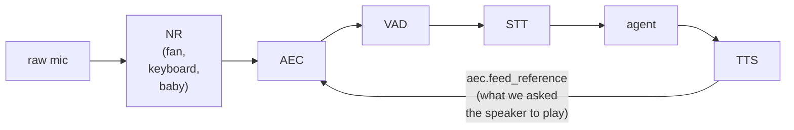

# Chapter 10 — Cleaning the Signal

> Two problems often confused as one. **Noise reduction** removes
> uncorrelated background sound (fan, keyboard, baby).
> **Echo cancellation** removes the bot's own voice coming back
> through the microphone. Same pipeline slot; fundamentally
> different techniques.

## Prerequisites

- [Chapter 9](../09-interruption/)
- For real NR: `uv pip install -e '.[rnnoise]'` (permissive
  RNNoise) or Krisp per its own SDK.
- For real AEC: `uv pip install -e '.[aec]'` (LiveKit APM).
- `OPENAI_API_KEY`, `DEEPGRAM_API_KEY`.

> **Minimum to skip the ladder:** chapter 4 (where VAD sits).
> NR / AEC are orthogonal to the agent layer — they belong
> upstream of VAD and don't depend on chapters 5-9. The bonus
> `wrong_order.py` here makes that "where it belongs" tangible.

Both factories **silently fall back to passthrough** when their
deps are missing. The script prints and journals the live backend
so you know which one you're actually hearing.

## Diff from chapter 9

- **Added:** `create_noise_reducer()` + `create_echo_canceller()`
  factories; a `clean_audio_pipeline` stage that runs NR → AEC
  before VAD; an `aec.feed_reference(event.audio)` line in the
  TTS drain (the only dual-input thing in the pipeline); an
  `audio.config` journal record naming the live backend;
  `generate_fixtures.py` + `replay.py` for deterministic offline
  runs; `wrong_order.py` showing what happens with the stages in
  the wrong order.
- **Modified:** pipeline order becomes mic → NR → AEC → VAD → STT
  → agent (and TTS still feeds AEC's reference).
- **Removed:** chapter 9c's `TurnLedger` / history-rewrite — this
  chapter isolates the NR/AEC axis. Merge them yourself in
  exercise 4 if you want both at once.

<!-- BEGIN auto:diff prev=09-interruption prev_src=estimate.py src=main.py -->
<details>
<summary>Full unified diff vs <code>09-interruption/estimate.py</code> (auto-generated)</summary>

```diff
--- docs/teaching/09-interruption/estimate.py
+++ docs/teaching/10-cleaning-signal/main.py
@@ -1,39 +1,56 @@
-"""Chapter 9c — cancel + estimate what the user actually heard.
-
-Same as ``cancel.py`` plus: we track bytes of TTS audio that made
-it onto the speaker before the cancel fires, compute the character
-position in the bot's *text* reply that corresponds to those bytes,
-and rewrite the assistant turn in the conversation history to end
-there. Next turn, the LLM has the same picture of reality the
-user does.
-
-The byte-to-char estimate is deliberately simple: bytes heard ÷
-total bytes × total chars. The production
-`easycat.session.interruption` estimator is a lot more careful
-about silence, SSML, markdown, and playback-ack fudge factors —
-read it after you understand the toy.
+"""Chapter 10 — Cleaning the signal.
+
+Add noise reduction (NR) and acoustic echo cancellation (AEC) to
+the ch9 pipeline. Toggle each independently via CLI flags, and
+read the journal to see which backend is actually running.
+
+    # Nothing on: the baseline.
+    --nr off --aec off
+
+    # NR alone: fan noise, keyboard clicks get filtered.
+    --nr on  --aec off
+
+    # AEC alone: bot-through-speaker bleed gets subtracted.
+    --nr off --aec on
+
+    # Both: prod-style.
+    --nr on  --aec on
+
+NR is single-input — it only sees the mic. AEC is dual-input —
+it needs both the mic *and* the far-end reference (the TTS audio
+we sent to the speaker). We feed the reference every time we
+emit a TTS chunk.
 
 Dependencies:
     uv sync --extra quickstart --group dev
+    For real NR:   uv pip install -e '.[rnnoise]'
+    For real AEC:  uv pip install -e '.[aec]'
+    Otherwise both silently fall back to passthrough — the
+    journal tells you which backend is live.
+
     export OPENAI_API_KEY=...
     export DEEPGRAM_API_KEY=...
 """
 
 from __future__ import annotations
 
+import argparse
 import asyncio
 import collections
 import os
 import time
 import types
-from dataclasses import dataclass, field
 from pathlib import Path
 
 from openai import AsyncOpenAI
 
-from easycat import CancelToken, LocalTransportConfig
+from easycat import (
+    CancelToken,
+    LocalTransportConfig,
+)
 from easycat.audio_format import PCM16_MONO_24K, AudioChunk
 from easycat.debug.export import export_debug_bundle
+from easycat.echo_cancellation import EchoCancellationConfig, create_echo_canceller
 from easycat.events import (
     EventBus,
     STTEventType,
@@ -41,6 +58,7 @@
     VADStartSpeaking,
     VADStopSpeaking,
 )
+from easycat.noise_reduction import NoiseReducerConfig, create_noise_reducer
 from easycat.runtime import InMemoryRingBuffer, JournalRecordKind
 from easycat.session import split_at_sentence_boundaries
 from easycat.strip_markdown import strip_markdown
@@ -54,48 +72,23 @@
 MODEL = "gpt-4o-mini"
 PREROLL_FRAMES = 15
 RUNS_DIR = Path(__file__).parent / "runs"
-SESSION_ID = f"ch09c-estimate-{int(time.time())}"
-
-# OpenAI TTS emits PCM16 mono at 24 kHz = 48,000 bytes/second.
-TTS_BYTES_PER_SECOND = 24_000 * 2
-
-
-@dataclass
-class TurnLedger:
-    """Per-turn record of what the bot tried to say vs. what played.
-
-    ``sentences_sent`` accumulates the text of each sentence dispatched
-    to TTS in order. ``bytes_sent`` tracks audio bytes that actually
-    reached ``transport.send_audio``. At cancel time we combine them
-    to estimate where, in the concatenated text, the user's ear fell
-    silent.
+
+
+class _Passthrough:
+    """Stand-in for --nr off / --aec off paths: no-op both directions.
+
+    Matches ``replay.py``'s passthrough so both entry points take the
+    same shape when a stage is disabled.
     """
 
-    sentences_sent: list[str] = field(default_factory=list)
-    bytes_sent: int = 0
-
-    def heard_text(self) -> str:
-        """Estimate the text prefix the user's ear actually reached.
-
-        Audio bytes map directly to playback duration (OpenAI TTS
-        emits a fixed-rate stream). Convert duration to characters
-        via the expected full-text byte count; clamp to the real
-        length so a complete turn returns the whole string.
-        """
-        if not self.sentences_sent:
-            return ""
-        full_text = " ".join(self.sentences_sent)
-        expected = max(1, _expected_bytes(full_text))
-        estimated_chars = int(len(full_text) * self.bytes_sent / expected)
-        estimated_chars = max(0, min(estimated_chars, len(full_text)))
-        return full_text[:estimated_chars]
-
-
-def _expected_bytes(text: str) -> int:
-    """Very rough ~15 chars/s of speech at 48000 bytes/s of TTS audio."""
-    chars_per_sec = 15
-    seconds = len(text) / chars_per_sec
-    return int(seconds * TTS_BYTES_PER_SECOND)
+    async def process(self, chunk):
+        return chunk
+
+    def feed_reference(self, chunk):
+        pass
+
+    def version_info(self):
+        return {"provider": "off"}
 
 
 class MiniTurnDetector:
@@ -123,13 +116,33 @@
                 self._preroll.append(chunk)
 
 
-async def mic_producer(detector, transport, queue: asyncio.Queue) -> None:
-    async for tag, chunk in detector.frames(transport.receive_audio()):
+async def clean_audio_pipeline(transport, nr, aec):
+    """Pipeline order: transport → NR → AEC → (downstream).
+
+    NR runs first so it sees the rawest noise spectrum possible.
+    AEC then subtracts the bot's own voice (reference-fed elsewhere).
+    VAD and STT live downstream in the detector + coordinator.
+    """
+    async for chunk in transport.receive_audio():
+        chunk = await nr.process(chunk)
+        chunk = await aec.process(chunk)
+        yield chunk
+
+
+async def mic_producer(detector, cleaned_audio, queue: asyncio.Queue) -> None:
+    async for tag, chunk in detector.frames(cleaned_audio):
         await queue.put((tag, chunk))
 
 
-async def run_agent(client, history, sentence_queue, cancel: CancelToken):
-    stream = await client.chat.completions.create(model=MODEL, messages=history, stream=True)
+async def run_agent(client, user_text, sentence_queue, cancel: CancelToken):
+    stream = await client.chat.completions.create(
+        model=MODEL,
+        messages=[
+            {"role": "system", "content": "You are a helpful voice assistant. Keep it brief."},
+            {"role": "user", "content": user_text},
+        ],
+        stream=True,
+    )
     buffer = ""
     async for chunk in stream:
         if cancel.is_cancelled:
@@ -150,95 +163,48 @@
     await sentence_queue.put(None)
 
 
-async def drain_to_speaker(tts, transport, sentence_queue, cancel, ledger, journal):
+async def drain_to_speaker(tts, transport, aec, sentence_queue, cancel, session_id, journal):
+    """Emit TTS audio to the speaker AND feed it to AEC as the far-end reference."""
     while True:
         sentence = await sentence_queue.get()
         if sentence is None or cancel.is_cancelled:
             break
-        ledger.sentences_sent.append(sentence)
         async for event in tts.synthesize(TTSInput(text=sentence)):
             if cancel.is_cancelled:
                 await tts.cancel()
                 break
             if event.type == TTSEventType.AUDIO and event.audio is not None:
                 await transport.send_audio(event.audio)
-                ledger.bytes_sent += len(event.audio.data)
+                # The crucial dual-input line: AEC needs to know what we
+                # asked the speaker to play, so it can subtract that
+                # pattern from the mic.
+                aec.feed_reference(event.audio)
         journal.append(
             kind=JournalRecordKind.EVENT,
             name="stage.tts.execute",
-            session_id=SESSION_ID,
-            data={
-                "stage": "tts",
-                "text": sentence,
-                "bytes_sent_so_far": ledger.bytes_sent,
-                "cancelled": cancel.is_cancelled,
-            },
+            session_id=session_id,
+            data={"stage": "tts", "text": sentence},
         )
 
 
-async def coordinator(mic_queue, stt_factory, client, tts, transport, journal):
-    """Maintain a multi-turn history and rewrite it on cancel."""
-    history: list[dict] = [
-        {
-            "role": "system",
-            "content": (
-                "You are a helpful voice assistant. "
-                "Give a long-ish answer so the reader has something to interrupt."
-            ),
-        }
-    ]
+async def coordinator(mic_queue, stt_factory, client, tts, transport, aec, session_id, journal):
     stt = None
     bot_task: asyncio.Task | None = None
     active_cancel: CancelToken | None = None
-    active_ledger: TurnLedger | None = None
 
     while True:
         tag, chunk = await mic_queue.get()
 
-        # Barge-in during bot speech → cancel AND rewrite history.
         if bot_task is not None and not bot_task.done():
-            if tag == "speech_started" and active_cancel is not None and active_ledger is not None:
+            if tag == "speech_started" and active_cancel is not None:
                 journal.append(
                     kind=JournalRecordKind.EVENT,
                     name="interruption.start",
-                    session_id=SESSION_ID,
+                    session_id=session_id,
                     data={"stage": "vad", "t_ms": time.monotonic() * 1000},
                 )
                 active_cancel.cancel()
                 await transport.clear_audio()
-
-                # Let the bot task unwind so the ledger is final. A
-                # transient agent/TTS error here shouldn't take the
-                # whole session down mid-barge-in; log it and move on.
-                try:
-                    await bot_task
-                except Exception as exc:
-                    journal.append(
-                        kind=JournalRecordKind.EVENT,
-                        name="bot_task.error",
-                        session_id=SESSION_ID,
-                        data={"stage": "coordinator", "error": repr(exc)},
-                    )
-
-                heard = active_ledger.heard_text()
-                full = " ".join(active_ledger.sentences_sent)
-                journal.append(
-                    kind=JournalRecordKind.EVENT,
-                    name="interruption.estimate",
-                    session_id=SESSION_ID,
-                    data={
-                        "stage": "interruption",
-                        "full_text": full,
-                        "heard_text": heard,
-                        "bytes_heard": active_ledger.bytes_sent,
-                    },
-                )
-                # Rewrite history: the bot said *only* what the user heard.
-                history.append({"role": "assistant", "content": heard})
-                print(f"  bot (cut): {heard!r}")
-                active_cancel = None
-                active_ledger = None
-                bot_task = None
             continue
 
         if tag == "speech_started":
@@ -258,33 +224,56 @@
             if not final_text.strip():
                 continue
             print(f"  user: {final_text!r}")
-            history.append({"role": "user", "content": final_text})
 
             cancel = CancelToken()
-            ledger = TurnLedger()
             active_cancel = cancel
-            active_ledger = ledger
-
-            async def _bot(hist=list(history), ct=cancel, led=ledger):
+
+            async def _bot(text=final_text, ct=cancel):
                 q: asyncio.Queue = asyncio.Queue()
                 await asyncio.gather(
-                    run_agent(client, hist, q, ct),
-                    drain_to_speaker(tts, transport, q, ct, led, journal),
+                    run_agent(client, text, q, ct),
+                    drain_to_speaker(tts, transport, aec, q, ct, session_id, journal),
                 )
-                if not ct.is_cancelled:
-                    # Clean completion: record the full reply in history.
-                    full = " ".join(led.sentences_sent)
-                    history.append({"role": "assistant", "content": full})
-                    print(f"  bot: {full!r}")
 
             bot_task = asyncio.create_task(_bot())
 
 
 async def main() -> None:
+    ap = argparse.ArgumentParser()
+    ap.add_argument("--nr", choices=("on", "off"), default="off")
+    ap.add_argument("--aec", choices=("on", "off"), default="off")
+    args = ap.parse_args()
+
     if not (os.getenv("OPENAI_API_KEY") and os.getenv("DEEPGRAM_API_KEY")):
         raise SystemExit("Set OPENAI_API_KEY and DEEPGRAM_API_KEY.")
 
+    session_id = f"ch10-nr{args.nr}-aec{args.aec}-{int(time.time())}"
     journal = InMemoryRingBuffer(capacity=10_000)
+
+    # Factory-wired stages. NR/AEC both fall back to passthrough if the
+    # optional deps aren't installed; the journal records which one is live.
+    if args.nr == "on":
+        nr = create_noise_reducer(NoiseReducerConfig())
+        nr_backend = nr.version_info().get("provider", "unknown")
+    else:
+        nr = _Passthrough()
+        nr_backend = "off"
+
+    if args.aec == "on":
+        aec = create_echo_canceller(EchoCancellationConfig(enabled=True))
+        aec_backend = aec.version_info().get("provider", "unknown")
+    else:
+        aec = _Passthrough()
+        aec_backend = "off"
+
+    print(f"NR backend: {nr_backend}    AEC backend: {aec_backend}")
+    journal.append(
+        kind=JournalRecordKind.EVENT,
+        name="audio.config",
+        session_id=session_id,
+        data={"stage": "audio", "nr": nr_backend, "aec": aec_backend},
+    )
+
     transport = LocalTransport(LocalTransportConfig(audio_format=PCM16_MONO_24K))
     vad = create_vad(VADConfig())
     detector = MiniTurnDetector(vad)
@@ -303,13 +292,14 @@
         )
 
     await transport.connect()
-    print("Cancel + history rewrite. Interrupt freely. Ctrl-C to stop.\n")
+    print("Talk. Ctrl-C to stop.\n")
 
     mic_queue: asyncio.Queue = asyncio.Queue()
+    cleaned = clean_audio_pipeline(transport, nr, aec)
     try:
         await asyncio.gather(
-            mic_producer(detector, transport, mic_queue),
-            coordinator(mic_queue, stt_factory, client, tts, transport, journal),
+            mic_producer(detector, cleaned, mic_queue),
+            coordinator(mic_queue, stt_factory, client, tts, transport, aec, session_id, journal),
         )
     except (KeyboardInterrupt, asyncio.CancelledError):
         pass
@@ -317,7 +307,7 @@
         await transport.disconnect()
 
     RUNS_DIR.mkdir(exist_ok=True)
-    bundle_path = RUNS_DIR / f"{SESSION_ID}.bundle"
+    bundle_path = RUNS_DIR / f"{session_id}.bundle"
     session_stub = types.SimpleNamespace(journal=journal)
     export_debug_bundle(session_stub, bundle_path, overwrite=True)
     print(f"\nWrote bundle → {bundle_path.relative_to(Path.cwd())}")
```

</details>
<!-- END auto:diff -->

## The naive predecessor

Before reaching for the right pipeline order, look at the wrong one:

```bash
# Run NR *after* VAD (no-op: VAD already classified the noise as speech)
uv run python docs/teaching/10-cleaning-signal/wrong_order.py --mode nr-after-vad

# Run AEC *without* feeding the reference (silently does nothing)
uv run python docs/teaching/10-cleaning-signal/wrong_order.py --mode aec-no-reference
```

Both modes are technically running NR / AEC, and both produce a
bundle. The journal shows the failure: VAD's false-fire rate
doesn't change in `nr-after-vad`, and AEC's `feed_reference()`
counter stays at zero in `aec-no-reference`. **Wrong-version-
first** for pipeline ordering — the same components, wired
wrong, do nothing.

**Scope note.** This chapter isolates the NR/AEC axis. It drops
chapter 9c's `TurnLedger` / history rewrite (the LLM's memory
goes back to one-shot) so you can focus on the signal cleaning
without extra moving parts. If you want both, merge the two
files — nothing prevents it.

## Two ways to run this chapter

### A — live (speakerphone + real voice)

```bash
uv run python docs/teaching/10-cleaning-signal/main.py --nr off --aec off
uv run python docs/teaching/10-cleaning-signal/main.py --nr on  --aec off
uv run python docs/teaching/10-cleaning-signal/main.py --nr off --aec on
uv run python docs/teaching/10-cleaning-signal/main.py --nr on  --aec on
```

**For the AEC cell you need mic + speaker in the same laptop, no
headphones** — if the bot's audio never reaches the mic, AEC has
nothing to cancel. Chapter 9 asked you to use headphones; for
this chapter's AEC demo, take them off.

### B — offline replay (deterministic fixtures)

Generate a synthetic fixture set once, then replay any condition
through `replay.py`:

```bash
uv run python docs/teaching/10-cleaning-signal/generate_fixtures.py
uv run python docs/teaching/10-cleaning-signal/replay.py \
    --mic recordings/speakerphone_loop.mic.wav \
    --ref recordings/speakerphone_loop.ref.wav \
    --nr on --aec on
```

The fixtures are toy signals (sine-wave "voice," deterministic
white noise, a 30 ms echo at -18 dB) — enough to exercise the
lockstep `feed_reference` path and dump bundles the journal can
compare. They are **not** a substitute for a real speech test
set. Replace the WAV pairs with your own recordings for a real
eval.

## The pipeline



- **NR** is *single-input*. It sees only the mic and subtracts a
  learned model of stationary noise. It does **not** know what
  the bot is saying. From NR's perspective the bot's voice coming
  back through the speaker is *signal* — real speech.
- **AEC** is *dual-input*. It sees the mic *and* the far-end
  reference — the exact PCM we sent to the speaker. It correlates
  the two and subtracts the echo path's filtered version of the
  reference from the mic. That's why the chapter-10 code has a
  new line in `drain_to_speaker`:

  ```python
  await transport.send_audio(event.audio)
  aec.feed_reference(event.audio)   # ← only AEC needs this
  ```

The `NR → AEC → VAD` stage itself is one short coroutine; the
order *is* the lesson:

<!-- BEGIN auto:snippet src=main.py symbol=clean_audio_pipeline -->
```python
async def clean_audio_pipeline(transport, nr, aec):
    """Pipeline order: transport → NR → AEC → (downstream).

    NR runs first so it sees the rawest noise spectrum possible.
    AEC then subtracts the bot's own voice (reference-fed elsewhere).
    VAD and STT live downstream in the detector + coordinator.
    """
    async for chunk in transport.receive_audio():
        chunk = await nr.process(chunk)
        chunk = await aec.process(chunk)
        yield chunk
```
<!-- END auto:snippet -->

### Why this order

1. **NR before AEC.** AEC's adaptive filter still converges
   because it sees the raw reference on one side and the
   NR-processed mic on the other — it learns the combined
   (echo-path ∘ NR) mapping. NR-first lets NR see the rawest
   possible noise spectrum.
2. **VAD after both.** Before NR, VAD false-triggers on
   stationary noise. Before AEC, VAD false-triggers on the bot's
   own voice. After both, VAD only fires on the user.

Swap either and something specific breaks. Try it.

### Reference-timing caveat

`feed_reference` is called when we *send* a TTS chunk to the
transport, not when the speaker actually radiates it. The physical
echo will arrive at the mic tens of milliseconds later. LiveKit
APM's adaptive filter learns this delay as part of the echo path,
so small misalignments are fine. A large misalignment — e.g. the
TTS stream outruns the mic loop by hundreds of ms — breaks
convergence and you hear audible echo. Production pipelines
compensate with playback-ack marks.

## What's in the journal

Every run writes an `audio.config` record with the live backends:

```python
from pathlib import Path
from easycat.debug.testing import load_bundle
for b in Path("docs/teaching/10-cleaning-signal/runs/").glob("*.bundle"):
    bundle = load_bundle(b)
    for r in bundle.records():
        if r["name"] == "audio.config":
            print(b.name, r["data"])
```

Expect entries like `{"stage": "audio", "nr": "rnnoise", "aec": "livekit"}`
or `{"stage": "audio", "nr": "passthrough", "aec": "off"}` if the
extras weren't installed — *that* is where you catch the silent
fallback.

## Half-duplex vs. full-duplex

A regular telephone speakerphone is half-duplex by hardware: only
one direction transmits at a time. That's why older speakerphones
"clip" when both people talk — the device is literally throwing
one direction away.

AEC is the technique that lets a modern speakerphone *feel*
full-duplex. The speaker's output is subtracted from the mic so
both can be live at once. When AEC is the only thing making a
device feel modern, disabling it in software is the same as
downgrading to 1980s phone hardware.

Headsets sidestep the whole problem: no acoustic path from
speaker to mic.

## Double-talk: the AEC failure mode

When the bot and the user speak at the *same time*, AEC's
adaptive filter has a moving target. Mainstream AECs (LiveKit APM
included) have a "double-talk detector" that freezes filter
adaptation during overlap; aggressive tuning clips the user's
voice audibly. This is the same physical problem as chapter 9's
barge-in, viewed from the other side. Tuning is per-deployment.

## Try breaking it

1. Type loudly on your keyboard while saying "hello." Run each of
   the four modes. Where does VAD fire in each?
2. Run on speakerphone (no headphones) with `--aec off`. The bot
   interrupts itself on chapter 9's `cancel.py` style pipeline.
   Then enable AEC. Compare.
3. Set NR to `off` and AEC to `on` with the `livekit` extra
   installed. AEC runs, but the signal it sees still has fan
   noise. Does the bot sound better, worse, or identical compared
   to NR on + AEC off? Why?

## What's next

[Chapter 11 — The journal as mental model](../11-journal/). The
ladder stops building and starts reading — teaching you the
single query surface the last ten chapters have been dumping
into.
